# The Orchestration Layer — Technical Deep Dive

## Table of Contents

- [1. Overview](#1-overview)
- [2. Architectural Position](#2-architectural-position)
- [3. Module Map](#3-module-map)
- [4. Agents Subsystem](#4-agents-subsystem)
  - [4.1 Type Definitions](#41-type-definitions)
  - [4.2 Agent Registry](#42-agent-registry)
  - [4.3 Agent Bootstrap](#43-agent-bootstrap)
  - [4.4 Agent Loading from Disk](#44-agent-loading-from-disk)
  - [4.5 Tool Resolution](#45-tool-resolution)
  - [4.6 Foreground Agent Execution](#46-foreground-agent-execution)
  - [4.7 Background Agent Execution](#47-background-agent-execution)
  - [4.8 Prompt Injection](#48-prompt-injection)
  - [4.9 Built-in Agents](#49-built-in-agents)
- [5. Context Management Subsystem](#5-context-management-subsystem)
  - [5.1 System Prompt Assembly](#51-system-prompt-assembly)
  - [5.2 AGENT.md Loading](#52-agentmd-loading)
  - [5.3 Memory System](#53-memory-system)
  - [5.4 Compaction](#54-compaction)
  - [5.5 Auto-Compaction](#55-auto-compaction)
  - [5.6 Plan Mode](#56-plan-mode)
- [6. Session Persistence Subsystem](#6-session-persistence-subsystem)
  - [6.1 Storage Architecture](#61-storage-architecture)
  - [6.2 Session Lifecycle](#62-session-lifecycle)
  - [6.3 Session Restoration](#63-session-restoration)
  - [6.4 Session History](#64-session-history)
- [7. State Management Subsystem](#7-state-management-subsystem)
  - [7.1 Pub/Sub Pattern](#71-pubsub-pattern)
  - [7.2 Task Store (V2)](#72-task-store-v2)
  - [7.3 Async Agent Store](#73-async-agent-store)
  - [7.4 Sub-Agent Progress Store](#74-sub-agent-progress-store)
  - [7.5 Notification Store](#75-notification-store)
  - [7.6 Task Mode Store](#76-task-mode-store)
  - [7.7 Todo Store (V1)](#77-todo-store-v1)
- [8. Cross-Layer Interactions](#8-cross-layer-interactions)
- [9. Key Flows](#9-key-flows)
  - [9.1 Application Bootstrap Flow](#91-application-bootstrap-flow)
  - [9.2 Foreground Sub-Agent Delegation Flow](#92-foreground-sub-agent-delegation-flow)
  - [9.3 Background Sub-Agent Lifecycle Flow](#93-background-sub-agent-lifecycle-flow)
  - [9.4 System Prompt Composition Flow](#94-system-prompt-composition-flow)
  - [9.5 Compaction Pipeline Flow](#95-compaction-pipeline-flow)
  - [9.6 Session Restore Flow](#96-session-restore-flow)
  - [9.7 Notification Injection Flow](#97-notification-injection-flow)
- [10. Data Flow Diagrams](#10-data-flow-diagrams)
- [11. Complexity Analysis](#11-complexity-analysis)

---

## 1. Overview

The **Orchestration Layer** is the brain of Agent Butler. Sitting between the UI (above) and the core agentic loop / tools / model communication (below), it manages everything that makes a single interactive session feel like a coherent, multi-turn, context-aware conversation with an intelligent agent.

This layer is responsible for four major concerns:

| Concern | Directory | Responsibility |
|---------|-----------|----------------|
| **Agent Management** | `src/agents/` | Registering, loading, resolving, and executing sub-agents |
| **Context Engineering** | `src/context/` | Building system prompts, managing memory, compacting conversations, plan mode |
| **Session Persistence** | `src/session/` | Saving and restoring conversation transcripts across restarts |
| **Runtime State** | `src/state/` | In-memory reactive stores for tasks, todos, agent progress, and notifications |

The Orchestration Layer does **not** directly call the LLM or execute tools. Instead, it composes the instructions and context that the LLM sees, manages the lifecycle of agents that _do_ call the LLM, persists what happens, and tracks runtime state so the UI can react in real time.

---

## 2. Architectural Position

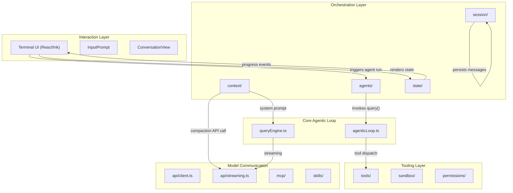

The orchestration layer acts as a mediator: it prepares context for the model, dispatches work to the core loop, captures results into persistent storage, and exposes reactive state to the UI.

---

## 3. Module Map

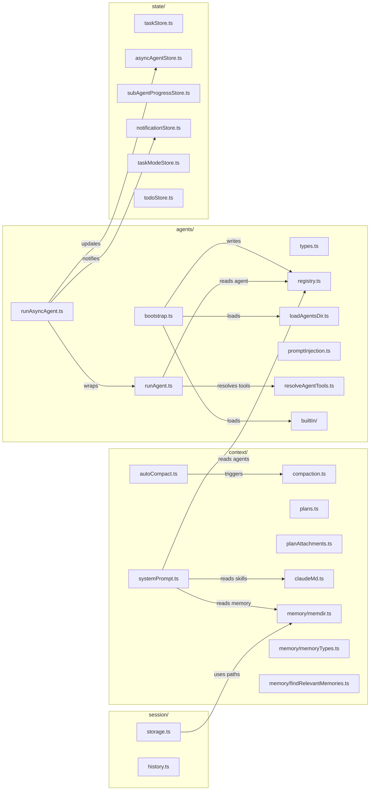

---

## 4. Agents Subsystem

### 4.1 Type Definitions

The agent type system is defined in `src/agents/types.ts` and forms the contract that all other agent modules depend on.

```python
# Pseudocode: Agent type definitions
from enum import Enum
from dataclasses import dataclass, field
from typing import Optional, Callable

class AgentSource(Enum):
    BUILT_IN = "built-in"
    USER = "user"          # ~/.agent-butler/agents/
    PROJECT = "project"    # <cwd>/.agent-butler/agents/

class AgentPermissionMode(Enum):
    DEFAULT = "default"
    PLAN = "plan"
    AUTO = "auto"

class AgentIsolation(Enum):
    NONE = "none"
    WORKTREE = "worktree"

@dataclass
class AgentDefinition:
    agent_type: str                    # e.g. "Explore", "general-purpose"
    when_to_use: str                   # description for LLM discovery
    tools: Optional[list[str]] = None  # None = wildcard (all tools)
    disallowed_tools: list[str] = field(default_factory=list)
    model: Optional[str] = None        # override model
    max_turns: Optional[int] = None    # override max turns
    permission_mode: Optional[AgentPermissionMode] = None
    isolation: Optional[AgentIsolation] = None
    source: AgentSource = AgentSource.BUILT_IN
    file_path: Optional[str] = None    # disk path for user/project agents
    get_system_prompt: Callable[[], str] = lambda: ""

@dataclass
class AgentRunResult:
    agent_type: str
    final_text: str
    messages: list
    total_tool_use_count: int
    total_duration_ms: int
    total_tokens: int
    input_tokens: int
    output_tokens: int
    turn_count: int
    reason: str                        # LoopTerminationReason
    warnings: Optional[list[str]] = None
```

Key design decisions:
- **`get_system_prompt` is a callable**, not a string. This enables lazy evaluation and composed prompts that may include dynamic context.
- **Three agent sources** with implicit priority: `project > user > built-in`. The registry uses last-writer-wins semantics on `Map.set()`, so project agents override user agents which override built-in agents.
- **`AgentRunResult`** captures comprehensive telemetry — token usage, duration, tool counts, and termination reason — enabling the parent agent to reason about sub-agent performance.

### 4.2 Agent Registry

The registry (`src/agents/registry.ts`) is a write-once, read-many in-memory store.

```python
# Pseudocode: Agent registry
class AgentRegistry:
    def __init__(self):
        self._agents: dict[str, AgentDefinition] = {}
        self._initialized: bool = False

    def set_agents(self, definitions: list[AgentDefinition]) -> None:
        """Bulk-replace all agents. Called once at startup."""
        self._agents.clear()
        for agent in definitions:
            self._agents[agent.agent_type] = agent  # last-writer-wins
        self._initialized = True

    def is_initialized(self) -> bool:
        return self._initialized

    def find_agent(self, agent_type: str) -> Optional[AgentDefinition]:
        return self._agents.get(agent_type)

    def get_all_agents(self) -> list[AgentDefinition]:
        return list(self._agents.values())

    def clear_agents(self) -> None:
        """Reset for tests/hot-reload."""
        self._agents.clear()
        self._initialized = False

# Module-level singleton
_registry = AgentRegistry()
```

The registry is intentionally simple: no events, no subscriptions, no complex queries. It is populated once during bootstrap and read many times during execution.

### 4.3 Agent Bootstrap

The bootstrap process (`src/agents/bootstrap.ts`) is the startup entry point that loads all agents and populates the registry.

```python
# Pseudocode: Agent bootstrap
async def bootstrap_agents(cwd: str) -> AgentsBootstrapResult:
    """
    Load all agents (built-in + custom) and register them.
    
    Execution order:
    1. Load built-in agents (explore, general-purpose)
    2. Load custom agents from disk (user + project dirs in parallel)
    3. Merge into registry (custom overrides built-in by name)
    """
    built_in_agents = get_built_in_agents()
    
    # Load user + project agents in parallel
    custom_result = await load_all_custom_agents(cwd)
    
    # Merge: built-ins first, then custom agents overwrite by name
    all_agents = built_in_agents + custom_result.agents
    set_agents(all_agents)
    
    return AgentsBootstrapResult(
        built_in_count=len(built_in_agents),
        custom_count=len(custom_result.agents),
        warnings=custom_result.warnings
    )
```

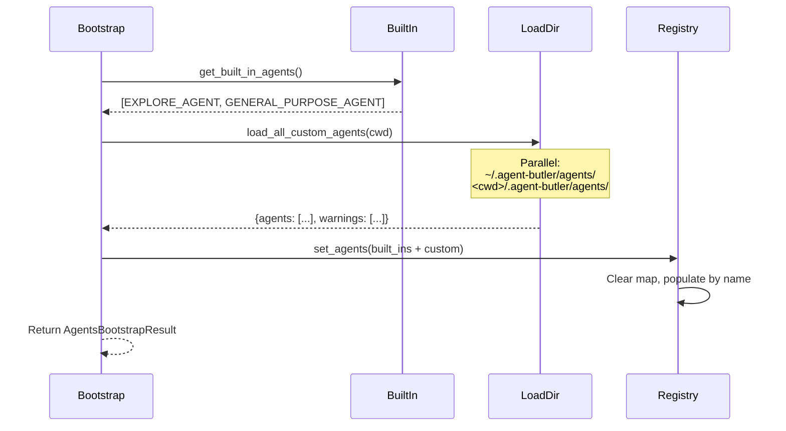

### 4.4 Agent Loading from Disk

Custom agents are loaded from `.md` files with YAML frontmatter (`src/agents/loadAgentsDir.ts`). Two directories are scanned:

1. **User directory**: `~/.agent-butler/agents/` — global user-defined agents
2. **Project directory**: `<cwd>/.agent-butler/agents/` — project-specific agents

```python
# Pseudocode: Agent loading from disk
import hashlib
from pathlib import Path

def get_user_agents_dir() -> str:
    return str(Path.home() / ".agent-butler" / "agents")

def get_project_agents_dir(cwd: str) -> str:
    return str(Path(cwd) / ".agent-butler" / "agents")

async def load_all_custom_agents(cwd: str) -> LoadAllAgentsResult:
    """
    Load agents from both user and project directories in parallel.
    Each .md file becomes one AgentDefinition.
    """
    user_dir = get_user_agents_dir()
    project_dir = get_project_agents_dir(cwd)
    
    # Parallel loading
    user_result = await load_from_one_dir(user_dir, AgentSource.USER)
    project_result = await load_from_one_dir(project_dir, AgentSource.PROJECT)
    
    return LoadAllAgentsResult(
        agents=user_result.agents + project_result.agents,
        warnings=user_result.warnings + project_result.warnings
    )

async def load_from_one_dir(directory: str, source: AgentSource) -> LoadDirResult:
    """
    Read all .md files in directory. Parse YAML frontmatter.
    Required fields: name, description
    Optional fields: tools, disallowedTools, model, maxTurns, 
                     permissionMode, isolation
    Body = system prompt.
    """
    agents = []
    warnings = []
    
    files = await read_markdown_files(directory)
    
    for file_path in files:
        try:
            raw = await read_file(file_path)
            frontmatter, body = split_frontmatter(raw)
            
            # Validate required fields
            name = as_string(frontmatter.get("name"))
            description = as_string(frontmatter.get("description"))
            if not name or not description:
                warnings.append(f"Skipping {file_path}: missing name/description")
                continue
            
            agent = AgentDefinition(
                agent_type=name,
                when_to_use=description,
                tools=as_string_array(frontmatter.get("tools")),
                disallowed_tools=as_string_array(frontmatter.get("disallowedTools", [])),
                model=as_string(frontmatter.get("model")),
                max_turns=as_positive_int(frontmatter.get("maxTurns")),
                permission_mode=as_permission_mode(frontmatter.get("permissionMode")),
                isolation=as_isolation(frontmatter.get("isolation")),
                source=source,
                file_path=file_path,
                get_system_prompt=lambda b=body: b  # capture body
            )
            agents.append(agent)
        except Exception as e:
            warnings.append(f"Error loading {file_path}: {e}")
    
    return LoadDirResult(agents=agents, warnings=warnings)
```

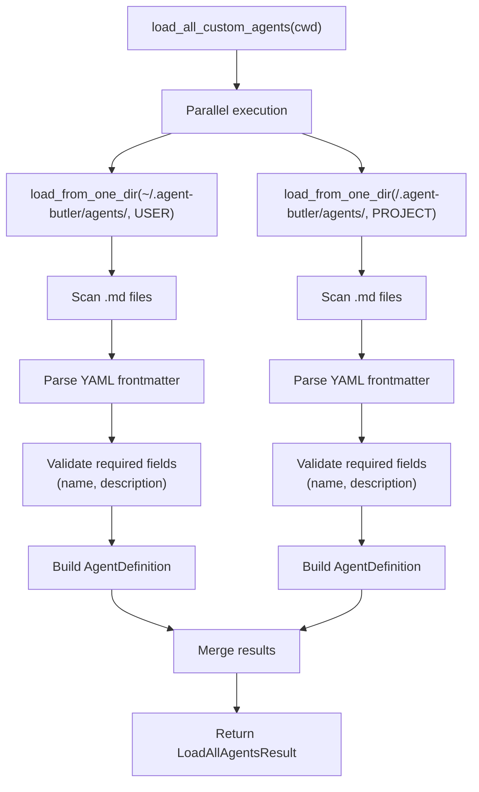

### 4.5 Tool Resolution

When a sub-agent is invoked, its tool pool must be derived from the parent's available tools (`src/agents/resolveAgentTools.ts`).

```python
# Pseudocode: Tool resolution
AGENT_TOOL_NAME = "Agent"

def resolve_agent_tools(
    agent_definition: AgentDefinition,
    available_tools: list[Tool]
) -> ResolvedAgentTools:
    """
    Build the sub-agent's tool pool from the parent's pool.
    
    Algorithm:
    1. Remove the Agent tool (no recursive sub-sub-agents)
    2. Remove any disallowed tools
    3. If tools is None or ['*'] → wildcard (keep all remaining)
    4. Otherwise → intersect with named tools
    """
    # Step 1: Remove Agent tool — structural guarantee against recursion
    tools = [t for t in available_tools if t.name != AGENT_TOOL_NAME]
    
    # Step 2: Remove disallowed tools
    disallowed = set(agent_definition.disallowed_tools)
    tools = [t for t in tools if t.name not in disallowed]
    
    # Step 3: Check for wildcard
    if agent_definition.tools is None or agent_definition.tools == ["*"]:
        return ResolvedAgentTools(
            has_wildcard=True,
            resolved_tools=tools,
            invalid_tools=[]
        )
    
    # Step 4: Intersect with named tools
    allowed = set(agent_definition.tools)
    resolved = []
    valid_names = {t.name for t in tools}
    invalid_tools = [name for name in allowed if name not in valid_names]
    
    for tool in tools:
        if tool.name in allowed:
            resolved.append(tool)
    
    return ResolvedAgentTools(
        has_wildcard=False,
        resolved_tools=resolved,
        invalid_tools=invalid_tools
    )
```

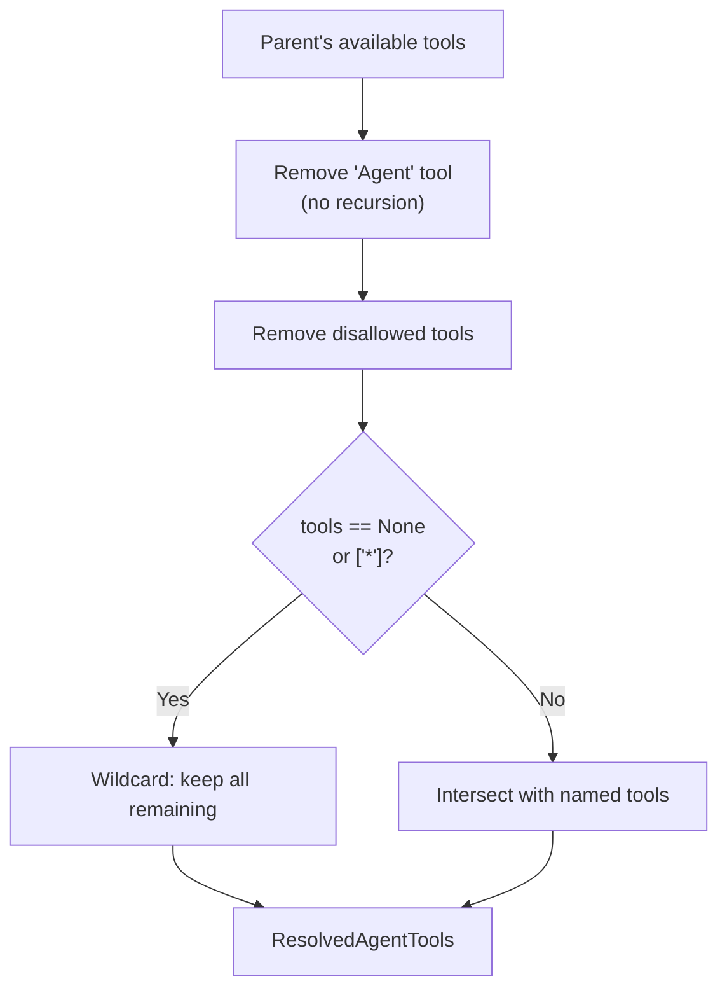

The "no sub-sub-agent" guarantee is **structural**, not prompt-based. The `Agent` tool is physically removed from the sub-agent's tool pool, making recursion impossible regardless of what the LLM tries.

### 4.6 Foreground Agent Execution

Foreground agent execution (`src/agents/runAgent.ts`) is the synchronous delegation path. The parent agent blocks until the sub-agent completes.

```python
# Pseudocode: Foreground agent execution
import time
import uuid

DEFAULT_AGENT_MAX_TURNS = 30

async def run_child_agent(params: RunChildAgentParams) -> AgentRunResult:
    """
    Execute a single sub-agent end-to-end.
    
    Steps:
    1. Resolve the sub-agent's tool pool
    2. Create an isolated ToolContext with unique session ID
    3. Run the agentic loop (query() generator)
    4. Collect progress events and forward to parent
    5. Extract final text and compute statistics
    """
    start_time = time.monotonic()
    
    # Step 1: Resolve tools
    resolved = resolve_agent_tools(
        params.agent_definition, 
        params.available_tools
    )
    
    # Step 2: Create isolated context
    agent_session_id = (
        f"{params.parent_tool_context.session_id}"
        f"/agent-{params.agent_definition.agent_type}"
        f"-{uuid.uuid4().hex[:8]}"
    )
    tool_context = ToolContext(
        session_id=agent_session_id,
        cwd=params.cwd_override or params.parent_tool_context.cwd,
        # ... other fields from parent context
    )
    
    # Step 3: Convert tools to API format
    api_tools = [tool_to_api_param(t) for t in resolved.resolved_tools]
    
    # Step 4: Run the agentic loop
    messages = []
    total_tool_use_count = 0
    turn_count = 0
    
    loop_generator = query(
        model=params.model,
        system_prompt=params.agent_definition.get_system_prompt(),
        messages=[{"role": "user", "content": params.prompt}],
        tools=api_tools,
        tool_handler=build_tool_handler(resolved.resolved_tools, tool_context),
        max_turns=params.agent_definition.max_turns or DEFAULT_AGENT_MAX_TURNS,
        permission_mode=params.permission_mode,
        abort_signal=params.abort_signal,
    )
    
    async for event in loop_generator:
        if event.type == "tool_use_start":
            total_tool_use_count += 1
            if params.on_progress:
                params.on_progress(ProgressEvent(
                    type="tool_use_start",
                    tool_name=event.tool_name,
                    tool_input=event.tool_input
                ))
        elif event.type == "text":
            if params.on_progress:
                params.on_progress(ProgressEvent(type="text", text=event.text))
        elif event.type == "turn_complete":
            turn_count += 1
            messages = event.messages
    
    # Step 5: Extract results
    final_text = extract_final_assistant_text(messages)
    duration_ms = int((time.monotonic() - start_time) * 1000)
    
    return AgentRunResult(
        agent_type=params.agent_definition.agent_type,
        final_text=final_text,
        messages=messages,
        total_tool_use_count=total_tool_use_count,
        total_duration_ms=duration_ms,
        total_tokens=compute_total_tokens(messages),
        turn_count=turn_count,
        reason="completed"
    )

def extract_final_assistant_text(messages: list) -> str:
    """Walk backwards to find the last assistant text block."""
    for msg in reversed(messages):
        if msg["role"] == "assistant":
            for block in msg["content"]:
                if isinstance(block, dict) and block.get("type") == "text":
                    return block["text"]
    return ""

def count_tool_uses(messages: list) -> int:
    """Count all tool_use blocks in message history."""
    count = 0
    for msg in messages:
        if msg["role"] == "assistant":
            for block in msg.get("content", []):
                if isinstance(block, dict) and block.get("type") == "tool_use":
                    count += 1
    return count
```

```mermaid
sequenceDiagram
    participant Parent as Parent Agent (AgentTool)
    participant RA as runChildAgent()
    participant RT as resolveAgentTools()
    participant Loop as query() generator
    participant Progress as onProgress callback

    Parent->>RA: run_child_agent(params)
    RA->>RT: resolve_agent_tools(definition, tools)
    RT-->>RA: ResolvedAgentTools
    
    RA->>RA: Create isolated ToolContext + session ID
    RA->>Loop: Start agentic loop
    
    loop Until task complete or max turns
        Loop->>RA: yield event (tool_use_start / text / turn_complete)
        RA->>Progress: Forward progress event
        RA->>RA: Update counters
    end
    
    RA->>RA: extract_final_assistant_text()
    RA->>RA: count_tool_uses()
    RA-->>Parent: AgentRunResult
```

### 4.7 Background Agent Execution

Background agents (`src/agents/runAsyncAgent.ts`) run fire-and-forget with full lifecycle management including transcript writing, store updates, worktree cleanup, and notification enqueueing.

```python
# Pseudocode: Background agent lifecycle
async def run_async_agent_lifecycle(params: RunAsyncAgentLifecycleParams) -> None:
    """
    Fire-and-forget background agent execution.
    
    This function never throws — errors are caught and recorded.
    
    Lifecycle:
    1. Write transcript header to JSONL output file
    2. Run the child agent with permission auto-deny
    3. Forward progress to both JSONL file and asyncAgentStore
    4. On completion: cleanup worktree, update store, enqueue notification
    5. On failure: record error, update store, enqueue notification
    """
    entry = params.entry
    agent_id = entry.agent_id
    
    try:
        # Step 1: Write header to output file
        await append_task_output(
            entry.output_file_path,
            format_header(entry)
        )
        
        # Step 2: Create own AbortController (independent of parent)
        abort_controller = AbortController()
        
        # Step 3: Run with permission auto-deny
        result = await run_child_agent(
            agent_definition=params.agent_definition,
            prompt=params.prompt,
            available_tools=params.available_tools,
            model=params.model,
            parent_tool_context=params.parent_tool_context,
            permission_mode=params.permission_mode,
            should_avoid_permission_prompts=True,  # auto-deny "ask" decisions
            abort_signal=abort_controller.signal,
            session_override=agent_id,  # pin session to public agent ID
            cwd_override=params.worktree_info.path if params.worktree_info else None,
            on_progress=lambda event: handle_progress(agent_id, entry, event)
        )
        
        # Step 4: Success path
        await cleanup_worktree_if_needed(params.worktree_info)
        await append_task_output(entry.output_file_path, format_completion(result))
        
        complete_async_agent(agent_id, result)
        enqueue_pending_notification(
            format_task_notification(
                TaskNotificationParts(
                    task_id=agent_id,
                    agent_type=params.agent_definition.agent_type,
                    status="completed",
                    output_file=entry.output_file_path,
                    result=result.final_text[:500],
                    usage=f"{result.total_tokens} tokens",
                    worktree_path=params.worktree_info.path if params.worktree_info else None
                )
            )
        )
        
    except Exception as error:
        # Step 5: Failure path — never rethrow
        duration_ms = compute_duration(entry.start_time)
        fail_async_agent(agent_id, str(error), duration_ms)
        enqueue_pending_notification(
            format_task_notification(
                TaskNotificationParts(
                    task_id=agent_id,
                    agent_type=params.agent_definition.agent_type,
                    status="failed",
                    error=str(error)
                )
            )
        )

async def cleanup_worktree_if_needed(info: Optional[WorktreeInfo]) -> None:
    """Keep worktree if dirty, remove if clean."""
    if info is None:
        return
    has_changes = await has_worktree_changes(info.path)
    if not has_changes:
        await remove_agent_worktree(info.path)

async def handle_progress(agent_id: str, entry: AsyncAgentEntry, event: ProgressEvent) -> None:
    """Mirror progress to both JSONL file and store."""
    # Write to JSONL transcript
    await append_task_output(entry.output_file_path, format_progress_event(event))
    
    # Update live store for UI
    update_async_agent_progress(agent_id, {
        "tool_name": event.tool_name if event.type == "tool_use_start" else None,
        "tool_count": entry.tool_count + (1 if event.type == "tool_use_done" else 0),
        "current_text": event.text if event.type == "text" else None,
    })
```

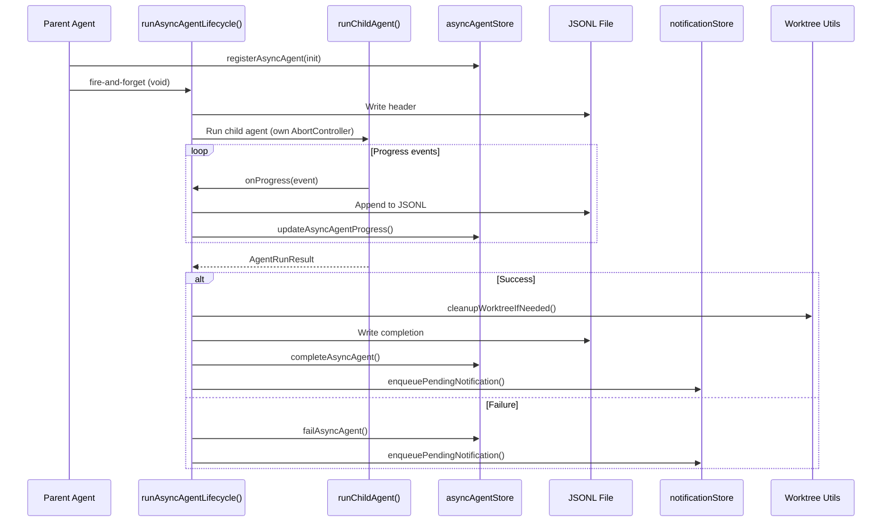

Key design decisions for background agents:
- **Own `AbortController`**: ESC on the parent does not kill background agents.
- **`shouldAvoidPermissionPrompts: true`**: "ask" permission decisions auto-deny instead of blocking.
- **`sessionIdOverride`**: Pins the session to the public agent ID for discoverability.
- **Never throws**: The `void runAsyncAgentLifecycle(...)` pattern ensures the parent is never interrupted.

### 4.8 Prompt Injection

The prompt injection module (`src/agents/promptInjection.ts`) formats the agent discovery listing as a `<system-reminder>` block for inclusion in the system prompt.

```python
# Pseudocode: Agent prompt injection
MAX_DESC_CHARS = 220

CREATION_GUIDANCE = """
To create a new agent, create a .md file in:
  - Project: <cwd>/.agent-butler/agents/
  - User: ~/.agent-butler/agents/

Required frontmatter:
  name: agent-name
  description: When to use this agent

Optional frontmatter:
  tools: [Tool1, Tool2]
  disallowedTools: [Tool3]
  model: claude-sonnet-4-20250514
  maxTurns: 30
  permissionMode: default|plan|auto
  isolation: none|worktree

Body = system prompt for the agent.
"""

def format_agents_system_reminder(agents: list[AgentDefinition]) -> str:
    """
    Format agent listing for system prompt injection.
    
    Structure:
    1. Header with usage instructions
    2. Agent listing (built-ins first, then alphabetical)
    3. Foreground vs background discipline rules
    4. Agent creation guidance
    """
    # Sort: built-ins first, then alphabetical
    sorted_agents = sorted(agents, key=lambda a: (
        0 if a.source == AgentSource.BUILT_IN else 1,
        a.agent_type.lower()
    ))
    
    lines = ["<system-reminder>", "Available agents:"]
    
    for agent in sorted_agents:
        desc = truncate(agent.when_to_use, MAX_DESC_CHARS)
        lines.append(f"  - {agent.agent_type}: {desc}")
    
    # Add discipline rules
    lines.append("")
    lines.append("Foreground agents: blocking, parent waits for completion.")
    lines.append("Background agents: non-blocking, results via notification.")
    lines.append("")
    lines.append(CREATION_GUIDANCE)
    lines.append("</system-reminder>")
    
    return "\n".join(lines)
```

### 4.9 Built-in Agents

Two built-in agents ship with Agent Butler:

| Agent | Type | Purpose | Tool Restrictions |
|-------|------|---------|-------------------|
| **Explore** | `"Explore"` | Read-only code search specialist | `disallowedTools: ["Write", "Edit", "MemoryWrite"]` |
| **General Purpose** | `"general-purpose"` | Default sub-agent, all tools | `tools: undefined` (wildcard) |

The Explore agent provides a belt-and-suspenders read-only guarantee: it cannot write files even if the LLM attempts to.

```python
# Pseudocode: Built-in agent definitions
EXPLORE_AGENT = AgentDefinition(
    agent_type="Explore",
    when_to_use="Use when you need to quickly find files by patterns, "
                "search code for keywords, or answer questions about the codebase.",
    disallowed_tools=["Write", "Edit", "MemoryWrite"],
    source=AgentSource.BUILT_IN,
    get_system_prompt=lambda: "You are a read-only code exploration agent..."
)

GENERAL_PURPOSE_AGENT = AgentDefinition(
    agent_type="general-purpose",
    when_to_use="General-purpose agent for researching complex questions "
                "and executing multi-step tasks.",
    tools=None,  # wildcard — all tools available
    source=AgentSource.BUILT_IN,
    get_system_prompt=lambda: "You are a general-purpose agent..."
)
```

---

## 5. Context Management Subsystem

### 5.1 System Prompt Assembly

The system prompt (`src/context/systemPrompt.ts`) is the most critical piece of context engineering. It is composed from multiple sources and divided into static and dynamic zones.

```python
# Pseudocode: System prompt assembly
SYSTEM_PROMPT_STATIC_START = "<!-- STATIC INSTRUCTIONS START -->"
SYSTEM_PROMPT_STATIC_END = "<!-- STATIC INSTRUCTIONS END -->"
SYSTEM_PROMPT_DYNAMIC_START = "<!-- DYNAMIC CONTEXT START -->"
SYSTEM_PROMPT_DYNAMIC_END = "<!-- DYNAMIC CONTEXT END -->"

@dataclass
class RuntimeEnvironmentContext:
    cwd: str
    date: str
    os: str
    git_branch: Optional[str] = None
    git_status: Optional[str] = None
    git_recent_commit: Optional[str] = None

async def build_system_prompt(options: BuildSystemPromptOptions) -> list[str]:
    """
    Build the full system prompt by composing multiple sections.
    
    Returns a list of string sections that will be joined with \\n\\n.
    
    Composition:
    ┌─────────────────────────────────────┐
    │ Static Zone                         │
    │  - Core behavioral instructions     │
    │  - Tool usage guidelines            │
    │  - Safety rules                     │
    ├─────────────────────────────────────┤
    │ Dynamic Zone                        │
    │  - Runtime environment (git, OS)    │
    │  - AGENT.md context files           │
    │  - Memory entrypoint                │
    │  - Memory type/access guidance      │
    │  - Session instructions             │
    │  - Skills reminder (budget-aware)   │
    │  - Agents reminder (discovery)      │
    └─────────────────────────────────────┘
    """
    # Parallel data fetching
    env_context, agent_md, memory_entrypoint = await asyncio.gather(
        get_runtime_environment_context(options.cwd),
        load_agent_md_context(options.cwd),
        read_memory_entrypoint(options.cwd) if not should_ignore_memory(options.user_query) else None
    )
    
    sections = []
    
    # Static zone
    sections.append(SYSTEM_PROMPT_STATIC_START)
    sections.extend(get_static_prompt_sections())
    sections.append(SYSTEM_PROMPT_STATIC_END)
    
    # Dynamic zone
    sections.append(SYSTEM_PROMPT_DYNAMIC_START)
    sections.append(format_environment_context(env_context))
    
    if agent_md:
        sections.append(agent_md)
    
    if memory_entrypoint:
        sections.append(format_memory_system_location(await get_project_memory_dir(options.cwd)))
        sections.append(memory_entrypoint)
        sections.extend(build_memory_type_guidance())
        sections.extend(build_memory_access_guidance())
        sections.extend(build_memory_validation_guidance())
    
    # Skills reminder (budget-aware)
    skills = get_model_visible_skills()
    if skills:
        sections.append(format_skills_system_reminder(skills))
    
    # Agents reminder
    agents = get_all_agents()
    if agents:
        sections.append(format_agents_system_reminder(agents))
    
    sections.append(SYSTEM_PROMPT_DYNAMIC_END)
    
    return sections

def render_system_prompt(parts: list[str]) -> str:
    """Join all sections with double newlines."""
    return "\n\n".join(parts)
```

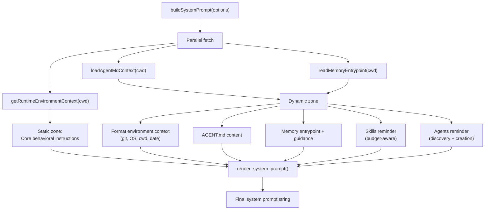

### 5.2 AGENT.md Loading

The AGENT.md system (`src/context/claudeMd.ts`) provides hierarchical project-specific instructions, similar to Claude Code's `CLAUDE.md`.

```python
# Pseudocode: AGENT.md hierarchical loading
async def load_agent_md_context(cwd: str) -> str:
    """
    Load AGENT.md files from the global config and every directory
    in the CWD chain up to root.
    
    Loading order (root → cwd):
    /AGENT.md
    /Users/AGENT.md
    /Users/nick/AGENT.md
    /Users/nick/Code/AGENT.md
    /Users/nick/Code/project/AGENT.md
    
    This ensures project-wide instructions come first,
    then increasingly specific overrides.
    """
    files = await get_agent_md_files(cwd)
    contents = []
    
    for file_path in files:
        content = await read_if_exists(file_path)
        if content:
            # Strip HTML comments (often used for TODOs)
            content = strip_html_comments(content)
            contents.append(f"# AGENT.md: {file_path}\n\n{content}")
    
    return "\n\n---\n\n".join(contents)

async def get_agent_md_files(cwd: str) -> list[str]:
    """
    Get all candidate AGENT.md paths from global config + directory chain.
    """
    paths = []
    
    # Global AGENT.md
    global_path = get_global_agent_md_path()
    paths.append(global_path)
    
    # Walk from root to cwd
    for directory in get_directory_chain(cwd):
        paths.append(os.path.join(directory, "AGENT.md"))
    
    return paths

def get_directory_chain(cwd: str) -> list[str]:
    """
    Generate directory chain from filesystem root to cwd.
    /Users/nick/Code/project → [/, /Users, /Users/nick, /Users/nick/Code, /Users/nick/Code/project]
    """
    parts = []
    current = cwd
    while current != "/":
        parts.append(current)
        current = os.path.dirname(current)
    parts.append("/")
    parts.reverse()
    return parts
```

### 5.3 Memory System

The memory system (`src/context/memory/memdir.ts`, `memoryTypes.ts`) provides persistent project knowledge stored as markdown files with YAML frontmatter.

```python
# Pseudocode: Memory system architecture

# Memory types
MEMORY_TYPES = ["user", "feedback", "project", "reference"]

@dataclass
class MemoryFrontmatter:
    name: str
    description: str
    type: str  # one of MEMORY_TYPES

@dataclass
class MemoryEntry:
    file_name: str
    file_path: str
    title: str
    hook: str  # one-line summary for the entrypoint

# Storage structure:
# ~/.agent-butler/projects/<projectKey>/memory/
#   MEMORY.md          (entrypoint — index of all memories)
#   api-conventions.md (individual memory file)
#   error-handling.md  (individual memory file)

async def get_project_path_info(cwd: str) -> ProjectPathInfo:
    """
    Derive project identity from CWD.
    
    Project key = {sanitized-basename}-{sha256-prefix-16}
    Example: "my-project-a1b2c3d4e5f67890"
    """
    git_root = await find_canonical_git_root(cwd)
    basename = os.path.basename(git_root)
    sanitized = sanitize_slug(basename)
    hash_prefix = hashlib.sha256(git_root.encode()).hexdigest()[:16]
    
    return ProjectPathInfo(
        git_root=git_root,
        project_key=f"{sanitized}-{hash_prefix}",
        project_dir=os.path.join(
            get_agent_butler_home(), "projects", f"{sanitized}-{hash_prefix}"
        )
    )

async def write_project_memory(input: MemoryWriteInput) -> WriteResult:
    """
    Write or update a memory file.
    
    Steps:
    1. Resolve project memory directory
    2. Check for existing memory (fuzzy deduplication)
    3. Write markdown file with frontmatter
    4. Rewrite MEMORY.md entrypoint
    """
    memory_dir = await ensure_memory_dir_exists(input.cwd)
    
    # Fuzzy deduplication
    existing = find_existing_memory_file(
        input.cwd, input.name, input.description
    )
    
    if existing:
        # Update existing file
        file_path = existing.file_path
        await write_file(file_path, format_memory_document(input))
        updated_existing = True
    else:
        # Create new file
        file_name = slugify_memory_file_name(input.name) + ".md"
        file_path = os.path.join(memory_dir, file_name)
        await write_file(file_path, format_memory_document(input))
        updated_existing = False
    
    # Rewrite entrypoint
    headers = await load_memory_headers(input.cwd)
    await rewrite_entrypoint(memory_dir, headers)
    
    return WriteResult(file_path=file_path, updated_existing=updated_existing)

async def rewrite_entrypoint(memory_dir: str, entries: list[MemoryHeader]) -> None:
    """
    Rewrite MEMORY.md with pointer lines to all memory files.
    
    Enforces limits:
    - MAX_ENTRYPOINT_LINES = 200
    - MAX_ENTRYPOINT_BYTES = 25,000
    """
    lines = ["# Project Memory", ""]
    
    for entry in entries:
        lines.append(build_pointer_line(entry))
    
    # Truncate if needed
    content = "\n".join(lines)
    if len(content) > MAX_ENTRYPOINT_BYTES:
        content = truncate_entrypoint(content)
    
    await write_file(os.path.join(memory_dir, "MEMORY.md"), content)
```

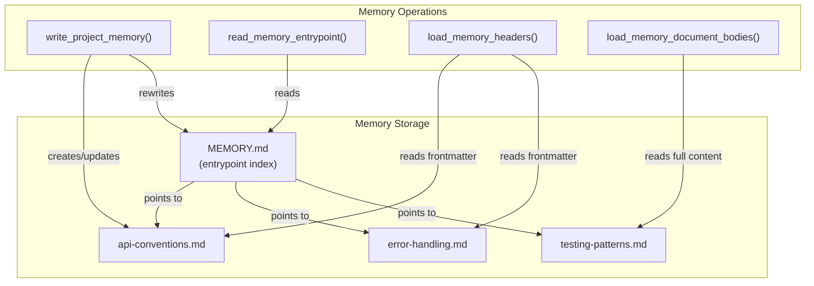

### 5.4 Compaction

Compaction (`src/context/compaction.ts`) implements a two-tier strategy to manage conversation length: **micro-compaction** (cheap tool result truncation) and **full compaction** (expensive API summarization).

```python
# Pseudocode: Two-tier compaction
OLD_TOOL_RESULT_PLACEHOLDER = "[Old tool result content cleared]"

COMPACTABLE_TOOLS = {"Read", "Grep", "Glob", "Bash", "Edit", "Write"}

async def compact_messages(
    messages: list,
    focus: Optional[str] = None,
    options: Optional[CompactionCheckOptions] = None
) -> CompactionResult:
    """
    Two-tier compaction pipeline.
    
    Tier 1 — Micro-compaction (always runs):
    Replace old tool results with placeholders.
    This is cheap and reduces token count without API calls.
    
    Tier 2 — Full compaction (only if still over budget):
    Use the LLM to summarize the conversation.
    Preserves the last 8 messages verbatim.
    """
    # Tier 1: Micro-compaction
    micro_compacted = micro_compact_messages(messages)
    
    # Check if micro-compaction is sufficient
    budget = build_token_budget_snapshot(micro_compacted, options)
    if budget.estimated_tokens < budget.threshold:
        return CompactionResult(
            messages=micro_compacted,
            did_compact=False,
            did_micro_compact=True
        )
    
    # Tier 2: Full compaction via API summarization
    summary = await summarize_messages(micro_compacted, focus)
    
    # Find safe tail boundary (no dangling tool_results)
    tail_start = find_preserved_tail_start(micro_compacted)
    tail = micro_compacted[tail_start:]
    
    # Compose: [compact boundary + summary] + [preserved tail]
    boundary = make_compact_boundary(summary)
    compacted_messages = [boundary] + tail
    
    return CompactionResult(
        messages=compacted_messages,
        summary=summary,
        did_compact=True,
        did_micro_compact=True
    )

def micro_compact_messages(messages: list) -> list:
    """
    Replace old tool results with placeholders.
    Only targets results from COMPACTABLE_TOOLS.
    Binary-only results become '[image]'.
    """
    result = []
    for msg in messages:
        if msg["role"] == "tool_result":
            compacted = micro_compact_message(msg)
            result.append(compacted)
        else:
            result.append(msg)
    return result

def micro_compact_message(message: dict) -> dict:
    """Replace tool result content with placeholder."""
    tool_name = message.get("name", "")
    if tool_name not in COMPACTABLE_TOOLS:
        return message
    
    # Check for binary-only content
    content = message.get("content", [])
    if all(block.get("type") == "image" for block in content):
        return {**message, "content": [{"type": "text", "text": "[image]"}]}
    
    return {**message, "content": [{"type": "text", "text": OLD_TOOL_RESULT_PLACEHOLDER}]}

async def summarize_messages(messages: list, focus: Optional[str] = None) -> str:
    """
    Use the LLM to generate a conversation summary.
    
    The summary prompt includes an <analysis> block for reasoning
    before the <summary> block, improving quality.
    
    NO_TOOLS_PREAMBLE prevents the model from calling tools during
    summarization.
    """
    prompt = BASE_COMPACT_PROMPT
    if focus:
        prompt += f"\n\nSpecial focus: {focus}"
    
    response = await create_message(
        model="default",
        system=NO_TOOLS_PREAMBLE,
        messages=[{"role": "user", "content": prompt}],
        max_tokens=4096
    )
    
    return extract_summary(response)

def find_preserved_tail_start(messages: list) -> int:
    """
    Find the last safe boundary for preserving recent messages.
    
    Ensures we don't split a tool_use/tool_result pair.
    Preserves the last 8 messages minimum.
    """
    # Walk backwards to find a clean boundary
    # (no dangling tool_results without matching tool_use)
    min_tail = max(0, len(messages) - 8)
    
    for i in range(len(messages) - 1, min_tail - 1, -1):
        msg = messages[i]
        if msg["role"] == "tool_result":
            # Check if matching tool_use exists in the tail
            tool_use_id = msg.get("tool_use_id")
            has_match = any(
                m.get("role") == "assistant" and
                any(b.get("id") == tool_use_id for b in m.get("content", []) if isinstance(b, dict))
                for m in messages[i:]
            )
            if not has_match:
                continue  # Skip this boundary
        return i
    
    return min_tail
```

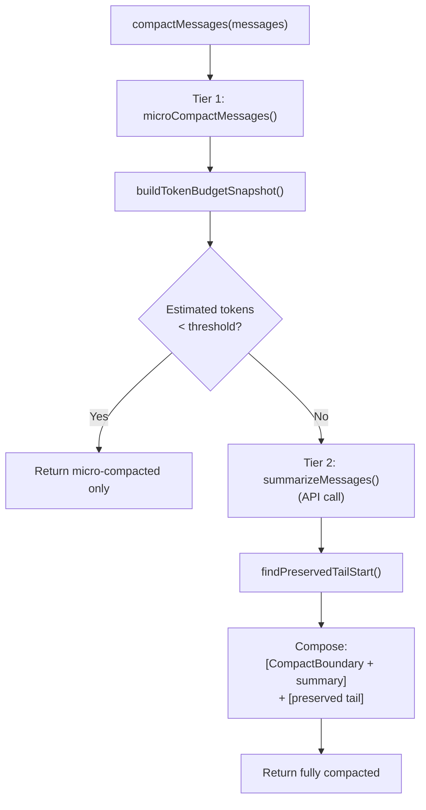

### 5.5 Auto-Compaction

Auto-compaction (`src/context/autoCompact.ts`) is the circuit breaker that triggers compaction automatically when the conversation approaches the token budget.

```python
# Pseudocode: Auto-compaction
MAX_CONSECUTIVE_AUTOCOMPACT_FAILURES = 3

# Module-level state
_consecutive_failures = 0

def should_auto_compact(
    estimated_tokens: int,
    model: str,
    query_source: Optional[str] = None
) -> bool:
    """
    Determine if auto-compaction should trigger.
    
    Skips for:
    - query_source == "compact" (prevents recursion)
    - query_source == "session_memory" (prevents recursion)
    - Already failed 3 times consecutively (circuit breaker)
    """
    if query_source in ("compact", "session_memory"):
        return False
    
    if _consecutive_failures >= MAX_CONSECUTIVE_AUTOCOMPACT_FAILURES:
        return False
    
    threshold = get_auto_compact_threshold(model)
    return estimated_tokens >= threshold

def calculate_token_warning_state(
    estimated_tokens: int,
    model: str
) -> TokenWarningResult:
    """
    Calculate the current token warning state.
    
    States:
    - normal:    < 80% of context window
    - warning:   80-90% of context window
    - error:     90-95% of context window
    - blocking:  > 95% of context window
    """
    context_window = get_context_window(model)
    threshold = get_auto_compact_threshold(model)
    blocking_limit = get_blocking_limit(model)
    
    if estimated_tokens >= blocking_limit:
        state = "blocking"
    elif estimated_tokens >= threshold * 1.125:  # ~90%
        state = "error"
    elif estimated_tokens >= threshold:
        state = "warning"
    else:
        state = "normal"
    
    return TokenWarningResult(
        state=state,
        estimated_tokens=estimated_tokens,
        threshold=threshold,
        blocking_limit=blocking_limit,
        context_window=context_window
    )

async def auto_compact_if_needed(
    messages: list,
    model: str,
    options: Optional[dict] = None
) -> AutoCompactResult:
    """
    Automatically compact if needed.
    
    Uses circuit breaker pattern: stops trying after 3 consecutive failures.
    Resets on next successful check.
    """
    global _consecutive_failures
    
    budget = build_token_budget_snapshot(messages)
    
    if not should_auto_compact(budget.estimated_tokens, model, options.get("query_source")):
        return AutoCompactResult(result=None, did_auto_compact=False)
    
    try:
        result = await compact_messages(messages, options={"force": True})
        _consecutive_failures = 0  # Reset on success
        return AutoCompactResult(result=result, did_auto_compact=True)
    except Exception as e:
        _consecutive_failures += 1
        debugLog(f"Auto-compact failed ({_consecutive_failures}/{MAX_CONSECUTIVE_AUTOCOMPACT_FAILURES}): {e}")
        return AutoCompactResult(result=None, did_auto_compact=False)
```

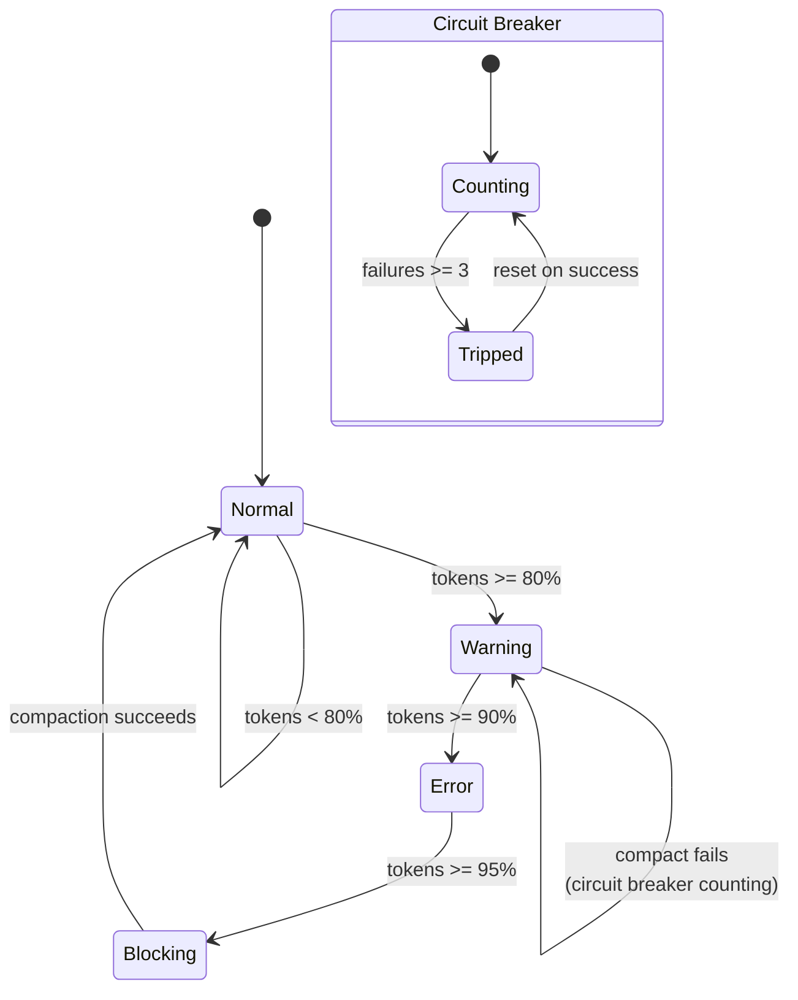

### 5.6 Plan Mode

Plan mode (`src/context/plans.ts`, `src/context/planAttachments.ts`) allows the agent to create and follow structured plans stored as markdown files.

```python
# Pseudocode: Plan management
import hashlib

# Module-level cached slug
_cached_slug: Optional[str] = None

def get_plan_slug() -> str:
    """Get or generate a random hex slug for the current plan."""
    global _cached_slug
    if _cached_slug is None:
        _cached_slug = hashlib.sha256(str(time.time()).encode()).hexdigest()[:12]
    return _cached_slug

def get_plan_file_path() -> str:
    """<plansRoot>/<slug>.md"""
    return os.path.join(get_plans_directory(), f"{get_plan_slug()}.md")

async def write_plan(content: str) -> str:
    """Write plan content to disk. Returns file path."""
    await ensure_plans_directory()
    file_path = get_plan_file_path()
    await write_file(file_path, content)
    return file_path

async def read_plan() -> Optional[str]:
    """Read current plan from disk."""
    file_path = get_plan_file_path()
    if await file_exists(file_path):
        return await read_file(file_path)
    return None
```

Plan attachments provide throttled reminders injected into user messages:

```python
# Pseudocode: Plan mode attachments
PLAN_ATTACHMENT_MARKER = "[plan_mode_attachment]"

def get_plan_mode_attachment(
    messages: list,
    plan_file_path: str
) -> Optional[MessageParam]:
    """
    Get the plan mode attachment for the current turn.
    
    Throttling rules:
    - First message: always gets full attachment
    - Every 5th human turn: full attachment
    - Other turns: sparse (brief) attachment
    - Returns None if plan mode is not active
    """
    human_turns = count_human_turns_since_last_attachment(messages)
    
    if human_turns == 0:
        # First message — full attachment
        return build_full_plan_mode_text(plan_file_path)
    elif human_turns % 5 == 0:
        # Every 5th turn — full reminder
        return build_full_plan_mode_text(plan_file_path)
    elif human_turns > 0:
        # Sparse reminder
        return build_sparse_plan_mode_text(plan_file_path)
    
    return None

def get_plan_mode_exit_attachment(
    plan_file_path: str,
    plan_exists: bool
) -> MessageParam:
    """Build the exit notification when leaving plan mode."""
    return build_plan_mode_exit_text(plan_file_path, plan_exists)
```

---

## 6. Session Persistence Subsystem

### 6.1 Storage Architecture

Sessions are persisted as JSONL (JSON Lines) files (`src/session/storage.ts`). Each line is a typed, discriminated union entry.

```python
# Pseudocode: Session storage types
from enum import Enum
from dataclasses import dataclass
from typing import Union

class TranscriptEntryType(Enum):
    SESSION_META = "session_meta"
    MESSAGE = "message"
    TOOL_EVENT = "tool_event"
    USAGE = "usage"
    SYSTEM = "system"
    COMPACTION = "compaction"

@dataclass
class SessionMetadata:
    session_id: str
    cwd: str
    started_at: str  # ISO 8601
    updated_at: str
    model: str

@dataclass
class SessionSummary:
    session_id: str
    cwd: str
    started_at: str
    updated_at: str
    model: str
    message_count: int
    total_usage: Usage

@dataclass
class SessionPaths:
    root_dir: str           # ~/.agent-butler/projects/<projectKey>/
    project_dir: str        # same as root_dir
    transcript_path: str    # <root_dir>/<sessionId>.jsonl
    latest_path: str        # <root_dir>/latest

@dataclass
class RestoredSession:
    summary: SessionSummary
    messages: list[MessageParam]
```

Storage layout:

```
~/.agent-butler/
└── projects/
    └── <projectKey>/
        ├── latest                    # contains most recent session ID
        ├── <sessionId1>.jsonl        # full transcript
        ├── <sessionId2>.jsonl
        └── ...
```

### 6.2 Session Lifecycle

```python
# Pseudocode: Session lifecycle
import uuid
import json

MAX_SESSIONS = 20

async def init_session_storage(metadata: SessionMetadata) -> SessionPaths:
    """
    Initialize a new session.
    
    Steps:
    1. Compute project hash from CWD
    2. Create session directory
    3. Write session_meta as first transcript entry
    4. Update 'latest' pointer
    """
    project_hash = await get_project_hash(metadata.cwd)
    root_dir = os.path.join(get_agent_butler_home(), "projects", project_hash)
    
    paths = SessionPaths(
        root_dir=root_dir,
        project_dir=root_dir,
        transcript_path=os.path.join(root_dir, f"{metadata.session_id}.jsonl"),
        latest_path=os.path.join(root_dir, "latest")
    )
    
    await ensure_session_dir(paths)
    
    # Write first entry
    await append_transcript_entry(metadata.cwd, metadata.session_id, {
        "type": "session_meta",
        "data": metadata
    })
    
    # Update latest pointer
    await write_file(paths.latest_path, metadata.session_id)
    
    return paths

async def append_transcript_entry(
    cwd: str,
    session_id: str,
    entry: dict
) -> None:
    """
    Append a single JSONL entry to the session transcript.
    
    Each entry is a JSON object with a 'type' discriminator.
    Appending is atomic (single write + newline).
    """
    paths = await get_session_paths(cwd, session_id)
    line = json.dumps(entry) + "\n"
    await append_file(paths.transcript_path, line)

def create_session_id() -> str:
    """Generate a UUID-based session ID."""
    return str(uuid.uuid4())
```

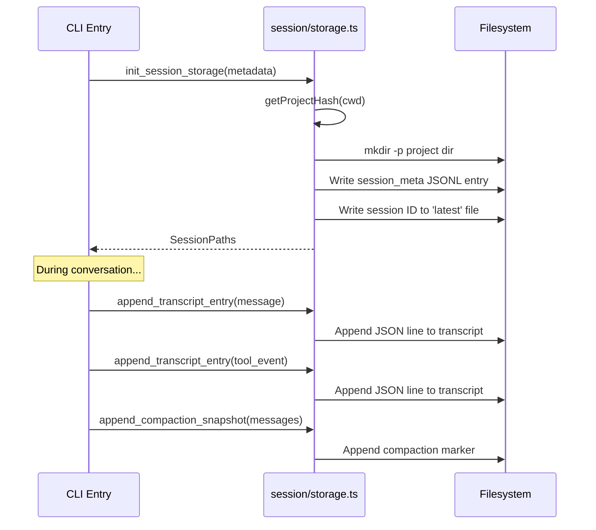

### 6.3 Session Restoration

Session restoration reconstructs a conversation from the JSONL transcript, using compaction markers as optimization boundaries.

```python
# Pseudocode: Session restoration
async def restore_session(
    cwd: str,
    session_id: Optional[str] = None
) -> RestoredSession:
    """
    Restore a session from disk.
    
    Steps:
    1. Find session ID (explicit or from 'latest' pointer)
    2. Read all transcript entries
    3. Find last compaction marker
    4. Only use messages after the compaction marker
    5. Reconstruct summary from session_meta + usage entries
    """
    # Step 1: Resolve session ID
    if session_id is None:
        session_id = await get_latest_session_id(cwd)
    if session_id is None:
        raise NoSessionFoundError()
    
    # Step 2: Read transcript
    paths = await get_session_paths(cwd, session_id)
    entries = await read_transcript_entries(paths.transcript_path)
    
    # Step 3: Find last compaction marker
    compaction_index = -1
    for i, entry in enumerate(entries):
        if entry.get("type") == "compaction":
            compaction_index = i
    
    # Step 4: Extract messages after compaction
    messages = []
    for entry in entries[compaction_index + 1:]:
        if entry.get("type") == "message":
            messages.append(entry["data"])
    
    # Step 5: Build summary
    meta = next(e["data"] for e in entries if e.get("type") == "session_meta")
    usage_entries = [e["data"] for e in entries if e.get("type") == "usage"]
    total_usage = sum_usage(usage_entries)
    
    summary = SessionSummary(
        session_id=session_id,
        cwd=meta.cwd,
        started_at=meta.started_at,
        updated_at=get_last_updated_at(entries, meta.started_at),
        model=meta.model,
        message_count=len(messages),
        total_usage=total_usage
    )
    
    return RestoredSession(summary=summary, messages=messages)
```

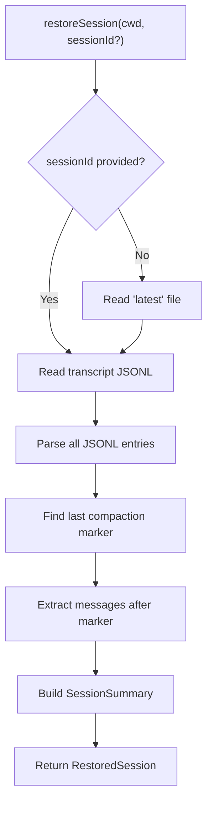

### 6.4 Session History

Session history (`src/session/history.ts`) provides human-readable formatting of past sessions.

```python
# Pseudocode: Session history
async def format_project_session_history(cwd: str) -> str:
    """
    Format a human-readable summary of recent sessions.
    
    Shows: session ID (short), start time, model, message count, usage.
    Limited to MAX_SESSIONS (20).
    """
    sessions = await list_project_sessions(cwd, limit=MAX_SESSIONS)
    
    if not sessions:
        return "No sessions found."
    
    lines = ["Session History:", ""]
    for session in sessions:
        usage_str = format_session_usage(session.total_usage)
        lines.append(
            f"  {session.session_id[:8]}...  "
            f"{session.started_at}  "
            f"{session.model}  "
            f"{session.message_count} msgs  "
            f"{usage_str}"
        )
    
    return "\n".join(lines)

def format_session_usage(usage: Usage) -> str:
    return f"{usage.input_tokens} in / {usage.output_tokens} out / {usage.total_tokens} total"
```

---

## 7. State Management Subsystem

### 7.1 Pub/Sub Pattern

All state stores follow a consistent pub/sub pattern. This is the foundational pattern for the entire state management subsystem.

```python
# Pseudocode: Generic pub/sub pattern
from typing import TypeVar, Generic, Callable
import threading

T = TypeVar("T")

class ReactiveStore(Generic[T]):
    """
    Generic reactive store with module-level state and subscriptions.
    
    Pattern:
    - Module-level Map or variable holds state
    - Set[Listener] for subscribers
    - subscribe*() returns unsubscribe function
    - Mutation functions call notify() after updating
    - Listeners are try-caught so UI can't break mutations
    """
    def __init__(self, initial_state: T):
        self._state: T = initial_state
        self._listeners: set[Callable[[], None]] = set()
        self._lock = threading.Lock()
    
    def subscribe(self, listener: Callable[[], None]) -> Callable[[], None]:
        """Subscribe to state changes. Returns unsubscribe function."""
        self._listeners.add(listener)
        def unsubscribe():
            self._listeners.discard(listener)
        return unsubscribe
    
    def _notify(self) -> None:
        """Notify all listeners of state change."""
        for listener in self._listeners:
            try:
                listener()
            except Exception:
                pass  # UI errors must not break mutations
    
    def get_state(self) -> T:
        return self._state
```

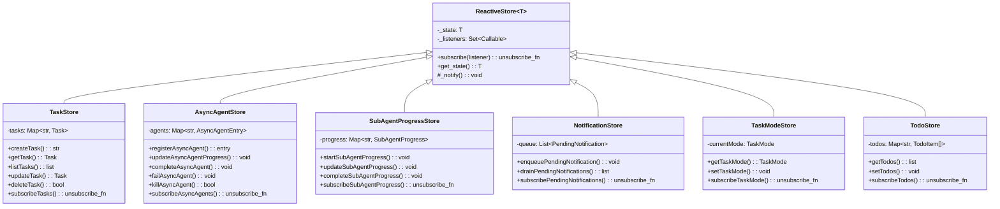

### 7.2 Task Store (V2)

The task store (`src/state/taskStore.ts`) is the most complex store with 24 functions. It provides persistent, file-per-task storage with concurrency control.

```python
# Pseudocode: Task store (V2)
import json
import os
import re

TASKS_ROOT = "~/.agent-butler/tasks"

def sanitize_path_component(input: str) -> str:
    """Sanitize string for use as path component. Blocks '../' traversal."""
    return re.sub(r'[^a-zA-Z0-9_\-]', '_', input)

def get_task_list_id(session_id: str) -> str:
    """Derive task list ID from session ID."""
    return sanitize_path_component(session_id)

def get_tasks_dir(task_list_id: str) -> str:
    return os.path.join(TASKS_ROOT, task_list_id)

def get_task_path(task_list_id: str, task_id: str) -> str:
    return os.path.join(get_tasks_dir(task_list_id), f"{task_id}.json")

async def create_task(task_list_id: str, data: dict) -> str:
    """
    Create a new task.
    
    Uses lock file for concurrency control.
    High water mark prevents ID reuse after deletion.
    """
    async with acquire_lock(task_list_id):
        task_id = str(await find_highest_task_id(task_list_id) + 1)
        task = Task(
            id=task_id,
            status="pending",
            created_at=now_iso(),
            updated_at=now_iso(),
            **data
        )
        await write_file(get_task_path(task_list_id, task_id), json.dumps(task))
        await write_high_water_mark(task_list_id, int(task_id))
        notify_tasks_updated()
        return task_id

async def update_task(
    task_list_id: str,
    task_id: str,
    updates: dict
) -> Optional[Task]:
    """
    Update an existing task.
    
    Uses per-task lock for concurrent updates to different tasks.
    Bidirectional block relationships are kept in sync.
    """
    task = await get_task(task_list_id, task_id)
    if task is None:
        return None
    
    updated = {**task, **updates, "updated_at": now_iso()}
    await write_file(get_task_path(task_list_id, task_id), json.dumps(updated))
    notify_tasks_updated()
    return updated

async def block_task(
    task_list_id: str,
    from_task_id: str,
    to_task_id: str
) -> bool:
    """
    Create a bidirectional block relationship.
    
    from_task.blocks contains to_task_id
    to_task.blocked_by contains from_task_id
    
    Both sides are always kept in sync.
    """
    from_task = await get_task(task_list_id, from_task_id)
    to_task = await get_task(task_list_id, to_task_id)
    
    if not from_task or not to_task:
        return False
    
    # Update both sides
    from_task.blocks.append(to_task_id)
    to_task.blocked_by.append(from_task_id)
    
    await update_task(task_list_id, from_task_id, {"blocks": from_task.blocks})
    await update_task(task_list_id, to_task_id, {"blocked_by": to_task.blocked_by})
    
    return True

def is_ready(task: Task, all_tasks: list[Task]) -> bool:
    """
    Check if a task is ready to work on.
    
    Ready = status is "pending" AND all blocking tasks are "completed".
    """
    if task.status != "pending":
        return False
    
    task_map = {t.id: t for t in all_tasks}
    for blocker_id in task.blocked_by:
        blocker = task_map.get(blocker_id)
        if blocker and blocker.status != "completed":
            return False
    
    return True
```

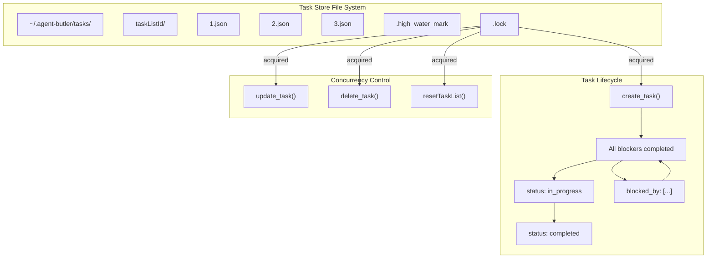

### 7.3 Async Agent Store

The async agent store (`src/state/asyncAgentStore.ts`) tracks background sub-agents from registration to completion.

```python
# Pseudocode: Async agent store
class AsyncAgentStatus(Enum):
    RUNNING = "running"
    COMPLETED = "completed"
    FAILED = "failed"
    KILLED = "killed"

@dataclass
class AsyncAgentEntry:
    agent_id: str
    agent_type: str
    description: str
    status: AsyncAgentStatus
    started_at: str
    abort_controller: AbortController
    output_file_path: str
    # Live progress fields
    tool_count: int = 0
    current_tool_name: Optional[str] = None
    current_text: Optional[str] = None
    turn_count: int = 0
    # Terminal fields
    completed_at: Optional[str] = None
    result: Optional[AgentRunResult] = None
    error: Optional[str] = None
    duration_ms: Optional[int] = None
    worktree_path: Optional[str] = None

# Module-level state
_agents: dict[str, AsyncAgentEntry] = {}
_listeners: set[Callable] = set()

def register_async_agent(init: RegisterAsyncAgentInit) -> AsyncAgentEntry:
    """Create a new background agent entry with its own AbortController."""
    entry = AsyncAgentEntry(
        agent_id=init.agent_id,
        agent_type=init.agent_type,
        description=init.description,
        status=AsyncAgentStatus.RUNNING,
        started_at=now_iso(),
        abort_controller=AbortController(),
        output_file_path=init.output_file_path
    )
    _agents[entry.agent_id] = entry
    _notify()
    return entry

def update_async_agent_progress(agent_id: str, patch: dict) -> None:
    """Update live progress fields for a running agent."""
    entry = _agents.get(agent_id)
    if entry and entry.status == AsyncAgentStatus.RUNNING:
        for key, value in patch.items():
            setattr(entry, key, value)
        _notify()

def complete_async_agent(
    agent_id: str,
    result: AgentRunResult,
    extra: Optional[dict] = None
) -> None:
    """Mark agent as completed."""
    entry = _agents.get(agent_id)
    if entry:
        entry.status = AsyncAgentStatus.COMPLETED
        entry.completed_at = now_iso()
        entry.result = result
        if extra:
            for k, v in extra.items():
                setattr(entry, k, v)
        _notify()

def fail_async_agent(agent_id: str, error: str, duration_ms: int) -> None:
    """Mark agent as failed."""
    entry = _agents.get(agent_id)
    if entry:
        entry.status = AsyncAgentStatus.FAILED
        entry.completed_at = now_iso()
        entry.error = error
        entry.duration_ms = duration_ms
        _notify()

def kill_async_agent(agent_id: str) -> bool:
    """
    Kill a running agent by aborting its controller.
    Returns False if agent was already terminal.
    Idempotent — safe to call multiple times.
    """
    entry = _agents.get(agent_id)
    if not entry or entry.status != AsyncAgentStatus.RUNNING:
        return False
    
    entry.abort_controller.abort()
    entry.status = AsyncAgentStatus.KILLED
    entry.completed_at = now_iso()
    _notify()
    return True
```

### 7.4 Sub-Agent Progress Store

The sub-agent progress store (`src/state/subAgentProgressStore.ts`) provides live progress updates for foreground sub-agents as a side-channel from `AgentTool.call()`.

```python
# Pseudocode: Sub-agent progress store

# Why a store instead of agentic-loop events?
# AgentTool.call() runs inside runTools() which blocks the generator —
# there's no way to yield events back through the loop.
# This store is the side-channel that bridges the gap.

class SubAgentStatus(Enum):
    RUNNING = "running"
    COMPLETED = "completed"
    ERROR = "error"
    MAX_TURNS = "max_turns"
    ABORTED = "aborted"

@dataclass
class SubAgentProgress:
    tool_use_id: str
    agent_type: str
    status: SubAgentStatus
    tool_count: int = 0
    current_tool_name: Optional[str] = None
    current_text: Optional[str] = None
    turn_count: int = 0
    total_tokens: int = 0

# Module-level state: Map keyed by tool_use.id
_progress: dict[str, SubAgentProgress] = {}
_listeners: set[Callable] = set()

def start_sub_agent_progress(tool_use_id: str, init: dict) -> None:
    """Register a new sub-agent's progress tracking."""
    _progress[tool_use_id] = SubAgentProgress(
        tool_use_id=tool_use_id,
        **init
    )
    _notify()

def update_sub_agent_progress(tool_use_id: str, patch: dict) -> None:
    """Update live progress for a running sub-agent."""
    entry = _progress.get(tool_use_id)
    if entry:
        for key, value in patch.items():
            setattr(entry, key, value)
        _notify()

def complete_sub_agent_progress(
    tool_use_id: str,
    result: AgentRunResult
) -> None:
    """Mark sub-agent as completed."""
    entry = _progress.get(tool_use_id)
    if entry:
        entry.status = SubAgentStatus.COMPLETED
        _notify()
```

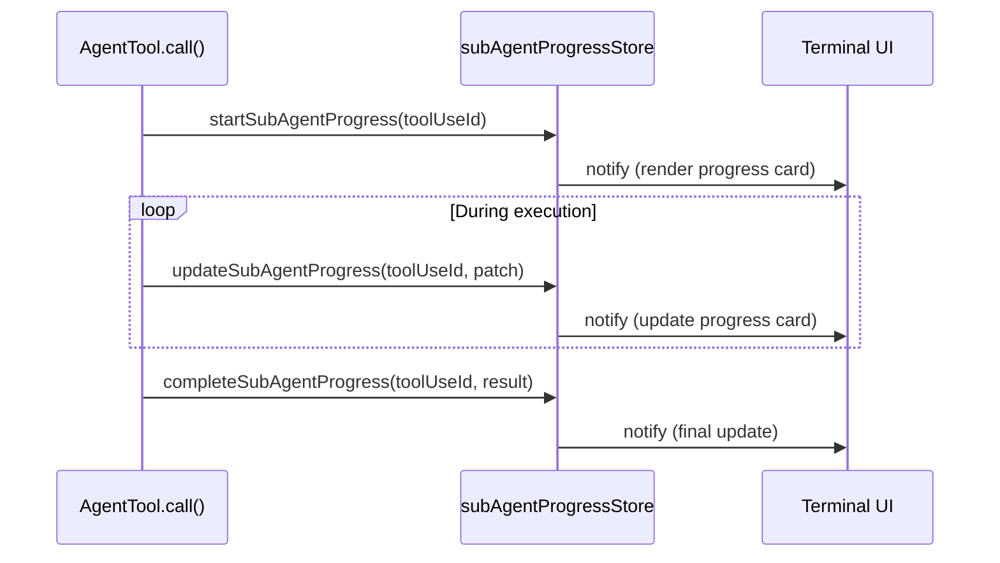

### 7.5 Notification Store

The notification store (`src/state/notificationStore.ts`) is a FIFO queue for cross-turn message injection, primarily used for background agent completion notifications.

```python
# Pseudocode: Notification store
@dataclass
class PendingNotification:
    mode: str = "task-notification"
    text: str = ""
    enqueued_at: str = ""

@dataclass
class TaskNotificationParts:
    task_id: str
    agent_type: str
    status: str
    output_file: Optional[str] = None
    result: Optional[str] = None
    error: Optional[str] = None
    usage: Optional[str] = None
    worktree_path: Optional[str] = None

# Module-level state
_queue: list[PendingNotification] = []
_listeners: set[Callable] = set()

def enqueue_pending_notification(notification: PendingNotification) -> None:
    """Add a notification to the FIFO queue."""
    _queue.append(notification)
    _notify()

def drain_pending_notifications() -> list[PendingNotification]:
    """Atomically take all pending notifications (clears the queue)."""
    result = list(_queue)
    _queue.clear()
    return result

def peek_pending_notifications() -> list[PendingNotification]:
    """Read without consuming."""
    return list(_queue)

def format_task_notification(parts: TaskNotificationParts) -> PendingNotification:
    """
    Build a structured XML notification.
    
    Format:
    <task-notification>
      <task_id>...</task_id>
      <agent_type>...</agent_type>
      <status>completed|failed</status>
      <output_file>...</output_file>
      <result>...</result>
      <error>...</error>
      <usage>...</usage>
      <worktree_path>...</worktree_path>
    </task-notification>
    """
    xml_parts = ["<task-notification>"]
    xml_parts.append(f"  <task_id>{parts.task_id}</task_id>")
    xml_parts.append(f"  <agent_type>{parts.agent_type}</agent_type>")
    xml_parts.append(f"  <status>{parts.status}</status>")
    
    if parts.output_file:
        xml_parts.append(f"  <output_file>{parts.output_file}</output_file>")
    if parts.result:
        xml_parts.append(f"  <result>{parts.result}</result>")
    if parts.error:
        xml_parts.append(f"  <error>{parts.error}</error>")
    if parts.usage:
        xml_parts.append(f"  <usage>{parts.usage}</usage>")
    if parts.worktree_path:
        xml_parts.append(f"  <worktree_path>{parts.worktree_path}</worktree_path>")
    
    xml_parts.append("</task-notification>")
    
    return PendingNotification(
        mode="task-notification",
        text="\n".join(xml_parts),
        enqueued_at=now_iso()
    )
```

The notification store's `subscribe` mechanism is critical: it enables the QueryEngine to be notified immediately when a background agent completes, triggering a fresh LLM turn to process the notification.

### 7.6 Task Mode Store

The task mode store (`src/state/taskModeStore.ts`) is a simple toggle between Task V2 and TodoWrite V1 modes.

```python
# Pseudocode: Task mode store
class TaskMode(Enum):
    TASK = "task"   # V2 file-based task system
    TODO = "todo"   # V1 in-memory todo list

# Module-level state
_current_mode: TaskMode = TaskMode.TASK  # default
_listeners: set[Callable] = set()

def get_task_mode() -> TaskMode:
    return _current_mode

def set_task_mode(mode: TaskMode) -> None:
    global _current_mode
    _current_mode = mode
    _notify()

def is_task_mode_enabled() -> bool:
    return _current_mode == TaskMode.TASK

def is_todo_mode_enabled() -> bool:
    return _current_mode == TaskMode.TODO
```

### 7.7 Todo Store (V1)

The todo store (`src/state/todoStore.ts`) is the V1 session-scoped in-memory todo list with full-replace semantics.

```python
# Pseudocode: Todo store
@dataclass
class TodoItem:
    id: str
    text: str
    completed: bool = False

# Module-level state
_todos: dict[str, list[TodoItem]] = {}  # keyed by session ID
_listeners: set[Callable] = set()

def get_todos(session_id: str) -> list[TodoItem]:
    """Get todos for a session. Returns empty list if none exist."""
    return _todos.get(session_id, [])

def set_todos(session_id: str, todos: list[TodoItem]) -> None:
    """Full replace of todos for a session. Notifies listeners."""
    _todos[session_id] = todos
    _notify()

def clear_todos(session_id: str) -> None:
    """Clear all todos for a session."""
    _todos.pop(session_id, None)
    _notify()
```

Key difference from Task Store: TodoStore is **in-memory only** — data is lost on process exit. TaskStore is **disk-persistent** with file-per-task storage.

---

## 8. Cross-Layer Interactions

The orchestration layer interacts with every other layer in the system. Here is a complete map of cross-layer dependencies.

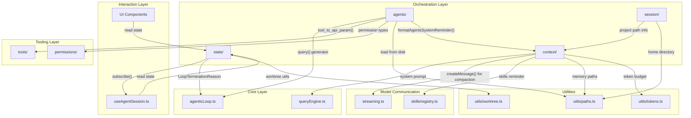

| Orchestration Module | Target Layer | Target Module | Interface |
|---------------------|-------------|---------------|-----------|
| `agents/runAgent.ts` | Core | `core/agenticLoop.ts` | `query()` generator |
| `agents/runAsyncAgent.ts` | State | `state/asyncAgentStore.ts` | `completeAsyncAgent()`, `failAsyncAgent()` |
| `agents/runAsyncAgent.ts` | State | `state/notificationStore.ts` | `enqueuePendingNotification()` |
| `agents/runAsyncAgent.ts` | Utils | `utils/worktree.ts` | `hasWorktreeChanges()`, `removeAgentWorktree()` |
| `agents/runAsyncAgent.ts` | Utils | `utils/taskOutput.ts` | `appendTaskOutput()` |
| `agents/resolveAgentTools.ts` | Tools | `tools/Tool.ts` | `Tool` interface |
| `agents/bootstrap.ts` | Disk | `~/.agent-butler/agents/` | Filesystem reads |
| `context/systemPrompt.ts` | Skills | `services/skills/registry.ts` | `getModelVisibleSkills()` |
| `context/systemPrompt.ts` | Skills | `services/skills/budget.ts` | `formatSkillsSystemReminder()` |
| `context/compaction.ts` | API | `services/api/streaming.ts` | `createMessage()` |
| `context/compaction.ts` | Utils | `utils/tokens.ts` | `buildTokenBudgetSnapshot()` |
| `context/memory/memdir.ts` | Utils | `utils/paths.ts` | `getProjectsRoot()` |
| `session/storage.ts` | Context | `context/memory/memdir.ts` | `getProjectPathInfo()` |
| `session/storage.ts` | Utils | `utils/paths.ts` | `getEasyAgentHome()` |
| `state/taskStore.ts` | Types | `types/task.ts` | `Task`, `TaskStatus` |
| `state/subAgentProgressStore.ts` | Core | `core/agenticLoop.ts` | `LoopTerminationReason` type |

---

## 9. Key Flows

### 9.1 Application Bootstrap Flow

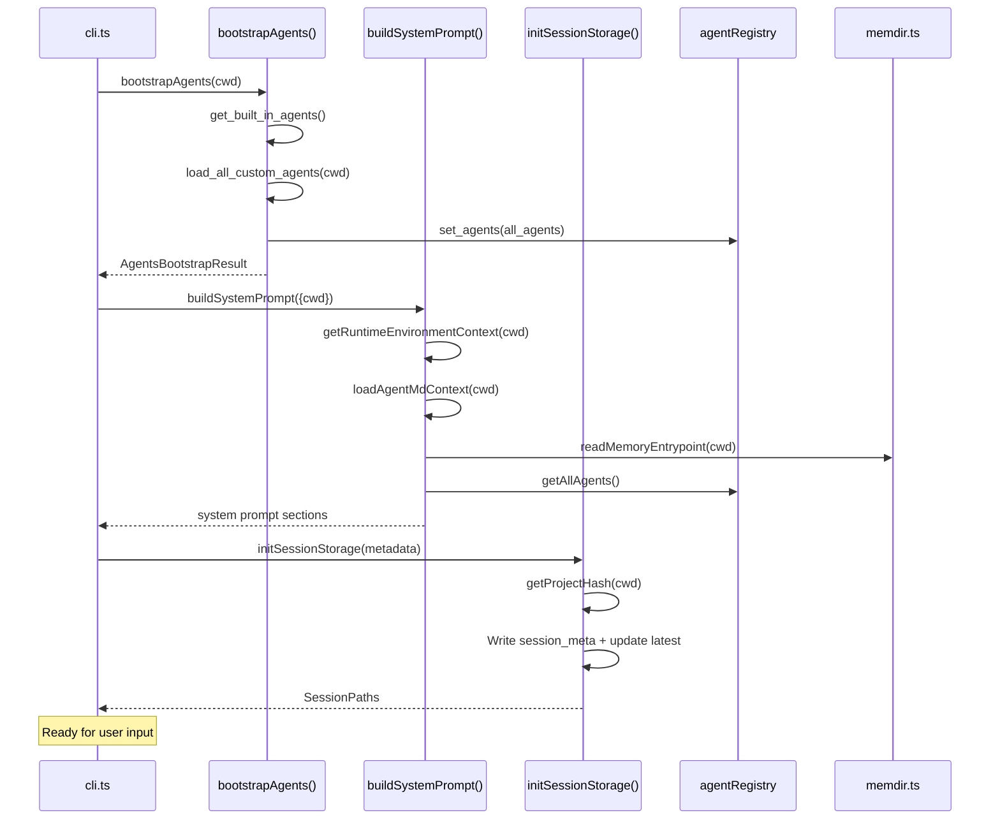

### 9.2 Foreground Sub-Agent Delegation Flow

```mermaid
sequenceDiagram
    participant LLM as LLM Response
    participant QE as QueryEngine
    participant AT as AgentTool
    participant Registry as agentRegistry
    participant RT as resolveAgentTools()
    participant SAPS as subAgentProgressStore
    participant RA as runChildAgent()
    participant Loop as agenticLoop.query()
    participant Tools as Tool Execution

    LLM->>QE: tool_use: Agent(agent_type, prompt)
    QE->>AT: call(params)
    AT->>Registry: findAgent(agent_type)
    Registry-->>AT: AgentDefinition
    AT->>RT: resolveAgentTools(definition, tools)
    RT-->>AT: ResolvedAgentTools
    AT->>SAPS: startSubAgentProgress(toolUseId)
    
    AT->>RA: runChildAgent(params)
    RA->>Loop: query(system_prompt, messages, tools)
    
    loop Sub-agent turns
        Loop->>Tools: Execute tool
        Tools-->>Loop: Tool result
        Loop->>RA: yield progress event
        RA->>SAPS: updateSubAgentProgress()
    end
    
    Loop-->>RA: Final messages
    RA-->>AT: AgentRunResult
    AT->>SAPS: completeSubAgentProgress()
    AT-->>QE: Tool result (final text)
    QE-->>LLM: Feed result back
```

### 9.3 Background Sub-Agent Lifecycle Flow

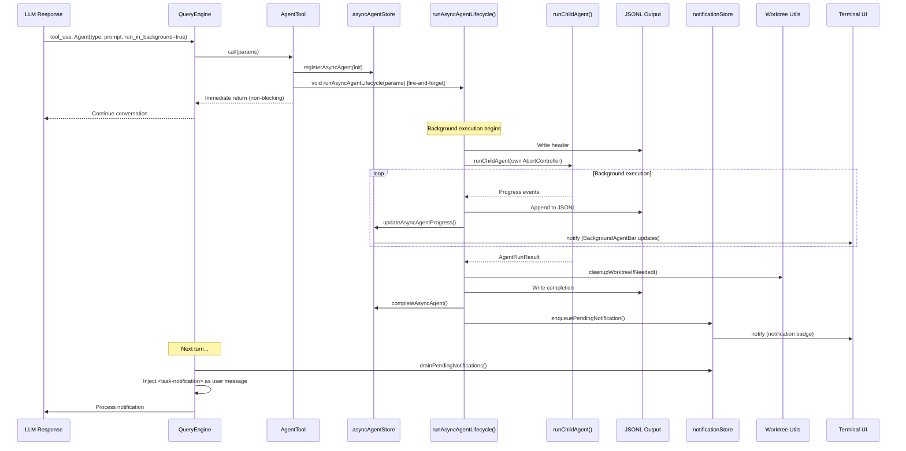

### 9.4 System Prompt Composition Flow

```mermaid
flowchart TD
    Start["buildSystemPrompt(options)"] --> Gather["Gather all sources"]
    
    Gather --> Static["Static Instructions<br/>(behavioral rules, tool guidelines, safety)"]
    Gather --> Env["RuntimeEnvironmentContext<br/>(git branch, OS, cwd, date)"]
    Gather --> AgentMd["AGENT.md Files<br/>(hierarchical: root → cwd)"]
    Gather --> Memory["Memory System<br/>(MEMORY.md + type guidance)"]
    Gather --> Skills["Skills Reminder<br/>(budget-aware listing)"]
    Gather --> Agents["Agents Reminder<br/>(discovery + creation template)"]
    
    Static --> Zones["Two Zones"]
    Env --> Zones
    AgentMd --> Zones
    Memory --> Zones
    Skills --> Zones
    Agents --> Zones
    
    Zones --> Output["render_system_prompt()"]
    
    subgraph "Zone Structure"
        direction TB
        Z1["<!-- STATIC INSTRUCTIONS START -->"]
        Z2["Core behavioral rules"]
        Z3["<!-- STATIC INSTRUCTIONS END -->"]
        Z4["<!-- DYNAMIC CONTEXT START -->"]
        Z5["Environment + AGENT.md + Memory + Skills + Agents"]
        Z6["<!-- DYNAMIC CONTEXT END -->"]
        Z1 --> Z2 --> Z3 --> Z4 --> Z5 --> Z6
    end
```

### 9.5 Compaction Pipeline Flow

```mermaid
flowchart TD
    Trigger["autoCompactIfNeeded() OR manual call"] --> Micro["Tier 1: microCompactMessages()"]
    
    Micro --> Scan["Scan all messages"]
    Scan --> Filter["Filter COMPACTABLE_TOOLS:<br/>Read, Grep, Glob, Bash, Edit, Write"]
    Filter --> Replace["Replace old tool results with:<br/>'[Old tool result content cleared]'<br/>Binary → '[image]'"]
    
    Replace --> Budget["buildTokenBudgetSnapshot()"]
    Budget --> Check{"Estimated tokens<br/>< threshold?"}
    
    Check -->|Yes| Return1["Return micro-compacted<br/>(no API call needed)"]
    Check -->|No| Summarize["Tier 2: summarizeMessages()"]
    
    Summarize --> Prompt["Build summary prompt:<br/>NO_TOOLS_PREAMBLE + BASE_COMPACT_PROMPT"]
    Prompt --> APICall["createMessage() API call"]
    APICall --> Parse["Parse <analysis> + <summary> blocks"]
    
    Parse --> Tail["findPreservedTailStart()"]
    Tail --> Safe["Find safe boundary<br/>(no dangling tool_results)"]
    Safe --> Min["Ensure minimum 8 messages preserved"]
    
    Min --> Compose["Compose final message list:<br/>[CompactBoundary + summary] + [preserved tail]"]
    Compose --> Return2["Return fully compacted"]
```

### 9.6 Session Restore Flow

```mermaid
flowchart TD
    Start["restoreSession(cwd, sessionId?)"] --> Resolve{"sessionId<br/>provided?"}
    Resolve -->|No| Latest["Read 'latest' file<br/>→ get most recent sessionId"]
    Resolve -->|Yes| Direct["Use provided sessionId"]
    
    Latest --> Read["Read .jsonl transcript file"]
    Direct --> Read
    
    Read --> Parse["Parse all JSONL entries:<br/>session_meta | message | tool_event |<br/>usage | system | compaction"]
    
    Parse --> FindCompact["Find last compaction marker"]
    FindCompact --> Slice["Extract messages after marker"]
    
    Slice --> Summary["Build SessionSummary:<br/>sessionId, cwd, startedAt, model,<br/>messageCount, totalUsage"]
    
    Summary --> Return["Return RestoredSession"]
```

### 9.7 Notification Injection Flow

```mermaid
sequenceDiagram
    participant BG as Background Agent
    participant NS as notificationStore
    participant QE as QueryEngine
    participant LLM as LLM

    BG->>NS: enqueuePendingNotification(xml)
    NS->>NS: _queue.append(notification)
    NS->>NS: _notify() → listeners
    
    QE->>QE: Listener triggered
    QE->>QE: Schedule fresh turn
    
    Note over QE: On next turn boundary...
    QE->>NS: drainPendingNotifications()
    NS-->>QE: [notification1, notification2, ...]
    
    QE->>QE: Format as user message:<br/>"<task-notification>...</task-notification>"
    QE->>LLM: Inject as user message in conversation
    LLM->>LLM: Process notification,<br/>acknowledge completion
```

---

## 10. Data Flow Diagrams

### 10.1 Agent Definition Data Flow

```mermaid
flowchart LR
    subgraph "Disk"
        UserDir["~/.agent-butler/agents/*.md"]
        ProjDir["<cwd>/.agent-butler/agents/*.md"]
    end

    subgraph "Bootstrap"
        Load["loadAllCustomAgents()"]
        BuiltIn["getBuiltInAgents()"]
    end

    subgraph "Registry"
        Reg["agentRegistry<br/>Map<string, AgentDefinition>"]
    end

    subgraph "Runtime"
        AT["AgentTool.call()"]
        RT["resolveAgentTools()"]
        RA["runChildAgent()"]
    end

    UserDir -->|".md + frontmatter"| Load
    ProjDir -->|".md + frontmatter"| Load
    Load -->|"AgentDefinition[]"| Reg
    BuiltIn -->|"AgentDefinition[]"| Reg
    Reg -->|"findAgent()"| AT
    AT -->|"definition + tools"| RT
    RT -->|"ResolvedAgentTools"| RA
```

### 10.2 State Mutation Data Flow

```mermaid
flowchart TD
    subgraph "Mutations"
        AT["AgentTool"]
        RAA["runAsyncAgentLifecycle()"]
        TaskTools["TaskCreate/Update/Delete Tools"]
        TodoTool["TodoWriteTool"]
    end

    subgraph "Stores"
        AAS["asyncAgentStore"]
        SAPS["subAgentProgressStore"]
        NS["notificationStore"]
        TS["taskStore"]
        TDS["todoStore"]
        TMS["taskModeStore"]
    end

    subgraph "Subscribers"
        UI["Terminal UI"]
        Hooks["useAgentSession.ts"]
        QE["QueryEngine"]
    end

    AT -->|"register/update/complete"| AAS
    AT -->|"start/update/complete"| SAPS
    RAA -->|"update/complete/fail"| AAS
    RAA -->|"enqueue"| NS
    TaskTools -->|"create/update/delete"| TS
    TodoTool -->|"setTodos()"| TDS
    
    AAS -->|"subscribe"| UI
    SAPS -->|"subscribe"| UI
    NS -->|"subscribe/drain"| QE
    TS -->|"subscribe"| UI
    TDS -->|"subscribe"| UI
    TMS -->|"subscribe"| Hooks
```

### 10.3 Context Composition Data Flow

```mermaid
flowchart TD
    subgraph "Sources"
        Git["git branch/status/commit"]
        OS["os.platform(), os.release()"]
        CWD["process.cwd()"]
        Date["current date"]
        AgentMd["AGENT.md files (hierarchical)"]
        Memory["MEMORY.md + memory files"]
        Skills["Skills registry"]
        Agents["Agent registry"]
    end

    subgraph "Assembly"
        SP["buildSystemPrompt()"]
        Static["Static sections"]
        Dynamic["Dynamic sections"]
    end

    subgraph "Output"
        Prompt["Full system prompt string"]
        QE["QueryEngine uses as system parameter"]
    end

    Git --> SP
    OS --> SP
    CWD --> SP
    Date --> SP
    AgentMd --> SP
    Memory --> SP
    Skills --> SP
    Agents --> SP

    SP --> Static
    SP --> Dynamic
    Static --> Prompt
    Dynamic --> Prompt
    Prompt --> QE
```

---

## 11. Complexity Analysis

### File Complexity Ranking

| File | Lines | Functions | Complexity | Notes |
|------|-------|-----------|------------|-------|
| `state/taskStore.ts` | 411 | 24 | **Highest** | Most functions in any file; file-per-task, locks, HWM |
| `context/systemPrompt.ts` | ~350 | 5 | **High** | Composes 7+ sources; parallel fetch; conditional sections |
| `session/storage.ts` | 362 | 16 | **High** | JSONL parsing, compaction markers, session listing |
| `context/memory/memdir.ts` | 330 | 24 | **High** | File I/O, frontmatter parsing, fuzzy dedup, entrypoint rewriting |
| `context/compaction.ts` | 318 | 11 | **High** | Two-tier strategy, API call, safe tail boundary detection |
| `agents/runAsyncAgent.ts` | 284 | 2 | **High** | Complex lifecycle with 5+ async subsystems |
| `agents/runAgent.ts` | 268 | 3 | **Medium** | Straightforward but critical path |
| `agents/loadAgentsDir.ts` | 210 | 9 | **Medium** | Parallel loading, type coercion, validation |
| `state/asyncAgentStore.ts` | 236 | 11 | **Medium** | In-memory Map with lifecycle management |
| `context/autoCompact.ts` | ~150 | 8 | **Medium** | Circuit breaker pattern, threshold calculation |

### Architectural Complexity Drivers

1. **Concurrency**: `taskStore.ts` uses `proper-lockfile` for list-level and per-task locking. `runAsyncAgent.ts` runs agents fire-and-forget with independent `AbortController` instances.

2. **Two-tier compaction**: `compaction.ts` implements micro-compaction (cheap, always runs) and full compaction (expensive, API-gated). The safe tail boundary algorithm prevents dangling tool_result references.

3. **Hierarchical loading**: Both `claudeMd.ts` (AGENT.md) and `loadAgentsDir.ts` (agent definitions) walk directory trees. The memory system adds a project key derivation step with SHA-256 hashing.

4. **Side-channel communication**: `subAgentProgressStore.ts` exists because `AgentTool.call()` runs inside `runTools()` which blocks the generator — there's no way to yield events back through the agentic loop.

5. **Cross-turn injection**: `notificationStore.ts` enables background agent completions to be injected as user messages in the next turn, bridging the temporal gap between fire-and-forget execution and result consumption.

---

## 12. How the Orchestration Layer Achieves Agentic Behavior

This section steps back from individual files and functions to explain how the four subsystems — agents, context, session, and state — work together as a unified whole to produce agentic orchestration. No code; only concepts.

### 12.1 The Five Responsibilities of Orchestration

An agentic system is not just a loop that calls an LLM. The loop itself — Reason → Act → Observe — lives in the Core Layer (`agenticLoop.ts`). What makes the system _agentic_ rather than merely _reactive_ is everything that happens around that loop: knowing what to remember, when to compress, how to delegate, when to notify, and how to resume. That is the Orchestration Layer's job.

The Orchestration Layer fulfils five responsibilities that transform a raw LLM call into a coherent multi-turn agent:

1. **Identity** — Who am I, what tools do I have, what rules do I follow?
2. **Memory** — What do I know about this project, this session, this conversation?
3. **Delegation** — Can I hand work to a specialist? Can I do it without blocking?
4. **Continuity** — If I crash and restart, can I pick up where I left off?
5. **Awareness** — What is happening right now, across all my sub-agents and tasks?

Each responsibility maps to a specific subsystem, but the real power comes from how they interlock.

### 12.2 Identity: System Prompt as Self-Definition

The system prompt is not a static string. It is a **living document** assembled at the start of every conversation from seven distinct sources: core behavioral rules, runtime environment (OS, git branch, date), hierarchical project instructions (AGENT.md files), persistent memory (MEMORY.md), session-specific instructions, skill listings with budget awareness, and agent discovery with creation guidance.

This composition has two zones. The **static zone** contains immutable behavioral instructions — how to use tools, how to handle safety, how to format responses. The **dynamic zone** changes every time the agent starts a new session. It might contain different git context, different project instructions, different memory entries.

The effect is that the agent has a stable personality (static zone) but a contextually aware understanding of _where_ it is and _what_ it knows (dynamic zone). When you move from one project to another, the AGENT.md files change, the memory changes, and the git context changes — but the agent's core behavior remains consistent.

### 12.3 Memory: Three Tiers of Knowledge

The Orchestration Layer maintains three distinct tiers of memory, each with different persistence characteristics and different purposes.

```mermaid
graph TB
    subgraph "Tier 1: Conversation Memory"
        Msgs["Message history"]
        Micro["Micro-compacted tool results"]
        Full["Summarized history (compaction)"]
    end

    subgraph "Tier 2: Session Memory"
        Transcript["JSONL transcript"]
        SessionMeta["Session metadata"]
        Restore["Session restoration"]
    end

    subgraph "Tier 3: Project Memory"
        MemoryFiles["Memory .md files"]
        Entrypoint["MEMORY.md index"]
        AgentMd["AGENT.md instructions"]
    end

    Msgs -->|"token pressure"| Micro
    Micro -->|"still over budget"| Full
    Full -->|"persisted as"| Transcript
    Transcript -->|"restored on next run"| Restore
    MemoryFiles -->|"indexed by"| Entrypoint
    Entrypoint -->|"injected into"| SystemPrompt["System prompt"]
    AgentMd -->|"injected into"| SystemPrompt
```

**Tier 1 — Conversation Memory** is the live message history in the current session. It is subject to token pressure: when the conversation grows too long, micro-compaction replaces old tool results with placeholders. If that is still not enough, full compaction summarizes the entire history into a condensed narrative, preserving only the most recent messages verbatim. The agent experiences this as continuity — it remembers the gist of what happened but loses the details of old file reads and bash outputs.

**Tier 2 — Session Memory** is the JSONL transcript persisted to disk. When the agent restarts, it restores the last session by reading the transcript and skipping to the most recent compaction boundary. This means the agent can survive process crashes, terminal closures, and machine reboots. The user experiences this as "it remembers where we left off."

**Tier 3 — Project Memory** is the long-term knowledge store. Memory files are markdown documents with YAML frontmatter, stored in a project-specific directory keyed by a hash of the git root. The agent can read and write these files during a session. They persist across all sessions for a given project. The MEMORY.md entrypoint file acts as an index, listing all memory files with one-line hooks so the agent can quickly scan what it knows without reading every file.

The three tiers form a hierarchy: conversation memory is ephemeral and lossy, session memory is durable but per-session, and project memory is permanent and cross-session. The agent uses all three simultaneously — recent conversation for immediate context, session history for continuity, and project memory for accumulated knowledge.

### 12.4 Delegation: The Agent-within-Agent Pattern

The most architecturally significant feature of the Orchestration Layer is its support for **agent delegation** — the ability for one agent to spawn child agents that run specialized tasks.

Delegation solves a fundamental problem: a single agent with a single system prompt and a single tool pool cannot be optimal for every task. A code search task does not need write access. A complex multi-file refactor benefits from isolation. A long-running task should not block the user's conversation.

The delegation model has three structural guarantees:

1. **No recursion.** The `Agent` tool is physically removed from a sub-agent's tool pool. A sub-agent cannot spawn its own sub-agents. This is enforced at the tool resolution level, not through prompt instructions — it is structurally impossible.

2. **Isolation.** Each sub-agent gets its own session ID, its own system prompt (from the agent definition), its own tool pool (resolved from the parent's pool), and optionally its own working directory (via worktree isolation). Sub-agents cannot see or modify each other's state.

3. **Two execution modes.** Foreground agents block the parent until completion — the parent waits, and the user sees progress in real time. Background agents fire-and-forget — the parent continues immediately, and the result arrives as a notification in a future turn.

```mermaid
graph TD
    User["User conversation"] --> Parent["Parent agent"]
    
    Parent -->|"foreground (blocking)"| FG["Foreground sub-agent"]
    Parent -->|"background (fire-and-forget)"| BG["Background sub-agent"]
    
    FG -->|"waits for result"| Parent
    FG -->|"progress events"| UI1["Real-time UI updates"]
    
    BG -->|"immediate return"| Parent
    BG -->|"continues independently"| BG
    BG -->|"completion notification"| Notif["Notification store"]
    Notif -->|"injected in next turn"| Parent
```

Background agents are the more complex pattern. They run with their own `AbortController` (so the parent's ESC key does not kill them), they auto-deny permission prompts (so they never block waiting for user input), and they write their full transcript to a JSONL output file that the parent can read later. When they complete — successfully or not — they enqueue a structured XML notification that the QueryEngine injects as a user message in the parent's next turn. This is the mechanism that bridges the temporal gap: the parent does not wait, but it _does_ eventually learn what happened.

### 12.5 Continuity: The Session Lifecycle

A session is not just a conversation — it is a persistent artifact. The Orchestration Layer treats sessions as first-class objects with a full lifecycle: creation, accumulation, compaction, persistence, and restoration.

The lifecycle begins when the CLI boots and calls `initSessionStorage`. This creates a JSONL file and writes the session metadata as the first entry. Every subsequent event — user messages, assistant responses, tool calls, tool results, usage snapshots, compaction markers — is appended as a new JSON line. The JSONL format was chosen for its append-friendly nature: each write is independent, there is no need to rewrite the file, and crashes mid-write lose at most one line.

Compaction markers are the key to efficient restoration. When compaction runs, it writes a marker entry into the transcript. On restore, the system finds the last compaction marker and only loads messages after it. This means a long-running session with dozens of compactions does not need to parse its entire history — it jumps to the last checkpoint and resumes from there.

The "latest" pointer file enables seamless session continuity. When the user restarts the agent in the same project directory, it automatically resumes the most recent session without needing to specify a session ID.

### 12.6 Awareness: Reactive State as Nervous System

The state stores are the agent's nervous system. They provide real-time awareness of what is happening across all concurrent activities — running tasks, background agents, pending notifications, progress updates — without polling.

Every store follows the same pattern: a module-level data structure, a set of listener callbacks, and a subscribe/notify mechanism. When state changes, all listeners are notified immediately. The UI subscribes to the stores it cares about and re-renders when notified. The QueryEngine subscribes to the notification store so it can trigger a fresh LLM turn when a background agent completes.

This pub/sub architecture has a critical property: **mutations are decoupled from consumption**. The `runAsyncAgentLifecycle` function does not know or care that the UI exists — it simply calls `updateAsyncAgentProgress` on the store. The store notifies its listeners. The UI re-renders. This separation means the background agent logic, the UI logic, and the notification logic can evolve independently.

The notification store deserves special attention. It is a FIFO queue, not a keyed map. Notifications are consumed once and discarded. This reflects the semantic: a notification is not a persistent piece of state but a one-time signal. "Agent X completed with result Y" is meaningful the first time the parent sees it, but not the second. The `drainPendingNotifications` operation is atomic — it takes all pending notifications and clears the queue in one step, preventing race conditions where two consumers each see half the notifications.

### 12.7 The Orchestration Loop in Practice

When a user types a message, here is what happens at the orchestration level, in conceptual order:

```mermaid
sequenceDiagram
    participant User
    participant UI as Interaction Layer
    participant OE as Orchestration Layer
    participant Core as Core Agentic Loop

    User->>UI: Type message
    
    Note over OE: 1. Session: append user message to JSONL transcript
    
    Note over OE: 2. Context: check token budget
    alt Over budget
        OE->>OE: Trigger auto-compaction (micro → full)
        Note over OE: Append compaction marker to transcript
    end
    
    Note over OE: 3. State: drain notification store
    alt Notifications pending
        OE->>OE: Inject <task-notification> as user message
    end
    
    Note over OE: 4. Context: rebuild system prompt
    Note over OE: (env, AGENT.md, memory, skills, agents)
    
    Note over OE: 5. Plan mode: inject attachment if active
    
    OE->>Core: Hand off to agentic loop
    
    loop Reason → Act → Observe
        Core->>Core: LLM generates response
        Core->>Core: Execute tool calls
        Core->>OE: Progress events → update state stores
        OE->>UI: Notify UI of state changes
        
        alt Agent tool invoked (foreground)
            OE->>OE: resolveAgentTools → runChildAgent
            OE->>OE: Progress → subAgentProgressStore
        end
        
        alt Agent tool invoked (background)
            OE->>OE: registerAsyncAgent → fire-and-forget
            OE->>OE: Background agent runs independently
        end
    end
    
    Core->>OE: Final response
    
    Note over OE: 6. Session: append assistant response to JSONL
    Note over OE: 7. Session: append usage snapshot
    OE->>UI: Render final response
```

The orchestration layer acts as a **preparation and capture layer**. Before the core loop runs, it prepares context (system prompt, compaction, notifications, plan attachments). After the core loop runs, it captures results (transcript persistence, state updates). During the core loop, it monitors progress (via state store subscriptions) and manages delegation (via the agent tool).

### 12.8 Why This Architecture Works

The Orchestration Layer's design reflects five principles that make agentic behavior practical:

**Separation of concerns.** The agent registry does not know about the memory system. The memory system does not know about the session storage. The session storage does not know about the state stores. Each subsystem has a narrow, well-defined interface. This makes the system possible to reason about, test, and extend.

**Structural guarantees over prompt instructions.** The "no sub-sub-agent" rule is enforced by removing the Agent tool from the sub-agent's tool pool, not by asking the LLM nicely. The Explore agent's read-only guarantee is enforced by removing Write, Edit, and MemoryWrite from its tool pool. Background agents' non-blocking behavior is enforced by the fire-and-forget pattern, not by trusting the agent to yield. Wherever possible, the architecture makes bad behavior impossible rather than unlikely.

**Disk as source of truth.** Agents are defined in `.md` files on disk. Memory is stored in `.md` files on disk. Sessions are stored in JSONL files on disk. Tasks are stored as individual JSON files on disk. The in-memory stores are caches and live state, not the canonical record. This means the system survives restarts, and external tools can inspect and modify the data.

**Reactive over polling.** The pub/sub pattern means the UI and the QueryEngine react to state changes immediately, rather than polling at intervals. This is essential for responsiveness — when a background agent completes, the parent agent should see the notification on its very next turn, not after a delay.

**Temporal decoupling.** Background agents, notifications, and session persistence all deal with the problem of things happening at different times. A background agent starts now but finishes in five minutes. A notification is enqueued now but consumed next turn. A session is written now but restored tomorrow. The architecture handles all of these through message passing (notifications), append-only logs (JSONL transcripts), and independent lifecycle management (AbortControllers), rather than shared mutable state or synchronous blocking.

Together, these principles produce a system where the LLM is not just answering questions but _operating within an environment_ — one that remembers, delegates, persists, and adapts. That is what makes it agentic.

---

*This document covers the Orchestration Layer as implemented through Stage 20 of the Agent Butler project. Stage 21 (Agent Teams / multi-agent collaboration) is planned and will extend this layer with new coordination primitives.*
