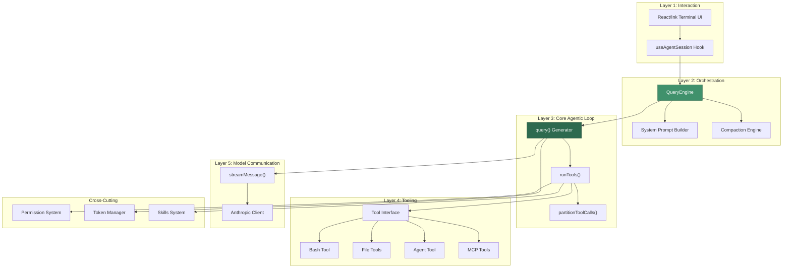
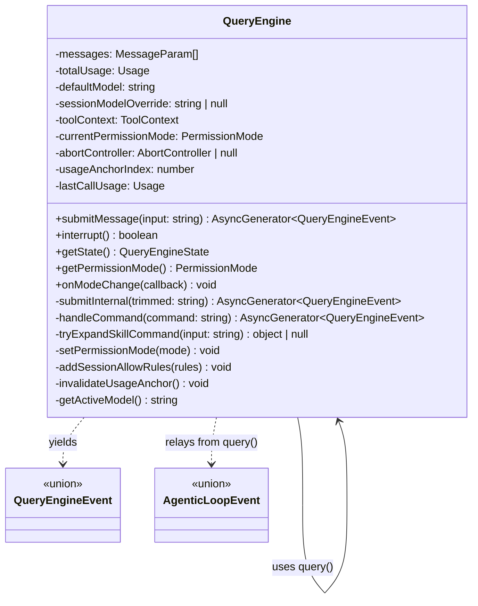
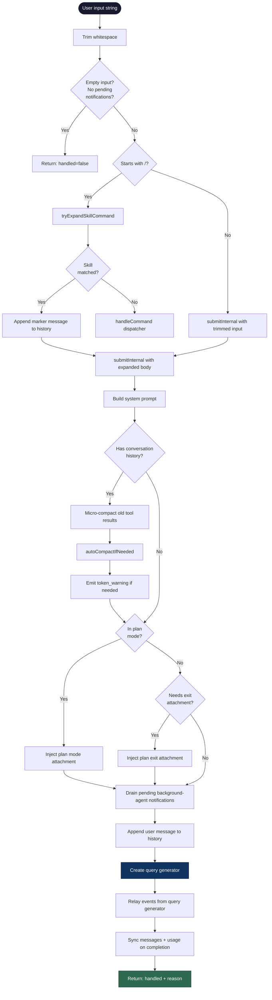
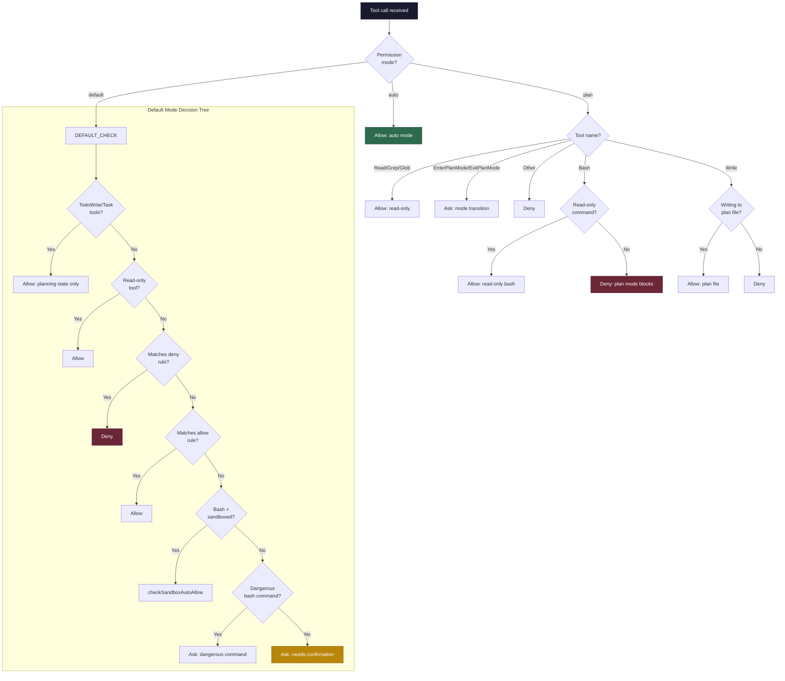
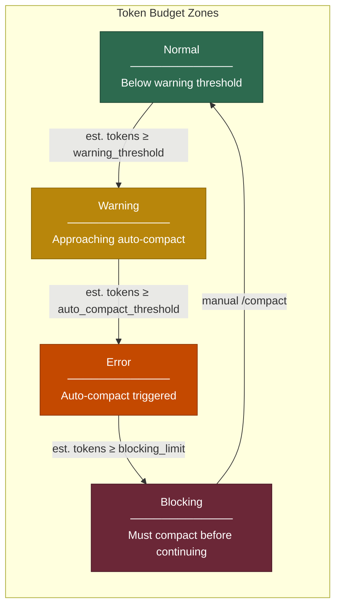
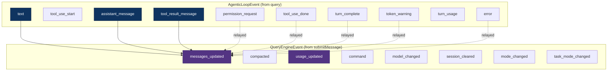
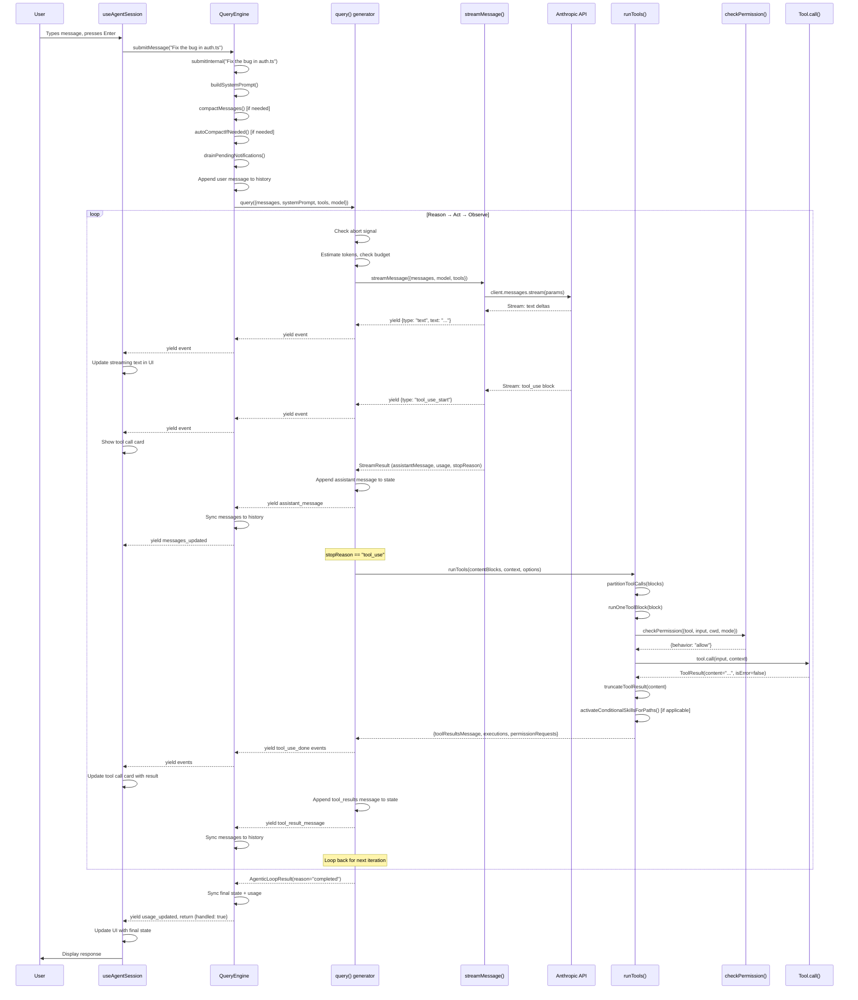
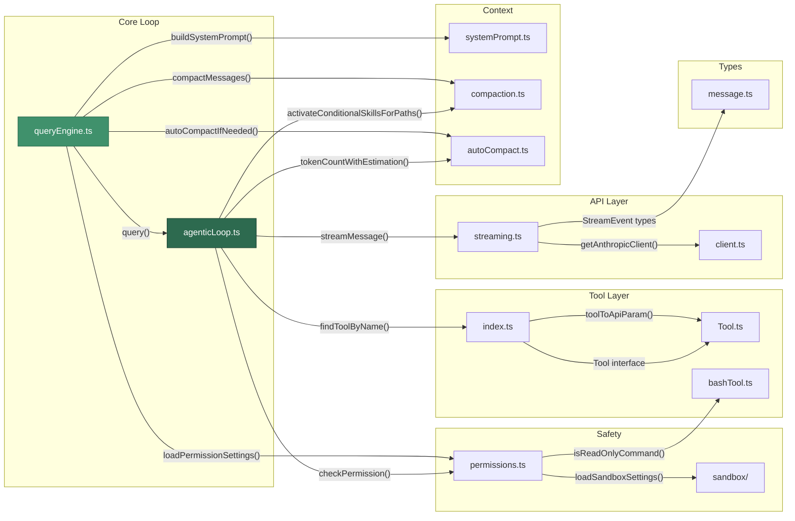
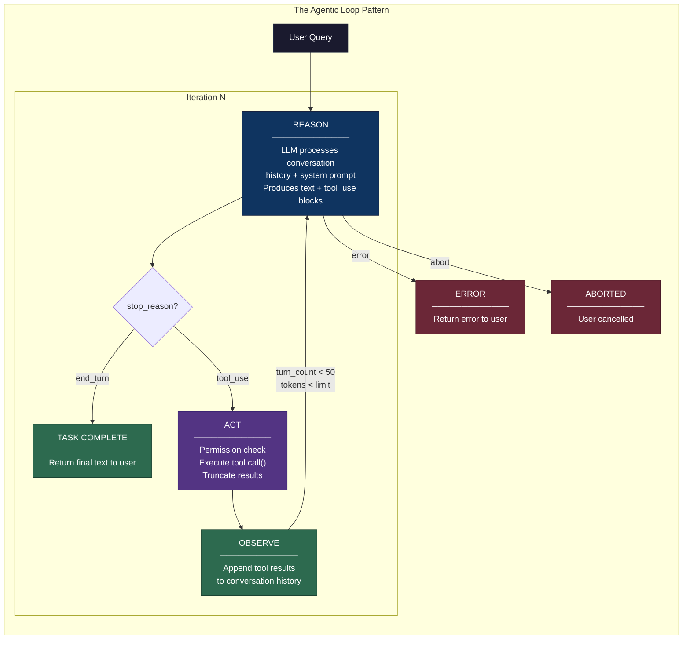

# Core Agentic Loop — Technical Deep Dive

## Table of Contents

1. [Module Overview](#1-module-overview)
2. [Architecture and Layer Position](#2-architecture-and-layer-position)
3. [File Map and Responsibilities](#3-file-map-and-responsibilities)
4. [Key Data Structures](#4-key-data-structures)
5. [The `query()` Generator — Heart of the Loop](#5-the-query-generator--heart-of-the-loop)
6. [The `QueryEngine` Class — Session-Level Orchestrator](#6-the-queryengine-class--session-level-orchestrator)
7. [Streaming Communication](#7-streaming-communication)
8. [Tool Execution Pipeline](#8-tool-execution-pipeline)
9. [Permission System Integration](#9-permission-system-integration)
10. [Token Management and Compaction](#10-token-management-and-compaction)
11. [Event System and Downstream Consumers](#11-event-system-and-downstream-consumers)
12. [Call Chain Analysis](#12-call-chain-analysis)
13. [How the Module Achieves the Agentic Loop](#13-how-the-module-achieves-the-agentic-loop)

---

## 1. Module Overview

The Core Agentic Loop is the autonomous execution engine of Agent Butler. It implements the fundamental **Reason → Act → Observe** pattern that transforms a single user query into a multi-step, tool-using, self-correcting agent session.

The module spans two primary files:

| File | Lines | Role |
|------|-------|------|
| `src/core/agenticLoop.ts` | 612 | Low-level loop: stream → tool call → observe → repeat |
| `src/core/queryEngine.ts` | 933 | High-level session orchestrator wrapping the loop |

The loop is backed by four critical subsystems:

- **Streaming Layer** (`src/services/api/streaming.ts`) — AsyncGenerator over the Anthropic Messages API
- **Tool System** (`src/tools/Tool.ts`, `src/tools/index.ts`) — Uniform tool interface and registry
- **Permission System** (`src/permissions/permissions.ts`) — Safety gating for every tool invocation
- **Context Management** (`src/context/compaction.ts`, `src/context/autoCompact.ts`) — Token budget and conversation compaction

---

## 2. Architecture and Layer Position

The Core Agentic Loop sits at **Layer 3** of the five-layer architecture, sandwiched between the tooling layer below and the orchestration layer above.



---

## 3. File Map and Responsibilities

### 3.1 Primary Files

| File | Description | Complexity |
|------|-------------|------------|
| `src/core/agenticLoop.ts` | The core Reason→Act→Observe loop. An async generator that streams LLM responses, executes tools, and loops until completion. | **612 lines, complex** |
| `src/core/queryEngine.ts` | Session-level wrapper managing conversation history, compaction, permissions, model switching, slash commands, and skill invocation. | **933 lines, complex** |

### 3.2 Direct Dependencies

| File | Role in the Loop |
|------|------------------|
| `src/services/api/streaming.ts` | Streams LLM responses as `AsyncGenerator<StreamEvent>`. Assembles content blocks from deltas. |
| `src/services/api/client.ts` | Anthropic SDK client singleton. Provides `getAnthropicClient()`. |
| `src/tools/Tool.ts` | Defines `Tool` interface, `ToolResult`, `ToolContext`, and `truncateToolResult()`. |
| `src/tools/index.ts` | Tool registry. `findToolByName()` for dispatch, `getToolsApiParams()` for API format. |
| `src/permissions/permissions.ts` | `checkPermission()` — the gatekeeper for every tool call. Returns allow/ask/deny. |
| `src/context/compaction.ts` | `compactMessages()` — summarizes old conversation to free token budget. |
| `src/context/autoCompact.ts` | `autoCompactIfNeeded()` — triggers compaction when token usage exceeds thresholds. |
| `src/context/systemPrompt.ts` | `buildSystemPrompt()` / `renderSystemPrompt()` — assembles the system prompt. |
| `src/services/skills/conditional.ts` | `activateConditionalSkillsForPaths()` — promotes skills when file patterns match. |
| `src/utils/tokens.ts` | `tokenCountWithEstimation()` — estimates token count for messages. |
| `src/types/message.ts` | Type definitions: `ContentBlock`, `ToolUseBlock`, `Usage`, `StreamEvent`. |

---

## 4. Key Data Structures

### 4.1 Core Types

```python
# Pseudocode representation of the key types

class TextBlock:
    type: "text"
    text: str

class ToolUseBlock:
    type: "tool_use"
    id: str           # Unique ID from the API (e.g. "toolu_01ABC...")
    name: str         # Tool name (e.g. "Read", "Bash", "Edit")
    input: dict       # Tool arguments parsed from streamed JSON

class ToolResultBlock:
    type: "tool_result"
    tool_use_id: str  # Must match a ToolUseBlock.id
    content: str
    is_error: bool

ContentBlock = TextBlock | ToolUseBlock | ToolResultBlock

class Usage:
    input_tokens: int
    output_tokens: int
    cache_creation_input_tokens: int | None
    cache_read_input_tokens: int | None

class ToolResult:
    content: str      # Human-readable output sent back to the model
    is_error: bool    # Whether this call produced an error

class ToolContext:
    cwd: str                          # Current working directory
    abort_signal: AbortSignal         # Cancellation
    set_permission_mode: Callable     # Switch mode at runtime
    get_permission_mode: Callable     # Query current mode
    session_id: str                   # Session identifier
    tool_use_id: str                  # Per-call correlation ID
    default_model: str                # Parent's active model
    # ... plus permission infrastructure for sub-agents
```

### 4.2 Loop State

```python
class LoopState:
    messages: list[MessageParam]  # Full conversation history
    turn_count: int               # Number of LLM calls made
    aborted: bool                 # Whether the loop was aborted

class AgenticLoopResult:
    state: LoopState
    usage: Usage                  # Total tokens consumed
    last_call_usage: Usage        # Tokens for the final turn
    reason: LoopTerminationReason # Why the loop stopped
```

### 4.3 Event Union

The `query()` generator yields a discriminated union of events:

```python
# AgenticLoopEvent variants
AgenticLoopEvent = (
    { type: "text", text: str }                                    # Streaming text delta
    | { type: "tool_use_start", id: str, name: str }               # Tool call begins
    | { type: "permission_request", request: PermissionRequest }   # Needs user approval
    | { type: "tool_use_done", id: str, name: str, input: dict,   # Tool call completes
        result: ToolResult }
    | { type: "assistant_message", message: MessageParam }         # Full assistant turn
    | { type: "tool_result_message", message: MessageParam }       # Tool results batch
    | { type: "turn_complete", reason: str, turn_count: int }      # Loop iteration done
    | { type: "token_warning", warning: TokenWarningResult }       # Approaching limits
    | { type: "turn_usage", turn_usage: Usage,                     # Per-turn token count
        cumulative_usage: Usage, turn_count: int }
    | { type: "error", error: Error }                              # Fatal error
)
```

---

## 5. The `query()` Generator — Heart of the Loop

The `query()` function in `agenticLoop.ts:432` is an **async generator** that implements the core Reason→Act→Observe loop for a single user query. It is the lowest-level loop in the system.

### 5.1 High-Level Flow

```mermaid
flowchart TD
    START([query called with messages + tools + model]) --> INIT[Initialize LoopState<br/>turnCount=0, copy messages]
    INIT --> CHECK_ABORT{abortSignal<br/>aborted?}

    CHECK_ABORT -->|Yes| ABORT[Return: reason=aborted]
    CHECK_ABORT -->|No| TOKEN_CHECK{turnCount > 0?}

    TOKEN_CHECK -->|Yes| ESTIMATE[Estimate token count<br/>tokenCountWithEstimation]
    TOKEN_CHECK -->|No| STREAM_CALL

    ESTIMATE --> WARNING[Calculate token warning state]
    WARNING --> BLOCKING{At blocking<br/>limit?}

    BLOCKING -->|Yes| BLOCK_ERR[Emit error +<br/>Return: reason=blocking_limit]
    BLOCKING -->|No| WARN_EMIT{Warning<br/>state?}

    WARN_EMIT -->|Not normal| YIELD_WARN[Emit token_warning event]
    WARN_EMIT -->|Normal| STREAM_CALL
    YIELD_WARN --> STREAM_CALL

    STREAM_CALL[Call streamMessage with messages + tools + model] --> STREAM_LOOP[Iterate stream events]

    STREAM_LOOP --> STREAM_DONE{Stream<br/>done?}

    STREAM_DONE -->|No| DISPATCH{Event type?}
    DISPATCH -->|text| YIELD_TEXT[Emit text event]
    DISPATCH -->|tool_use_start| YIELD_TOOL_START[Emit tool_use_start]
    DISPATCH -->|error| STREAM_ERR[Emit error, Return: model_error]

    YIELD_TEXT --> STREAM_LOOP
    YIELD_TOOL_START --> STREAM_LOOP

    STREAM_DONE -->|Yes| CHECK_RESULT{Stream result<br/>exists?}

    CHECK_RESULT -->|No| NULL_ERR[Return: model_error]
    CHECK_RESULT -->|Yes| ACCUMULATE[Accumulate usage totals<br/>Extract assistantContent + stopReason]

    ACCUMULATE --> BUILD_MSG[Build assistant MessageParam]
    BUILD_MSG --> ADD_TO_STATE[Append assistant message to state]
    ADD_TO_STATE --> YIELD_ASSISTANT[Emit assistant_message]
    YIELD_ASSISTANT --> YIELD_USAGE[Emit turn_usage]

    YIELD_USAGE --> STOP_CHECK{stopReason ==<br/>"tool_use"?}

    STOP_CHECK -->|No| COMPLETE[Return: reason=completed]
    STOP_CHECK -->|Yes| RUN_TOOLS[Call runTools with content blocks]

    RUN_TOOLS --> YIELD_PERMS[Emit permission_request events]
    YIELD_PERMS --> YIELD_TOOLS[Emit tool_use_done events]
    YIELD_TOOLS --> APPEND_RESULTS[Append tool_results message to state]
    APPEND_RESULTS --> NEXT_TURN[Loop back: turnCount++]

    NEXT_TURN --> CHECK_ABORT

    style START fill:#1a1a2e,stroke:#16213e,color:#fff
    style STREAM_CALL fill:#0f3460,stroke:#16213e,color:#fff
    style RUN_TOOLS fill:#533483,stroke:#2d1b69,color:#fff
    style COMPLETE fill:#2d6a4f,stroke:#1b4332,color:#fff
    style ABORT fill:#6b2737,stroke:#4a1a28,color:#fff
```

### 5.2 The Loop as Python Pseudocode

```python
async def query(params: QueryParams) -> AsyncGenerator[AgenticLoopEvent, AgenticLoopResult]:
    """
    Core agentic loop for one user query.
    
    Streams LLM responses, executes tool calls, and repeats until:
    - The model stops calling tools (completed)
    - The user aborts
    - Max turns reached
    - Token budget exhausted
    - A model error occurs
    """
    max_turns = params.max_turns or MAX_TOOL_TURNS  # 50
    state = LoopState(messages=copy(params.messages), turn_count=0, aborted=False)
    total_usage = Usage(input_tokens=0, output_tokens=0)
    last_call_usage = Usage(input_tokens=0, output_tokens=0)

    while state.turn_count < max_turns:
        # ── Guard: Abort check ──
        if params.abort_signal and params.abort_signal.aborted:
            yield TurnCompleteEvent(reason="aborted")
            return AgenticLoopResult(state, total_usage, last_call_usage, "aborted")

        turn_count = state.turn_count + 1

        # ── Guard: Token budget check (skip first turn) ──
        if state.turn_count > 0:
            estimated = estimate_tokens(state.messages, last_call_usage, params.system_prompt)
            warning = calculate_token_warning(estimated, params.model)

            if warning.state != "normal":
                yield TokenWarningEvent(warning)

            if warning.state == "blocking":
                yield ErrorEvent("Context window limit reached")
                yield TurnCompleteEvent(reason="blocking_limit")
                return AgenticLoopResult(state, total_usage, last_call_usage, "blocking_limit")

        # ── Reason: Call the LLM via streaming ──
        current_tools = params.get_tools() if params.get_tools else params.tools
        stream = stream_message(
            messages=state.messages,
            model=params.model,
            system=params.system_prompt,
            tools=current_tools,
            signal=params.abort_signal,
        )

        assistant_content = []
        stop_reason = ""

        async for event in stream:
            if event.type == "text":
                yield TextEvent(event.text)          # Forward to UI
            elif event.type == "tool_use_start":
                yield ToolUseStartEvent(event.id, event.name)
            elif event.type == "error":
                yield ErrorEvent(event.error)
                yield TurnCompleteEvent(reason="model_error")
                return ...
            elif event.type == "message_done":
                accumulate_usage(total_usage, event.usage)
                last_call_usage = copy(event.usage)
                assistant_content = event.assistant_message.content
                stop_reason = event.stop_reason

        # ── Build assistant message ──
        assistant_message = Message(role="assistant", content=assistant_content)
        state.messages.append(assistant_message)
        yield AssistantMessageEvent(assistant_message)
        yield TurnUsageEvent(last_call_usage, total_usage, turn_count)

        # ── Observe: Check if the model wants to use tools ──
        if stop_reason != "tool_use":
            yield TurnCompleteEvent(reason="completed")
            return AgenticLoopResult(state, total_usage, last_call_usage, "completed")

        # ── Act: Execute all tool calls ──
        tool_results_message, executions, permission_requests = await run_tools(
            assistant_content, params.tool_context, params.tool_options,
        )

        for req in permission_requests:
            yield PermissionRequestEvent(req)

        for execution in executions:
            yield ToolUseDoneEvent(execution)

        # ── Observe: Feed tool results back ──
        state.messages.append(tool_results_message)
        yield ToolResultMessageEvent(tool_results_message)

    # ── Max turns exhausted ──
    yield TurnCompleteEvent(reason="max_turns")
    return AgenticLoopResult(state, total_usage, last_call_usage, "max_turns")
```

### 5.3 Termination Reasons

The loop terminates for exactly one of five reasons:

| Reason | Trigger | Line |
|--------|---------|------|
| `completed` | `stopReason !== "tool_use"` — the model produced a final text response | `agenticLoop.ts:563` |
| `aborted` | `abortSignal.aborted === true` — user pressed Ctrl+C | `agenticLoop.ts:451` |
| `model_error` | Stream returned null or yielded an error event | `agenticLoop.ts:502, 532` |
| `max_turns` | `turnCount >= MAX_TOOL_TURNS` (50) | `agenticLoop.ts:605` |
| `blocking_limit` | Estimated tokens exceed the blocking threshold | `agenticLoop.ts:477` |

---

## 6. The `QueryEngine` Class — Session-Level Orchestrator

The `QueryEngine` class (`queryEngine.ts:80`) wraps the `query()` generator with session-level concerns: conversation history, compaction, model management, permission modes, slash commands, and skill invocation.

### 6.1 Class Structure



### 6.2 `submitMessage()` Flow



### 6.3 Command Dispatch

The `QueryEngine` intercepts slash commands before they reach the model:

| Command | Handler | Purpose |
|---------|---------|---------|
| `/help` | `handleCommand` | List available commands |
| `/clear` | `handleCommand` | Clear conversation history |
| `/cost` | `handleCommand` | Show token usage |
| `/model [name]` | `handleCommand` | Inspect/override session model |
| `/mode [mode]` | `handleCommand` | Switch permission mode |
| `/tasks [mode]` | `handleCommand` | Switch task system |
| `/compact [focus]` | `handleCommand` | Manual compaction |
| `/mcp [sub]` | `handleMcpCommand` | MCP server management |
| `/skills` | `handleSkillsCommand` | List loaded skills |
| `/agents` | `handleAgentsCommand` | List sub-agent definitions |
| `/history` | `handleCommand` | Show saved sessions |
| `/<skill-name>` | `tryExpandSkillCommand` | Invoke a skill |

---

## 7. Streaming Communication

The streaming layer (`streaming.ts:63`) wraps the Anthropic SDK's streaming API into an `AsyncGenerator<StreamEvent, StreamResult>`.

### 7.1 Stream Lifecycle

```mermaid
sequenceDiagram
    participant Loop as agenticLoop.query()
    participant Stream as streamMessage()
    participant SDK as Anthropic SDK
    participant API as Anthropic API

    Loop->>Stream: streamMessage(messages, model, tools)
    Stream->>SDK: client.messages.stream(params)
    SDK->>API: HTTP streaming request

    API-->>SDK: message_start (id, usage)
    SDK-->>Stream: event
    Stream-->>Loop: yield { type: "message_start", messageId }

    loop Content Block Assembly
        API-->>SDK: content_block_start (text/tool_use/thinking)
        SDK-->>Stream: event
        Stream-->>Loop: yield tool_use_start (if tool_use)

        loop Delta Accumulation
            API-->>SDK: content_block_delta (text/input_json/thinking)
            SDK-->>Stream: event
            Stream-->>Loop: yield { type: "text", text } or tool_use_input
        end

        API-->>SDK: content_block_stop
        SDK-->>Stream: event
        Note over Stream: Parse accumulated JSON for tool inputs
    end

    API-->>SDK: message_delta (stop_reason, usage)
    SDK-->>Stream: event
    Note over Stream: Capture final usage + stop_reason

    API-->>SDK: message_stop
    SDK-->>Stream: event
    Stream-->>Loop: yield { type: "message_done", stopReason, usage }

    Note over Loop: Returns StreamResult with assembled AssistantMessage
```

### 7.2 Content Block Assembly

The streaming layer must assemble fragmented deltas into complete content blocks. Tool input JSON is tracked **per-block-index** to handle overlapping blocks from some providers:

```python
# Pseudocode for the assembly process

content_blocks = []          # Indexed array of ContentBlock
tool_input_json = {}         # Map[block_index, accumulated_json_string]

for event in stream:
    if event.type == "content_block_start":
        index = event.index
        if event.block.type == "text":
            content_blocks[index] = TextBlock(text="")
        elif event.block.type == "tool_use":
            content_blocks[index] = ToolUseBlock(
                id=event.block.id,
                name=event.block.name,
                input=event.block.input or {}
            )
            tool_input_json[index] = ""
            yield ToolUseStartEvent(id, name)

    elif event.type == "content_block_delta":
        index = event.index
        if delta.type == "text_delta":
            content_blocks[index].text += delta.text
            yield TextEvent(delta.text)
        elif delta.type == "input_json_delta":
            tool_input_json[index] += delta.partial_json

    elif event.type == "content_block_stop":
        index = event.index
        block = content_blocks[index]
        if block.type == "tool_use":
            try:
                block.input = json.loads(tool_input_json[index])
            except:
                block.input = { "_raw": tool_input_json[index] }
            del tool_input_json[index]

return StreamResult(
    assistant_message=AssistantMessage(content=content_blocks),
    usage=usage,
    stop_reason=stop_reason,
)
```

---

## 8. Tool Execution Pipeline

When the model returns `stop_reason == "tool_use"`, the loop enters the tool execution phase.

### 8.1 Execution Flow

```mermaid
flowchart TD
    BLOCKS[Content blocks from assistant] --> FILTER[Filter for tool_use blocks]
    FILTER --> PARTITION[partitionToolCalls]

    PARTITION --> BATCH_LOOP[For each batch]

    BATCH_LOOP --> SAFETY{isConcurrencySafe<br/>and multiple blocks?}

    SAFETY -->|Yes| PARALLEL[runBlocksConcurrently<br/>Promise.all with MAX_CONCURRENCY=10]
    SAFETY -->|No| SERIAL[runBlocksSerially<br/>sequential await]

    PARALLEL --> RUN_ONE
    SERIAL --> RUN_ONE

    subgraph "runOneToolBlock"
        RUN_ONE[Lookup tool by name] --> FOUND{Tool<br/>found?}
        FOUND -->|No| UNKNOWN_ERR[Return error: Unknown tool]
        FOUND -->|Yes| PERM[checkPermission]

        PERM --> PERM_RESULT{Permission<br/>behavior?}

        PERM_RESULT -->|deny| DENY_RESULT[Return: Permission denied]
        PERM_RESULT -->|allow| EXECUTE
        PERM_RESULT -->|ask| ASK_FLOW

        ASK_FLOW --> HEADLESS{shouldAvoid<br/>PermissionPrompts?}
        HEADLESS -->|Yes| AUTO_DENY[Return headless denial message]
        HEADLESS -->|No| PROMPT[onPermissionRequest callback]

        PROMPT --> DECISION{User<br/>decision?}
        DECISION -->|deny| USER_DENY[Return: Permission denied]
        DECISION -->|allow_once| EXECUTE
        DECISION -->|allow_always| ADD_RULE[Add to session allow rules]
        ADD_RULE --> EXECUTE

        EXECUTE[tool.call(input, context)] --> TRUNCATE[truncateToolResult]
        TRUNCATE --> ACTIVATE{Success?<br/>Has file paths?}
        ACTIVATE -->|Yes| SKILLS[activateConditionalSkillsForPaths]
        ACTIVATE -->|No| RETURN_RESULT[Return ToolExecutionResult]
        SKILLS --> RETURN_RESULT
    end

    RUN_ONE --> COLLECT[Collect executions in order]
    COLLECT --> BUILD_MSG[Build tool_results MessageParam]
    BUILD_MSG --> RETURN_BATCH[Return: toolResultsMessage, executions, permissionRequests]

    style BLOCKS fill:#1a1a2e,stroke:#16213e,color:#fff
    style EXECUTE fill:#533483,stroke:#2d1b69,color:#fff
    style RETURN_BATCH fill:#2d6a4f,stroke:#1b4332,color:#fff
```

### 8.2 Batching Strategy

The `partitionToolCalls()` function groups tool_use blocks into ordered batches for optimal execution:

```python
def partition_tool_calls(blocks: list[ToolUseBlock]) -> list[ToolBatch]:
    """
    Group consecutive concurrency-safe blocks into parallel batches.
    Non-safe blocks become singleton serial batches.

    Example:
        [Read, Read, Bash, Read, Grep, Edit]
        → Batch 1: [Read, Read] (parallel)
        → Batch 2: [Bash] (serial)
        → Batch 3: [Read, Grep] (parallel)
        → Batch 4: [Edit] (serial)
    """
    batches = []
    for block in blocks:
        tool = find_tool_by_name(block.name)
        is_safe = tool and tool.is_concurrency_safe(block.input)

        last_batch = batches[-1] if batches else None

        if is_safe and last_batch and last_batch.is_concurrency_safe:
            last_batch.blocks.append(block)  # Extend existing parallel batch
        else:
            batches.append(ToolBatch(
                is_concurrency_safe=is_safe,
                blocks=[block],
            ))

    return batches
```

### 8.3 Concurrency Control

Parallel execution is capped at `MAX_TOOL_USE_CONCURRENCY = 10` simultaneous invocations:

```python
async def run_blocks_concurrently(blocks, context, options):
    if len(blocks) <= MAX_TOOL_USE_CONCURRENCY:
        return await Promise.all([run_one_tool(b, context, options) for b in blocks])

    # Chunk into groups of MAX_TOOL_USE_CONCURRENCY
    results = []
    for i in range(0, len(blocks), MAX_TOOL_USE_CONCURRENCY):
        chunk = blocks[i : i + MAX_TOOL_USE_CONCURRENCY]
        settled = await Promise.all([run_one_tool(b, context, options) for b in chunk])
        results.extend(settled)
    return results
```

---

## 9. Permission System Integration

Every tool call passes through `checkPermission()` before execution. The permission system implements a layered decision tree.

### 9.1 Permission Decision Tree



### 9.2 Headless Sub-Agent Denial

When a backgrounded sub-agent encounters an "ask" permission, there is no UI to prompt the user. The loop auto-denies with a descriptive message:

```python
def build_headless_denial_message(tool_name: str) -> str:
    return (
        f"Permission to use {tool_name} has been denied: this sub-agent is "
        "running in the background and cannot prompt the user for approval. "
        "You may attempt to accomplish this action with other tools that don't "
        "require approval, but do NOT try to bypass the denial in ways that "
        "defeat its intent. If this capability is essential to complete the "
        "task, STOP and report the blocked action in your final summary so the "
        "user can either pre-approve the tool or run the task in the foreground."
    )
```

---

## 10. Token Management and Compaction

The module includes sophisticated token budget management to stay within the model's context window.

### 10.1 Token Warning States



### 10.2 Compaction Flow

The `QueryEngine.submitInternal()` method runs compaction **before** invoking the loop:

```python
async def submit_internal(self, trimmed: str):
    # 1. Build preview system prompt for token estimation
    system_parts = await build_system_prompt(cwd=self.tool_context.cwd, user_query=trimmed)
    system_prompt = render_system_prompt(system_parts)

    if len(self.messages) > 0:
        # 2. Micro-compact: replace old tool results with placeholders
        micro_result = compact_messages(self.messages, options={...})
        if micro_result.did_micro_compact or micro_result.did_compact:
            self.messages = micro_result.messages
            yield CompactedEvent(summary=micro_result.summary, trigger="micro")

        # 3. Auto-compact: summarize old conversation if over threshold
        auto_result = auto_compact_if_needed(self.messages, self.active_model, {...})
        if auto_result.did_auto_compact:
            self.messages = auto_result.messages
            yield CompactedEvent(summary=auto_result.summary, trigger="auto")

        # 4. Emit warning if still approaching limits
        estimated = estimate_tokens(self.messages, ...)
        warning = calculate_token_warning(estimated, self.active_model)
        if warning.state != "normal":
            yield TokenWarningEvent(warning)

    # ... continue with plan attachments, notifications, and loop invocation
```

### 10.3 Compaction Strategy

When compaction triggers, the system:

1. **Micro-compact** (lightweight): Replaces old tool result content with `[Old tool result content cleared]` — no API call needed
2. **Full compact** (expensive): Sends the conversation to the LLM with a detailed summarization prompt, preserves the 8 most recent messages verbatim

```python
def compact_messages(messages, focus=None, options={}):
    # Step 1: Micro-compact old tool results
    micro_compacted = micro_compact_messages(messages)

    # Step 2: Check if full compaction is needed
    budget = build_token_budget_snapshot(micro_compacted, options)
    if not options.force and budget.estimated < budget.auto_compact_threshold:
        return CompactionResult(messages=micro_compacted, did_compact=False)

    # Step 3: Full compaction — summarize via LLM
    summary = summarize_messages(micro_compacted, focus)
    tail = find_preserved_tail(micro_compacted, desired_count=8)

    # Step 4: Build compacted conversation
    compacted = [
        Message(role="user", content=f"Session continued from previous conversation.\n\n{summary}"),
        CompactBoundaryMessage(type="auto", original_count=len(micro_compacted)),
        *tail,  # Preserve recent messages verbatim
    ]

    return CompactionResult(messages=compacted, summary=summary, did_compact=True)
```

---

## 11. Event System and Downstream Consumers

The module uses a two-tier event system to communicate state changes to the UI layer.

### 11.1 Event Hierarchy



### 11.2 Consumer: `useAgentSession` Hook

The React hook at `ui/hooks/useAgentSession.ts` is the primary consumer. It:

1. Creates a `QueryEngine` instance
2. Calls `submitMessage()` for each user input
3. Iterates the async generator, updating React state for each event
4. Renders the conversation, tool call cards, and status indicators

```python
# Simplified consumer loop
async def handle_submit(user_input: str):
    async for event in query_engine.submit_message(user_input):
        if event.type == "text":
            update_streaming_text(event.text)
        elif event.type == "tool_use_start":
            add_tool_call_card(event.id, event.name)
        elif event.type == "tool_use_done":
            mark_tool_call_complete(event.id, event.result)
        elif event.type == "assistant_message":
            append_to_conversation(event.message)
        elif event.type == "messages_updated":
            sync_message_history(event.messages)
        elif event.type == "usage_updated":
            update_token_display(event.total_usage)
        elif event.type == "compacted":
            show_compaction_notice(event.summary)
        elif event.type == "permission_request":
            show_permission_dialog(event.request)
        elif event.type == "token_warning":
            show_token_warning(event.warning)
        elif event.type == "turn_complete":
            handle_loop_end(event.reason)
```

---

## 12. Call Chain Analysis

### 12.1 Complete Call Chain: User Input → Tool Execution → Response



### 12.2 File Interaction Map



---

## 13. How the Module Achieves the Agentic Loop

The "agentic loop" is the fundamental pattern that distinguishes an agent from a simple chatbot. Instead of a single request-response exchange, the system autonomously executes multiple reasoning and action cycles until a task is complete. Here is how each piece of the module contributes to this pattern.

### 13.1 The Three Phases

The loop implements a classic **Reason → Act → Observe** cycle, mapped to concrete code:

| Phase | Implementation | Location |
|-------|---------------|----------|
| **Reason** | The LLM receives the full conversation (system prompt + history + user message) and produces a response that may include tool_use blocks. | `streamMessage()` in `streaming.ts` |
| **Act** | The `runTools()` function executes each tool_use block: permission check → `tool.call()` → result truncation. | `runTools()` / `runOneToolBlock()` in `agenticLoop.ts` |
| **Observe** | Tool results are formatted as `tool_result` blocks and appended to the conversation history, becoming part of the next "Reason" phase. | `agenticLoop.ts:597-602` |

### 13.2 The Continuation Decision

The critical decision point is at `agenticLoop.ts:563`:

```python
if stop_reason != "tool_use":
    yield TurnCompleteEvent(reason="completed")
    return result
```

When the model's `stop_reason` is `"tool_use"`, it means the model wants to execute tools before continuing. The loop obliges by running the tools and feeding results back. When the `stop_reason` is `"end_turn"` (or anything other than `"tool_use"`), the model has finished its reasoning and the loop terminates.

This is the **heartbeat of agency**: the model itself decides whether to continue or stop. The loop is merely the executor of the model's autonomous decisions.

### 13.3 Multi-Turn Context Accumulation

Each iteration of the loop appends new messages to the conversation history:

```python
# Turn 1: User asks a question
messages = [user_message]

# Turn 1: Model reasons and calls a tool
messages = [user_message, assistant_message_with_tool_use]

# Turn 1: Tool results are appended
messages = [user_message, assistant_message_with_tool_use, tool_results_message]

# Turn 2: Model sees tool results, reasons further, may call more tools
messages = [user_message, assistant_message_with_tool_use, tool_results_message, assistant_message_2]

# ... continues until model produces a final text response
```

This growing context is what gives the agent its "memory" within a single query. Each tool result informs subsequent reasoning, creating a chain of thought that builds toward the goal.

### 13.4 Safety Boundaries

The loop never executes tools blindly. Three safety mechanisms gate every tool call:

1. **Permission System** (`checkPermission()`): A layered decision tree that evaluates tool name, input arguments, current mode, user-defined rules, and sandbox settings before allowing execution.

2. **Token Budget** (`calculateTokenWarningState()`): Prevents the loop from running indefinitely by monitoring cumulative token usage and blocking when the context window is exhausted.

3. **Turn Limit** (`MAX_TOOL_TURNS = 50`): A hard cap on iterations to prevent runaway loops, even if token budget allows.

### 13.5 Graceful Degradation

The loop handles failures at every level without crashing:

- **Model errors**: Stream errors are caught and propagated as events; the loop terminates with `reason="model_error"`
- **Tool errors**: Individual tool failures return `ToolResult(isError=true)` — the model sees the error and can adapt
- **Unknown tools**: Return a descriptive error message rather than crashing
- **Permission denials**: Return a denial message so the model can try alternative approaches
- **Abort signals**: Checked at the top of every iteration for immediate cancellation

### 13.6 The Full Picture



The `QueryEngine` wraps this pattern with session-level intelligence: it manages conversation persistence, automatically compacts old messages when the context window fills, handles slash commands, expands skills, drains background-agent notifications, and enforces permission modes. But at its core, every user interaction eventually funnels into this single `query()` generator — a while loop that alternates between calling the LLM and executing tools until the model says it's done.

This is the essence of agentic behavior: **the model controls its own execution flow**. The loop infrastructure provides the scaffolding — streaming, tool dispatch, safety gates, memory management — but the decision to continue or stop rests entirely with the LLM at each iteration.
