# 03 — Tooling Layer: Technical Deep Dive

> **Scope:** `src/tools/`, `src/sandbox/`, `src/permissions/`
>
> The Tooling Layer is the fourth layer in Agent Butler's five-layer architecture.
> It sits between the Core Agentic Loop (above) and the Model Communication Layer
> (below), providing the agent's actionable capabilities — file operations, shell
> execution, search, sub-agent delegation, planning tools, and the safety
> infrastructure (permissions + sandboxing) that governs every tool invocation.

---

## Table of Contents

1. [Architectural Overview](#1-architectural-overview)
2. [Core Abstractions](#2-core-abstractions)
3. [Tool Registry](#3-tool-registry)
4. [Built-in Tools](#4-built-in-tools)
5. [Path Safety Utilities](#5-path-safety-utilities)
6. [Permission System](#6-permission-system)
7. [Sandbox Subsystem](#7-sandbox-subsystem)
8. [MCP Tool Integration](#8-mcp-tool-integration)
9. [Agentic Loop Integration](#9-agentic-loop-integration)
10. [Concurrency Model](#10-concurrency-model)
11. [Complete Data Flows](#11-complete-data-flows)
12. [How the Module Achieves the Tooling Layer](#12-how-the-module-achieves-the-tooling-layer)

---

## 1. Architectural Overview

The Tooling Layer is composed of three tightly-coupled subsystems:

| Subsystem | Directory | Responsibility |
|-----------|-----------|----------------|
| **Tool System** | `src/tools/` | Tool interface, registry, and 16 built-in tool implementations |
| **Permission System** | `src/permissions/` | Rule-based access control for every tool invocation |
| **Sandbox Subsystem** | `src/sandbox/` | macOS `sandbox-exec` wrapping for Bash commands |

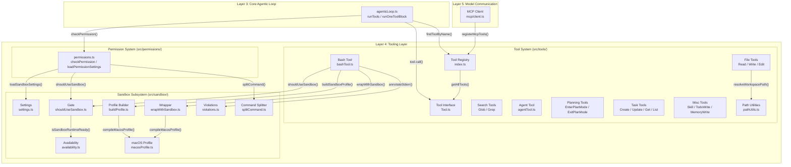

**Figure 1.1** — High-level architecture showing the three subsystems and their interactions with adjacent layers.

---

## 2. Core Abstractions

### 2.1 The `Tool` Interface

Every tool in the system implements the `Tool` interface defined in `src/tools/Tool.ts`.
This is the foundational contract that the agentic loop, permission system, and registry all depend on.

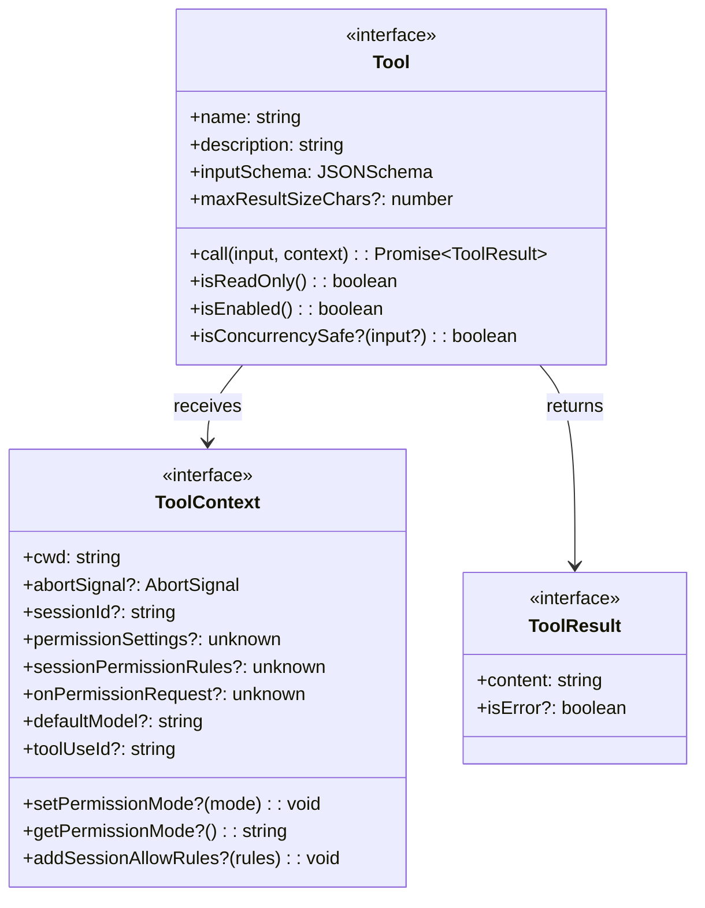

**Figure 2.1** — The `Tool`, `ToolContext`, and `ToolResult` interfaces.

#### Python Pseudocode: The Tool Interface

```python
from abc import ABC, abstractmethod
from dataclasses import dataclass
from typing import Any, Optional


@dataclass
class ToolResult:
    """Return value of a tool's call() method."""
    content: str          # Text sent back to the model
    is_error: bool = False


@dataclass
class ToolContext:
    """Runtime context passed to every tool invocation."""
    cwd: str
    abort_signal: Optional[Any] = None
    set_permission_mode: Optional[callable] = None
    get_permission_mode: Optional[callable] = None
    add_session_allow_rules: Optional[callable] = None
    session_id: Optional[str] = None
    permission_settings: Optional[Any] = None
    session_permission_rules: Optional[Any] = None
    on_permission_request: Optional[Any] = None
    default_model: Optional[str] = None
    tool_use_id: Optional[str] = None


class Tool(ABC):
    """The core tool abstraction. Every tool implements this interface."""

    @property
    @abstractmethod
    def name(self) -> str:
        """Unique tool name, sent to the API and used for lookup."""
        ...

    @property
    @abstractmethod
    def description(self) -> str:
        """Human-readable description shown to the model."""
        ...

    @property
    @abstractmethod
    def input_schema(self) -> dict:
        """JSON Schema describing the tool's input parameters."""
        ...

    @property
    def max_result_size_chars(self) -> int:
        """Maximum character count for tool result content. Default 100K."""
        return 100_000

    @abstractmethod
    async def call(self, input: dict[str, Any], context: ToolContext) -> ToolResult:
        """Execute the tool with the given input."""
        ...

    @abstractmethod
    def is_read_only(self) -> bool:
        """Whether this tool only reads data (no side effects)."""
        ...

    @abstractmethod
    def is_enabled(self) -> bool:
        """Whether this tool is available in the current environment."""
        ...

    def is_concurrency_safe(self, input: Optional[dict] = None) -> bool:
        """Whether this tool can run concurrently with other tools."""
        return False
```

#### Key Design Decisions

1. **`Record<string, unknown>` for input** — The interface uses a loose input type rather than generics to avoid a Zod dependency at this layer. Each tool casts internally.

2. **`isConcurrencySafe()` is optional** — Defaults to `false` for safety. Only read-only inspection tools (Read, Grep, Glob) and the Agent tool opt in. Mutating tools (Write, Edit, Bash, TodoWrite) must remain `false` to prevent interleaving writes.

3. **`ToolContext` carries permission infrastructure** — The `permissionSettings`, `sessionPermissionRules`, and `onPermissionRequest` fields are typed as `unknown` to avoid circular imports with `permissions.ts`. The Agent tool casts them at the call site.

4. **`toolUseId` for progress correlation** — Set fresh per call by `runTools()` in the agentic loop. The Agent tool uses it as the key for publishing live sub-agent progress to the UI store.

### 2.2 Helper Functions

```python
DEFAULT_MAX_RESULT_SIZE_CHARS = 100_000


def truncate_tool_result(content: str, max_chars: int | None = None) -> str:
    """Truncate tool result content to the specified max size."""
    limit = max_chars or DEFAULT_MAX_RESULT_SIZE_CHARS
    if len(content) <= limit:
        return content
    truncated = content[:limit]
    return f"{truncated}\n\n[Output truncated: {len(content)} chars total, showing first {limit}]"


def tool_to_api_param(tool: Tool) -> dict:
    """Convert a Tool to the Anthropic API 'tools' parameter format."""
    return {
        "name": tool.name,
        "description": tool.description,
        "input_schema": tool.input_schema,
    }
```

---

## 3. Tool Registry

The tool registry (`src/tools/index.ts`) maintains two separate collections:

1. **Built-in tools** — A compile-time constant array of 16 tool instances.
2. **MCP tools** — A mutable array populated at runtime from external MCP servers.

```mermaid
graph LR
    subgraph "Compile-time"
        BT[BUILTIN_TOOLS<br/>16 tool instances]
    end

    subgraph "Runtime"
        MT[mcpTools<br/>populated by MCP bootstrap]
    end

    subgraph "Public API"
        GA[getAllTools()<br/>BUILTIN + MCP, filtered by isEnabled]
        FN[findToolByName(name)<br/>lookup across both sets]
        GT[getToolsApiParams(mode)<br/>mode-aware API serialization]
        RM[registerMcpTools(tools)<br/>replace MCP registry]
        CM[clearMcpTools()<br/>drop MCP tools]
    end

    BT --> GA
    MT --> GA
    BT --> FN
    MT --> FN
    GA --> GT
    RM --> MT
    CM --> MT
```

**Figure 3.1** — Tool registry architecture with dual-collection design.

#### Python Pseudocode: Tool Registry

```python
from typing import Optional

# Compile-time constant
BUILTIN_TOOLS: list[Tool] = [
    file_read_tool, file_write_tool, file_edit_tool,
    glob_tool, grep_tool, bash_tool,
    memory_write_tool, todo_write_tool,
    task_create_tool, task_update_tool, task_get_tool, task_list_tool,
    enter_plan_mode_tool, exit_plan_mode_tool,
    skill_tool, agent_tool,
]

# Mutable runtime registry
_mcp_tools: list[Tool] = []


def register_mcp_tools(tools: list[Tool]) -> None:
    """Replace the registry of MCP-provided tools."""
    global _mcp_tools
    _mcp_tools = list(tools)


def clear_mcp_tools() -> None:
    """Drop the MCP-provided tools before re-registering."""
    global _mcp_tools
    _mcp_tools = []


def get_all_tools() -> list[Tool]:
    """Return built-in + MCP tools, filtered by isEnabled()."""
    return [t for t in (*BUILTIN_TOOLS, *_mcp_tools) if t.is_enabled()]


def find_tool_by_name(name: str) -> Optional[Tool]:
    """Lookup a tool by name across both collections."""
    for t in (*BUILTIN_TOOLS, *_mcp_tools):
        if t.name == name:
            return t
    return None


def get_tools_api_params(mode: Optional[str] = None) -> list[dict]:
    """
    Get tool API params with mode-aware Enter/Exit visibility.

    In plan mode: hide EnterPlanMode, show ExitPlanMode.
    Outside plan mode: show EnterPlanMode, hide ExitPlanMode.
    All other tools are always visible — enforcement happens at
    execution time in checkPermission().
    """
    tools = get_all_tools()
    if mode == "plan":
        return [tool_to_api_param(t) for t in tools if t.name != "EnterPlanMode"]
    return [tool_to_api_param(t) for t in tools if t.name != "ExitPlanMode"]
```

### 3.1 Mode-Aware Visibility

The registry implements a subtle but important design: **visibility ≠ permission**.

- `getToolsApiParams("plan")` hides `EnterPlanMode` from the model's tool list (the model can't enter plan mode when already in it).
- `getToolsApiParams("default")` hides `ExitPlanMode` (the model can't exit plan mode when not in it).
- All other tools remain visible regardless of mode. The permission system (`checkPermission()`) enforces what the model can actually *execute*.

This separation means the model always sees its full capability set (reducing confusion), while the permission system acts as the runtime guardrail.

---

## 4. Built-in Tools

### 4.1 Tool Inventory

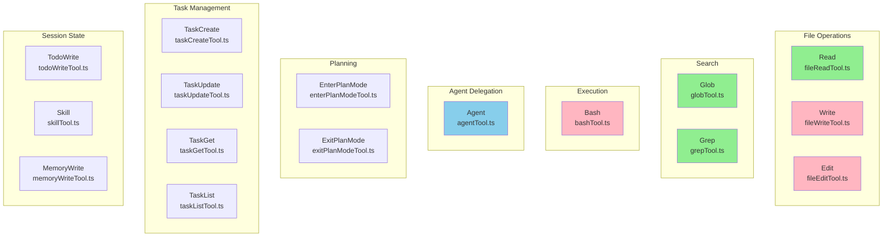

**Figure 4.1** — All 16 built-in tools organized by category. Green = read-only, pink = mutating, blue = delegation.

### 4.2 File Tools

#### 4.2.1 `Read` — `fileReadTool.ts`

| Property | Value |
|----------|-------|
| **Name** | `Read` |
| **Read-only** | `true` |
| **Concurrency-safe** | `true` |
| **Input** | `{ file_path: string, offset?: number, limit?: number }` |

Reads a file with optional line-range pagination. If `file_path` is a directory, returns a listing. All paths are resolved through `resolveWorkspacePath()` which enforces allowed roots (cwd + `~/.agent-butler`).

```python
async def read_call(input: dict, context: ToolContext) -> ToolResult:
    file_path = resolve_workspace_path(input["file_path"], context.cwd)

    if os.path.isdir(file_path):
        return ToolResult(content="\n".join(os.listdir(file_path)))

    lines = open(file_path).readlines()
    offset = input.get("offset", 0)
    limit = input.get("limit", 2000)
    selected = lines[offset : offset + limit]

    numbered = [f"{offset + i + 1}: {line}" for i, line in enumerate(selected)]
    return ToolResult(content="".join(numbered))
```

#### 4.2.2 `Write` — `fileWriteTool.ts`

| Property | Value |
|----------|-------|
| **Name** | `Write` |
| **Read-only** | `false` |
| **Concurrency-safe** | `false` |
| **Input** | `{ file_path: string, content: string }` |

Creates parent directories recursively, then writes the full content. Reports whether the file was "Created" or "Updated".

```python
async def write_call(input: dict, context: ToolContext) -> ToolResult:
    file_path = resolve_workspace_path(input["file_path"], context.cwd)
    is_new = not os.path.exists(file_path)

    os.makedirs(os.path.dirname(file_path), exist_ok=True)
    with open(file_path, "w") as f:
        f.write(input["content"])

    action = "Created" if is_new else "Updated"
    return ToolResult(content=f"{action} {file_path}")
```

#### 4.2.3 `Edit` — `fileEditTool.ts`

| Property | Value |
|----------|-------|
| **Name** | `Edit` |
| **Read-only** | `false` |
| **Concurrency-safe** | `false` |
| **Input** | `{ file_path: string, old_string: string, new_string: string }` |

Find-and-replace with **uniqueness enforcement**: `old_string` must match exactly once in the file. This prevents ambiguous edits. Normalizes smart quotes (curly → straight) for robustness.

```python
async def edit_call(input: dict, context: ToolContext) -> ToolResult:
    file_path = resolve_workspace_path(input["file_path"], context.cwd)
    old_string = normalize_smart_quotes(input["old_string"])
    new_string = input["new_string"]

    content = open(file_path).read()
    count = content.count(old_string)

    if count == 0:
        return ToolResult(content="Error: old_string not found", is_error=True)
    if count > 1:
        return ToolResult(
            content=f"Error: Found {count} matches. Provide more context.",
            is_error=True,
        )

    new_content = content.replace(old_string, new_string, 1)
    with open(file_path, "w") as f:
        f.write(new_content)

    diff = generate_diff_preview(old_string, new_string)
    return ToolResult(content=f"Applied edit:\n{diff}")
```

### 4.3 Search Tools

#### 4.3.1 `Glob` — `globTool.ts`

| Property | Value |
|----------|-------|
| **Name** | `Glob` |
| **Read-only** | `true` |
| **Concurrency-safe** | `true` |
| **Input** | `{ pattern: string, path?: string }` |

Prefers `rg --files --hidden -g <pattern>` (ripgrep) for speed, falls back to `find` if unavailable. Uses `execFile` with 1MB `maxBuffer`.

```python
async def glob_call(input: dict, context: ToolContext) -> ToolResult:
    pattern = input["pattern"]
    search_path = resolve_safe_path(input.get("path", "."), context.cwd)

    try:
        output = exec_file("rg", ["--files", "--hidden", "-g", pattern, search_path])
    except FileNotFoundError:
        output = exec_file("find", [search_path, "-name", pattern])

    files = output.strip().split("\n")
    return ToolResult(content="\n".join(files))
```

#### 4.3.2 `Grep` — `grepTool.ts`

| Property | Value |
|----------|-------|
| **Name** | `Grep` |
| **Read-only** | `true` |
| **Concurrency-safe** | `true` |
| **Input** | `{ pattern: string, path?: string, include?: string }` |

Prefers `rg -n --hidden [-g include] pattern path`, falls back to `grep -RIn`. Handles exit code 1 (no matches) gracefully.

```python
async def grep_call(input: dict, context: ToolContext) -> ToolResult:
    pattern = input["pattern"]
    search_path = resolve_safe_path(input.get("path", "."), context.cwd)
    include = input.get("include")

    args = ["-n", "--hidden"]
    if include:
        args.extend(["-g", include])
    args.extend([pattern, search_path])

    try:
        output = exec_file("rg", args)
    except ProcessExitCode as e:
        if e.code == 1:  # No matches
            return ToolResult(content="")
        raise

    return ToolResult(content=output)
```

### 4.4 Bash Tool — `bashTool.ts`

The most complex and powerful tool. Executes shell commands with full sandbox integration.

| Property | Value |
|----------|-------|
| **Name** | `Bash` |
| **Read-only** | `false` |
| **Concurrency-safe** | `false` |
| **Input** | `{ command: string, timeout?: number, dangerouslyDisableSandbox?: boolean }` |
| **Default timeout** | 120,000ms |
| **Max output** | 30,000 chars |

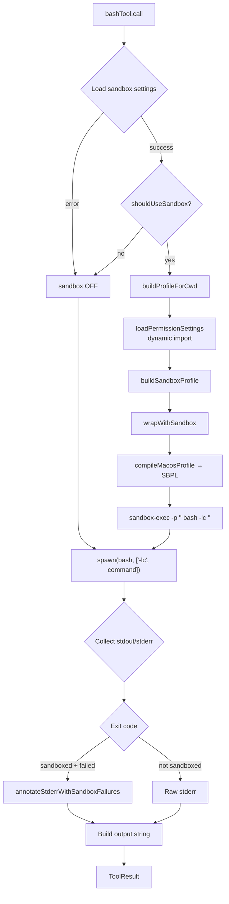

**Figure 4.4.1** — Bash tool execution flow with sandbox integration.

#### Python Pseudocode: Bash Tool

```python
READ_ONLY_COMMANDS = {
    "ls", "cat", "grep", "rg", "find", "fd", "pwd", "which",
    "git status", "git log", "git diff", "git show",
    "head", "tail", "wc", "sed",
}

DEFAULT_TIMEOUT_MS = 120_000
MAX_OUTPUT_CHARS = 30_000


def is_read_only_command(command: str) -> bool:
    """Check if ALL segments of a compound command are read-only."""
    segments = split_command_segments(command)  # split on &&, ||, |
    if not segments:
        return False
    return all(
        any(segment.startswith(roc) for roc in READ_ONLY_COMMANDS)
        for segment in segments
    )


async def bash_call(input: dict, context: ToolContext) -> ToolResult:
    command = input["command"]
    timeout = input.get("timeout", DEFAULT_TIMEOUT_MS)

    # 1. Load sandbox settings (per-call fresh)
    sandbox_settings = None
    try:
        sandbox_settings = await load_sandbox_settings(context.cwd)
    except Exception:
        pass

    # 2. Decide sandbox wrapping
    will_sandbox = (
        sandbox_settings is not None
        and should_use_sandbox(
            {"command": command, "dangerously_disable_sandbox": input.get("dangerously_disable_sandbox")},
            sandbox_settings,
        )
    )

    # 3. Build sandbox wrapper if needed
    executed_command = command
    if will_sandbox and sandbox_settings:
        profile = await build_profile_for_cwd(context.cwd, sandbox_settings)
        wrap = wrap_with_sandbox(command, profile)
        executed_command = wrap.wrapped_command

    # 4. Spawn process
    child = spawn("bash", ["-lc", executed_command], cwd=context.cwd)

    # 5. Collect output with timeout + abort support
    stdout, stderr = "", ""
    await child.wait(timeout=timeout)

    # 6. Annotate sandbox violations if applicable
    if will_sandbox:
        stderr = annotate_stderr_with_sandbox_failures(stderr, child.returncode)

    # 7. Build result
    output = (
        f"Command: {command}\n"
        f"Read-only: {is_read_only_command(command)}\n"
        f"Sandbox: {'enabled' if will_sandbox else 'disabled'}\n"
        f"Exit code: {child.returncode}\n"
        f"\nSTDOUT:\n{truncate_output(stdout)}"
        f"\nSTDERR:\n{truncate_output(stderr)}"
    )
    return ToolResult(content=output, is_error=(child.returncode != 0))
```

### 4.5 Agent Tool — `agentTool.ts`

The most complex tool (~626 lines). Delegates tasks to sub-agents via an isolated agentic loop.

| Property | Value |
|----------|-------|
| **Name** | `Agent` |
| **Read-only** | `true` (sub-agent's tools do their own permission checks) |
| **Concurrency-safe** | `true` (each sub-agent isolated by `tool_use_id`) |
| **Input** | `{ prompt, description, subagent_type?, model?, run_in_background?, isolation? }` |

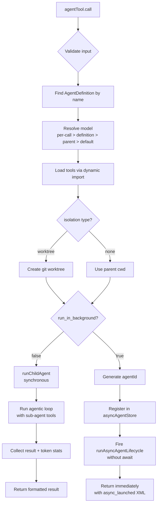

**Figure 4.5.1** — Agent tool execution flow showing synchronous and asynchronous paths.

#### Python Pseudocode: Agent Tool

```python
async def agent_call(input: dict, context: ToolContext) -> ToolResult:
    prompt = input["prompt"]
    description = input["description"]
    agent_type = input.get("subagent_type", "general")
    model = input.get("model") or context.default_model or DEFAULT_MODEL
    run_in_background = input.get("run_in_background", False)
    isolation = input.get("isolation", "none")

    # 1. Find agent definition
    agent_def = find_agent(agent_type)

    # 2. Resolve tools for this agent
    tools = load_all_tools()  # dynamic import to break circular deps

    # 3. Handle isolation
    cwd = context.cwd
    if isolation == "worktree":
        cwd = create_git_worktree(context.cwd)

    # 4. Build sub-agent context (inherits parent's permission infra)
    child_context = ToolContext(
        cwd=cwd,
        permission_settings=context.permission_settings,
        session_permission_rules=context.session_permission_rules,
        on_permission_request=context.on_permission_request,
    )

    if run_in_background:
        # Async path: fire and forget
        agent_id = generate_id()
        async_agent_store.register(agent_id, description)
        fire_and_forget(run_async_agent_lifecycle(agent_id, prompt, child_context))
        return ToolResult(content=f"<async_launched>{agent_id}</async_launched>")

    # Sync path: run and wait
    result = await run_child_agent(prompt, agent_def, tools, child_context, model)
    return format_agent_result(result)
```

### 4.6 Planning Tools

#### 4.6.1 `EnterPlanMode` — `enterPlanModeTool.ts`

| Property | Value |
|----------|-------|
| **Name** | `EnterPlanMode` |
| **Read-only** | `false` (triggers mode change) |
| **Input** | `{ reason: string }` |

Always requires user confirmation (`behavior: "ask"` in permission system). Switches the permission mode to `"plan"`, which restricts subsequent tool usage to read-only operations and plan file writes.

#### 4.6.2 `ExitPlanMode` — `exitPlanModeTool.ts`

| Property | Value |
|----------|-------|
| **Name** | `ExitPlanMode` |
| **Read-only** | `false` |
| **Input** | `{ summary, allowedPrompts? [{tool, prompt}], plan? }` |

Converts `allowedPrompts` into session-level allow rules (e.g., `Bash(npm test *)`), restores mode to `"default"`, and returns the approved plan content.

### 4.7 Task Management Tools

A V2 task management system with persistent storage in `~/.agent-butler/tasks/`.

| Tool | Name | Read-only | Description |
|------|------|-----------|-------------|
| `taskCreateTool` | `TaskCreate` | `false` | Creates a task in the persistent task graph |
| `taskUpdateTool` | `TaskUpdate` | `false` | Updates task fields, handles cascading deletes |
| `taskGetTool` | `TaskGet` | `true` | Returns full task details |
| `taskListTool` | `TaskList` | `true` | Returns compact summary of all tasks |

All task tools are gated by `isTaskModeEnabled()` and are always allowed by the permission system (they only mutate planning state, not the user's workspace).

### 4.8 Session State Tools

#### `TodoWrite` — `todoWriteTool.ts`

Full-replace semantics: each call replaces the entire todo list. When all items are "completed", auto-clears. Mutates in-memory `todoStore` keyed by `sessionId`. Gated by `isTodoModeEnabled()` (mutually exclusive with Task V2 tools).

#### `Skill` — `skillTool.ts`

Loads a `SKILL.md` from the registry, substitutes `$ARGUMENTS`, `${CLAUDE_SKILL_DIR}`, `${CLAUDE_SESSION_ID}`. Injects the skill's `allowed-tools` whitelist into session-allow rules.

#### `MemoryWrite` — `memoryWriteTool.ts`

Writes durable project memory via `writeProjectMemory()`. Supports types: `user`, `feedback`, `project`, `reference`.

---

## 5. Path Safety Utilities

`src/tools/pathUtils.ts` provides the path resolution and enforcement functions used by all file tools.

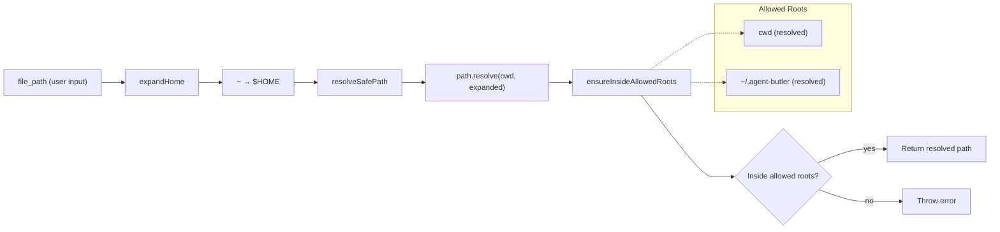

**Figure 5.1** — Path resolution and enforcement flow.

#### Python Pseudocode: Path Utilities

```python
import os
from pathlib import Path


def get_tool_allowed_roots(cwd: str) -> list[str]:
    """Return the two allowed root directories."""
    return [str(Path(cwd).resolve()), str(Path(get_agent_butler_home()).resolve())]


def expand_home(file_path: str) -> str:
    """Replace leading ~ with $HOME."""
    if file_path.startswith("~"):
        return file_path.replace("~", os.environ.get("HOME", ""), 1)
    return file_path


def resolve_safe_path(file_path: str, cwd: str) -> str:
    """Resolve a file path relative to cwd, expanding ~."""
    return str(Path(cwd) / expand_home(file_path))


def ensure_inside_allowed_roots(resolved_path: str, cwd: str) -> None:
    """Throw if the path escapes the allowed roots."""
    normalized = str(Path(resolved_path).resolve())
    for root in get_tool_allowed_roots(cwd):
        try:
            Path(normalized).relative_to(root)
            return  # Inside this root — OK
        except ValueError:
            continue
    raise PathViolationError(
        f"Path is outside allowed roots: {resolved_path}. "
        f"Allowed: {', '.join(get_tool_allowed_roots(cwd))}"
    )


def resolve_workspace_path(file_path: str, cwd: str) -> str:
    """Resolve + guard. Used by all file tools."""
    resolved = resolve_safe_path(file_path, cwd)
    ensure_inside_allowed_roots(resolved, cwd)
    return resolved
```

This two-root model (project cwd + `~/.agent-butler`) prevents the agent from reading or writing arbitrary files on the host filesystem. Every file tool calls `resolveWorkspacePath()` before any I/O.

---

## 6. Permission System

The permission system (`src/permissions/permissions.ts`) is the runtime gatekeeper for every tool invocation. It implements a multi-layered decision tree that balances safety with usability.

### 6.1 Type System

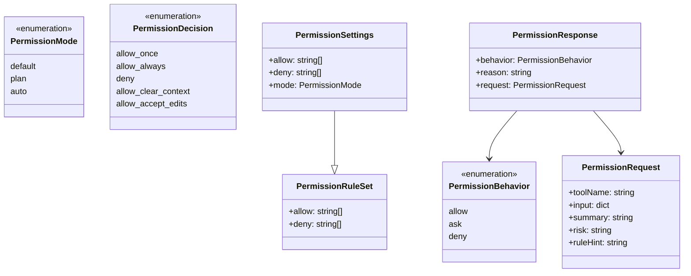

**Figure 6.1** — Permission system type hierarchy.

### 6.2 Settings Loading

Permission settings are loaded from two JSON files and merged:

| Source | Path | Override Priority |
|--------|------|-------------------|
| User | `~/.agent-butler/settings.json` | Lower |
| Project | `<cwd>/.agent-butler/settings.json` | Higher |

```python
async def load_permission_settings(cwd: str) -> PermissionSettings:
    user_path, project_path = get_settings_paths(cwd)

    user_settings = await read_permissions_from_settings(user_path)
    project_settings = await read_permissions_from_settings(project_path)

    return PermissionSettings(
        allow=[*DEFAULT_ALLOW, *user_settings.allow, *project_settings.allow],
        deny=[*DEFAULT_DENY, *user_settings.deny, *project_settings.deny],
        mode=project_settings.mode or user_settings.mode or "default",
    )
```

The system **throws on JSON parse errors** (rather than silently falling back) because a syntactically broken `settings.json` shouldn't silently reduce the permissions the user configured.

### 6.3 Rule Matching

Rules follow the format `ToolName(pattern)` where the pattern depends on the tool:

| Rule Format | Example | Matches |
|-------------|---------|---------|
| `ToolName` (simple) | `Bash` | All invocations of that tool |
| `ToolName(pattern)` | `Bash(npm *)` | Bash commands matching the wildcard |
| `ToolName(name)` | `Skill(review:*)` | Skill names matching the wildcard |
| `mcp__server__*` | `mcp__github__*` | All tools from an MCP server |

```python
def matches_permission_rule(rule: str, tool_name: str, input: dict) -> bool:
    normalized = rule.strip()
    if not normalized:
        return False

    # Simple match: rule == tool name
    if normalized == tool_name:
        return True

    # MCP wildcard: mcp__github__* matches all github tools
    if normalized.startswith("mcp__") and "*" in normalized:
        return wildcard_to_regex(normalized).match(tool_name) is not None

    # Parameterized: ToolName(pattern)
    match = re.match(r"^([A-Za-z]+)\((.*)\)$", normalized)
    if not match:
        return False

    rule_tool, pattern = match.groups()
    if rule_tool != tool_name:
        return False

    if tool_name == "Bash":
        command = input.get("command", "").strip()
        return wildcard_to_regex(pattern.strip()).match(command) is not None

    if tool_name == "Skill":
        skill_name = input.get("skill", "").strip()
        if "*" in pattern:
            return wildcard_to_regex(pattern.strip()).match(skill_name) is not None
        return pattern.strip() == skill_name

    return False
```

### 6.4 The `checkPermission()` Decision Tree

This is the core decision function. It implements a 10-step priority cascade:

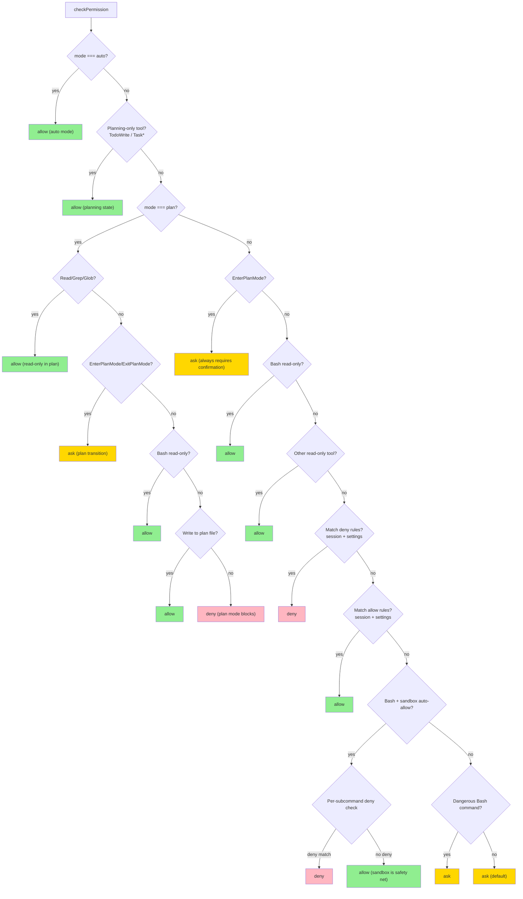

**Figure 6.4.1** — The `checkPermission()` decision tree. Green = allow, Red = deny, Yellow = ask (requires user confirmation).

#### Python Pseudocode: checkPermission

```python
PLAN_ALLOWED_TOOLS = {"Read", "Grep", "Glob"}

DANGEROUS_BASH_PREFIXES = [
    "rm ", "sudo ", "chmod ", "chown ", "mv ", "dd ", "mkfs",
    "shutdown", "reboot", "init 0", "init 6",
    "git push", "git reset --hard", "git clean -fd",
]


async def check_permission(tool, input, cwd, mode=None,
                           session_rules=None, settings=None) -> PermissionResponse:
    settings = settings or await load_permission_settings(cwd)
    mode = mode or settings.mode
    session_rules = session_rules or PermissionRuleSet(allow=[], deny=[])

    request = build_permission_request(tool, input)

    # Step 1: Auto mode allows everything
    if mode == "auto":
        return PermissionResponse(behavior="allow", reason="auto mode", request=request)

    # Step 2: Planning-only tools always allowed
    if tool.name in ("TodoWrite", "TaskCreate", "TaskUpdate", "TaskGet", "TaskList"):
        return PermissionResponse(behavior="allow", reason="planning state", request=request)

    # Step 3: Plan mode restrictions
    if mode == "plan":
        if tool.name in PLAN_ALLOWED_TOOLS:
            return PermissionResponse(behavior="allow", reason="read-only in plan", request=request)
        if tool.name in ("EnterPlanMode", "ExitPlanMode"):
            return PermissionResponse(behavior="ask", reason="plan transition", request=request)
        if tool.name == "Bash" and is_read_only_command(input.get("command", "")):
            return PermissionResponse(behavior="allow", reason="read-only bash in plan", request=request)
        if tool.name == "Write" and is_plan_file(input.get("file_path", "")):
            return PermissionResponse(behavior="allow", reason="plan file write", request=request)
        return PermissionResponse(behavior="deny", reason=f"plan mode blocks {tool.name}", request=request)

    # Step 4: EnterPlanMode always requires confirmation
    if tool.name == "EnterPlanMode":
        return PermissionResponse(behavior="ask", reason="entering plan mode", request=request)

    # Step 5-6: Read-only tools allowed
    if tool.name == "Bash" and is_read_only_command(input.get("command", "")):
        return PermissionResponse(behavior="allow", reason="read-only bash", request=request)
    if tool.name != "Bash" and tool.is_read_only():
        return PermissionResponse(behavior="allow", reason="read-only tool", request=request)

    # Step 7: Deny rules
    if matches_any_rule(session_rules.deny, tool.name, input) or \
       matches_any_rule(settings.deny, tool.name, input):
        return PermissionResponse(behavior="deny", reason="matched deny rule", request=request)

    # Step 8: Allow rules
    if matches_any_rule(session_rules.allow, tool.name, input) or \
       matches_any_rule(settings.allow, tool.name, input):
        return PermissionResponse(behavior="allow", reason="matched allow rule", request=request)

    # Step 9: Sandbox auto-allow (Bash only)
    if tool.name == "Bash":
        sandbox_settings = await load_sandbox_settings(cwd)
        if (sandbox_settings.enabled
            and sandbox_settings.auto_allow_bash_if_sandboxed
            and should_use_sandbox(input, sandbox_settings)):
            return check_sandbox_auto_allow(input["command"], settings, session_rules)

    # Step 10: Dangerous commands require confirmation
    if tool.name == "Bash" and is_dangerous_bash_command(input.get("command", "")):
        return PermissionResponse(behavior="ask", reason="dangerous command", request=request)

    # Default: ask for confirmation
    return PermissionResponse(behavior="ask", reason="requires confirmation", request=request)
```

### 6.5 Sandbox Auto-Allow Path

When the sandbox is enabled and `autoAllowBashIfSandboxed` is `true`, Bash commands can bypass the user confirmation dialog — but only after passing per-subcommand deny checks:

```python
def check_sandbox_auto_allow(command, settings, session_rules) -> PermissionResponse:
    all_deny = [*session_rules.deny, *settings.deny]
    all_allow = [*session_rules.allow, *settings.allow]

    # Split compound command for per-subcommand checking
    subcommands = split_command(command)

    # Pass 1: deny on ANY subcommand wins
    for sub in subcommands:
        deny_rule = find_first_matching_rule(all_deny, "Bash", {"command": sub})
        if deny_rule:
            return PermissionResponse(behavior="deny",
                reason=f'subcommand "{sub}" matched deny rule "{deny_rule}"')

    # Full-command deny check (covers wildcards like Bash(*evil*))
    full_deny = find_first_matching_rule(all_deny, "Bash", {"command": command})
    if full_deny:
        return PermissionResponse(behavior="deny",
            reason=f'command matched deny rule "{full_deny}"')

    # Pass 2: allow on any subcommand
    for sub in subcommands:
        allow_rule = find_first_matching_rule(all_allow, "Bash", {"command": sub})
        if allow_rule:
            return PermissionResponse(behavior="allow",
                reason=f'subcommand "{sub}" matched allow rule "{allow_rule}"')

    # No deny/ask matches → allow (sandbox is the safety net)
    return PermissionResponse(behavior="allow",
        reason="auto-allowed inside sandbox")
```

---

## 7. Sandbox Subsystem

The sandbox subsystem provides defense-in-depth for Bash command execution using macOS's `sandbox-exec` (Seatbelt) facility.

### 7.1 Architecture Overview

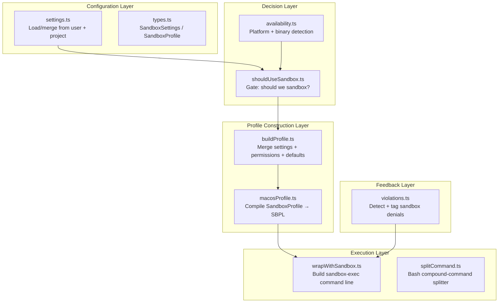

**Figure 7.1** — Sandbox subsystem architecture with five logical layers.

### 7.2 Types

```python
@dataclass
class SandboxFilesystemSettings:
    allow_write: list[str] = field(default_factory=list)
    deny_write: list[str] = field(default_factory=list)
    allow_read: list[str] = field(default_factory=list)
    deny_read: list[str] = field(default_factory=list)


@dataclass
class SandboxNetworkSettings:
    allowed_domains: list[str] = field(default_factory=list)
    denied_domains: list[str] = field(default_factory=list)


@dataclass
class SandboxSettings:
    """What the user writes in settings.json."""
    enabled: bool | None = None           # Default: False (opt-in)
    auto_allow_bash_if_sandboxed: bool | None = None  # Default: True
    allow_unsandboxed_commands: bool | None = None     # Default: True
    excluded_commands: list[str] = field(default_factory=list)
    filesystem: SandboxFilesystemSettings = field(default_factory=SandboxFilesystemSettings)
    network: SandboxNetworkSettings = field(default_factory=SandboxNetworkSettings)


@dataclass
class SandboxProfile:
    """What sandbox-exec receives. All paths are absolute."""
    filesystem: dict[str, list[str]]  # {allowWrite, denyWrite, allowRead, denyRead}
    network: dict[str, list[str]]     # {allowedDomains, deniedDomains}
```

### 7.3 Settings Loading and Merging

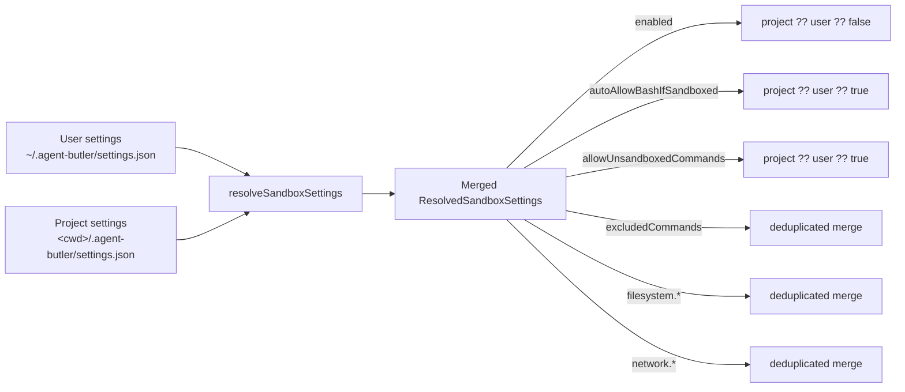

**Figure 7.3.1** — Settings merge strategy. Project overrides user; string arrays are merged with deduplication.

```python
async def load_sandbox_settings(cwd: str) -> ResolvedSandboxSettings:
    user_path, project_path = get_settings_paths(cwd)
    user_sandbox = await read_sandbox_from_file(user_path)
    project_sandbox = await read_sandbox_from_file(project_path)
    return resolve_sandbox_settings(user_sandbox, project_sandbox)


def resolve_sandbox_settings(user: SandboxSettings, project: SandboxSettings) -> ResolvedSandboxSettings:
    return ResolvedSandboxSettings(
        enabled=project.enabled if project.enabled is not None else (user.enabled or False),
        auto_allow_bash_if_sandboxed=project.auto_allow_bash_if_sandboxed
            if project.auto_allow_bash_if_sandboxed is not None
            else (user.auto_allow_bash_if_sandboxed or True),
        allow_unsandboxed_commands=project.allow_unsandboxed_commands
            if project.allow_unsandboxed_commands is not None
            else (user.allow_unsandboxed_commands or True),
        excluded_commands=merge_string_arrays(user.excluded_commands, project.excluded_commands),
        filesystem={
            "allow_write": merge_string_arrays(user.filesystem.allow_write, project.filesystem.allow_write),
            "deny_write": merge_string_arrays(user.filesystem.deny_write, project.filesystem.deny_write),
            "allow_read": merge_string_arrays(user.filesystem.allow_read, project.filesystem.allow_read),
            "deny_read": merge_string_arrays(user.filesystem.deny_read, project.filesystem.deny_read),
        },
        network={
            "allowed_domains": merge_string_arrays(user.network.allowed_domains, project.network.allowed_domains),
            "denied_domains": merge_string_arrays(user.network.denied_domains, project.network.denied_domains),
        },
    )
```

### 7.4 Availability Detection

```python
# Cached after first call — sandbox availability doesn't change during process lifetime
_cached_supported: bool | None = None


def is_platform_supported() -> bool:
    """Only macOS supports sandbox-exec."""
    return sys.platform == "darwin"


def is_sandbox_exec_available() -> bool:
    """Check if /usr/bin/sandbox-exec exists."""
    try:
        subprocess.run(["/usr/bin/which", "sandbox-exec"], capture_output=True, check=True)
        return True
    except subprocess.CalledProcessError:
        return False


def is_sandbox_runtime_ready() -> bool:
    """Fast, cached check. Used on every Bash invocation."""
    global _cached_supported
    if _cached_supported is not None:
        return _cached_supported
    _cached_supported = is_platform_supported() and is_sandbox_exec_available()
    return _cached_supported
```

### 7.5 Sandbox Decision Gate

```python
def should_use_sandbox(input: dict, settings: ResolvedSandboxSettings) -> bool:
    """Gate that decides whether a Bash invocation should be sandboxed."""
    if not settings.enabled:
        return False
    if not is_sandbox_runtime_ready():
        return False
    if input.get("dangerously_disable_sandbox") and settings.allow_unsandboxed_commands:
        return False
    if not input.get("command"):
        return False
    if contains_excluded_command(input["command"], settings.excluded_commands):
        return False
    return True
```

### 7.6 Profile Building — The Unified Abstraction

The profile builder (`buildProfile.ts`) merges three input sources into a single `SandboxProfile`:

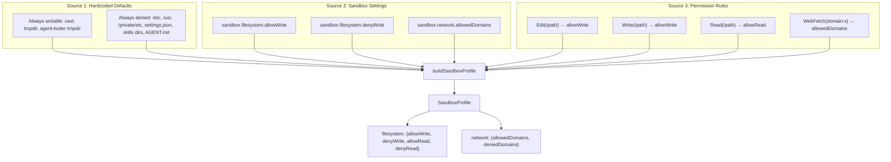

**Figure 7.6.1** — Three-source merge in `buildSandboxProfile()`.

This is the **"unified abstraction"** design point: a single permission rule like `Edit(/src)` contributes to BOTH the permission system (allowing the Edit tool) AND the sandbox profile (allowing writes to `/src` in the sandbox). No double-configuration required.

```python
def build_sandbox_profile(cwd: str, settings: ResolvedSandboxSettings,
                          permissions: PermissionRules) -> SandboxProfile:
    # Source 1: Hardcoded defaults
    allow_write = {canonicalize(cwd), canonicalize(os_tmpdir()),
                   canonicalize(join(os_tmpdir(), "agent-butler"))}
    deny_write = {canonicalize(p) for p in SYSTEM_DENY_PATHS}
    deny_write |= {canonicalize(p) for p in get_critical_deny_paths(cwd)}

    allow_read, deny_read = set(), set()
    allowed_domains, denied_domains = set(), set()

    # Source 2: Sandbox settings (verbatim)
    for p in settings.filesystem.allow_write:
        allow_write.add(canonicalize(resolve_rule_path(p, cwd)))
    for p in settings.filesystem.deny_write:
        deny_write.add(canonicalize(resolve_rule_path(p, cwd)))
    # ... (same for allow_read, deny_read, network)

    # Source 3: Permission rules → sandbox config
    for rule in permissions.allow:
        parsed = parse_rule(rule)
        if not parsed:
            continue
        if parsed.tool_name in ("Edit", "Write"):
            allow_write.add(canonicalize(strip_glob(resolve_rule_path(parsed.content, cwd))))
        elif parsed.tool_name == "Read":
            allow_read.add(canonicalize(strip_glob(resolve_rule_path(parsed.content, cwd))))
        elif parsed.tool_name == "WebFetch" and parsed.content.startswith("domain:"):
            allowed_domains.add(parsed.content[len("domain:"):])

    # ... (same for deny rules)

    return SandboxProfile(
        filesystem={"allow_write": list(allow_write), "deny_write": list(deny_write),
                    "allow_read": list(allow_read), "deny_read": list(deny_read)},
        network={"allowed_domains": list(allowed_domains), "denied_domains": list(denied_domains)},
    )
```

### 7.7 macOS SBPL Compilation

The macOS profile compiler (`macosProfile.ts`) converts a `SandboxProfile` into Seatbelt Policy Language (SBPL), a Scheme-like DSL consumed by `sandbox-exec -p '...'`.

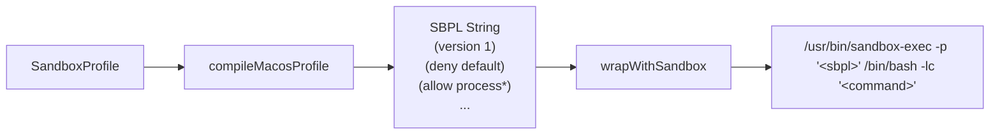

**Figure 7.7.1** — SBPL compilation and wrapping.

Key SBPL properties:
- **Deny-default**: Everything is denied unless explicitly allowed.
- **Last-match-wins**: Later rules override earlier ones. We emit `(allow file-write*)` FIRST, then `(deny file-write*)` for critical paths — so deny wins on overlapping paths.
- **All reads allowed**: Tutorial simplification. Production systems restrict reads too.

```python
def compile_macos_profile(profile: SandboxProfile) -> str:
    """Compile SandboxProfile → SBPL string."""
    writable = " ".join(subpath(p) for p in profile.filesystem["allow_write"])
    deny_write = " ".join(subpath(p) for p in profile.filesystem["deny_write"])
    network_allow_all = len(profile.network["allowed_domains"]) > 0

    lines = [
        "(version 1)",
        "(deny default)",
        "(allow process*)",
        "(allow signal)",
        "(allow mach-lookup)",
        "(allow ipc-posix-shm)",
        "(allow sysctl-read)",
        "(allow file-read*)",
    ]

    if writable:
        lines.append(f"(allow file-write* {writable})")
    if deny_write:
        lines.append(f"(deny file-write* {deny_write})")

    if network_allow_all:
        lines.append("(allow network*)")
    else:
        lines.append("(deny network-outbound) (allow network-bind (local ip))")

    return "\n".join(lines)
```

### 7.8 Violation Detection

Since macOS `sandbox-exec` writes denials to syslog (not stderr), Agent Butler uses heuristic detection:

```python
SANDBOX_VIOLATION_INDICATORS = [
    "Operation not permitted", "operation not permitted",
    "sandbox-exec:", "deny file-write", "deny network-outbound",
    "EPERM", "EACCES",
]


def annotate_stderr_with_sandbox_failures(stderr: str, exit_code: int | None) -> str:
    """Tag stderr with sandbox_violations if we suspect a sandbox denial."""
    if not stderr or exit_code == 0 or exit_code is None:
        return stderr
    if not any(indicator in stderr for indicator in SANDBOX_VIOLATION_INDICATORS):
        return stderr
    return stderr + (
        "\n<sandbox_violations>\n"
        "The command appears to have been blocked by the sandbox.\n"
        "</sandbox_violations>"
    )


def remove_sandbox_violation_tags(text: str) -> str:
    """UI-side: strip the tag before showing stderr to the human."""
    return re.sub(r"<sandbox_violations>[\s\S]*?</sandbox_violations>", "", text).strip()
```

The model sees the `<sandbox_violations>` tag and knows the failure was a policy enforcement (not a command bug), allowing it to decide whether to ask for permission, change approach, or give up. The UI strips the tag before rendering to the human.

---

## 8. MCP Tool Integration

External tools from MCP (Model Context Protocol) servers are integrated alongside built-in tools through the same `Tool` interface.

### 8.1 Naming Convention

MCP tools use a triple-segment naming convention: `mcp__<server>__<tool>` (double underscore delimiter). This prevents collisions with built-in tool names and enables wildcard permission rules like `mcp__github__*`.

### 8.2 Bootstrap Flow

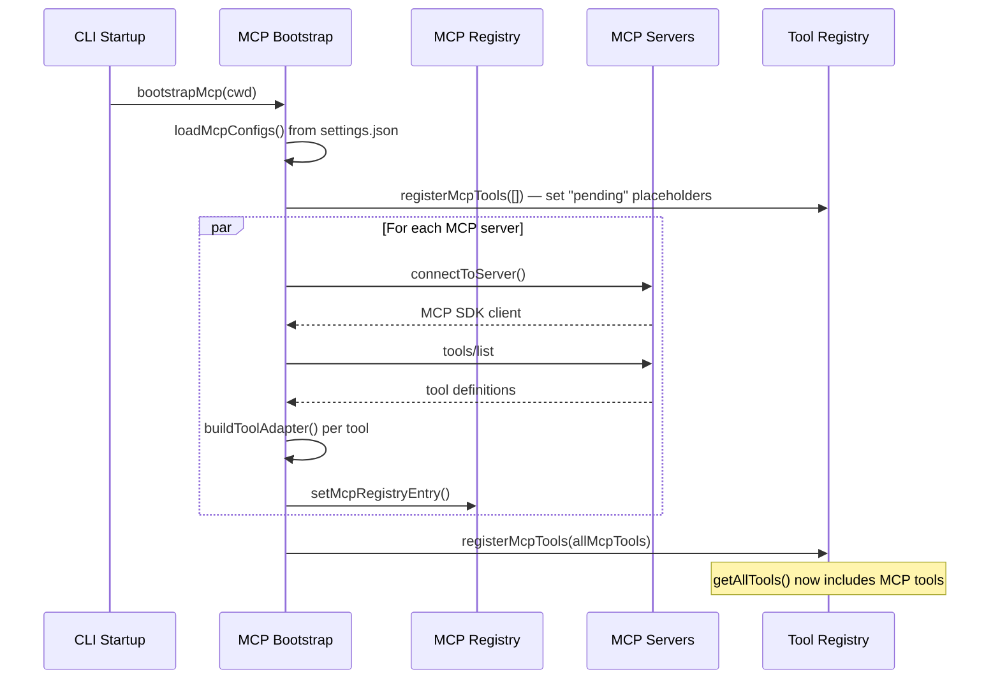

**Figure 8.2.1** — MCP tool bootstrap sequence diagram.

### 8.3 Tool Adaptation

Each MCP tool is wrapped as a local `Tool` instance:

```python
def build_mcp_tool_adapter(connection, mcp_tool_def) -> Tool:
    """Wrap an MCP tool as a local Tool instance."""
    prefixed_name = f"mcp__{connection.server_name}__{mcp_tool_def.name}"

    class McpToolAdapter(Tool):
        @property
        def name(self) -> str:
            return prefixed_name

        @property
        def description(self) -> str:
            return mcp_tool_def.description[:2048]  # Truncate

        @property
        def input_schema(self) -> dict:
            return mcp_tool_def.inputSchema  # Pass through

        def is_read_only(self) -> bool:
            return mcp_tool_def.annotations.get("readOnlyHint", False)

        def is_enabled(self) -> bool:
            return True

        async def call(self, input: dict, context: ToolContext) -> ToolResult:
            # Forward to MCP server using ORIGINAL tool name (not prefixed)
            response = await connection.client.request({
                "method": "tools/call",
                "params": {"name": mcp_tool_def.name, "arguments": input},
            })
            # Map response content
            content = ""
            for block in response.get("content", []):
                if block.get("type") == "text":
                    content += block["text"]
                elif block.get("type") == "image":
                    content += "[Image content]"
                elif block.get("type") == "resource":
                    content += block.get("text", block.get("uri", ""))
            return ToolResult(content=content)

    return McpToolAdapter()
```

---

## 9. Agentic Loop Integration

The tooling layer integrates with the Core Agentic Loop (`src/core/agenticLoop.ts`) through a well-defined execution pipeline.

### 9.1 The Tool Execution Pipeline

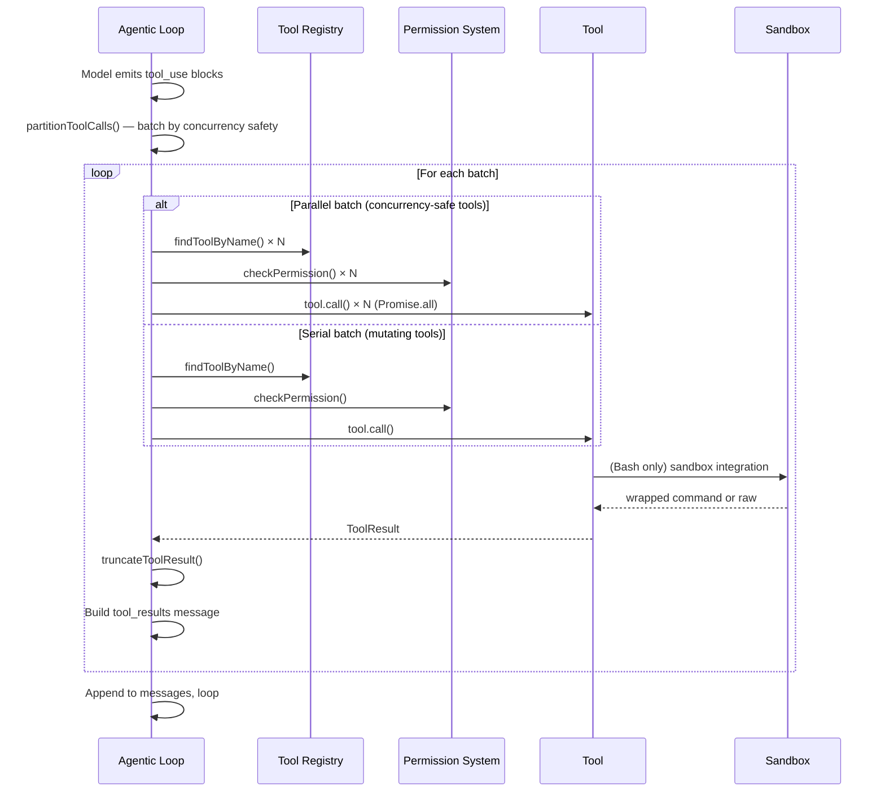

**Figure 9.1.1** — Tool execution pipeline in the agentic loop.

### 9.2 Single Tool Execution (`runOneToolBlock`)

```python
async def run_one_tool_block(block, context, params) -> dict:
    """Execute a single tool_use block."""
    # 1. Find tool by name
    tool = find_tool_by_name(block["name"])
    if not tool:
        return build_error_result(block["id"], f"Unknown tool: {block['name']}")

    # 2. Check permission
    permission = await check_permission(
        tool=tool,
        input=block["input"],
        cwd=context.cwd,
        mode=params.permission_mode,
        settings=params.permission_settings,
        session_rules=params.session_permission_rules,
    )

    # 3. Handle permission decisions
    if permission.behavior == "deny":
        return build_error_result(block["id"], f"Denied: {permission.reason}")

    if permission.behavior == "ask":
        if params.should_avoid_permission_prompts:
            # Headless mode (background agents): auto-deny
            return build_error_result(block["id"],
                "Permission required but running in headless mode. "
                f"Add rule: {permission.request.rule_hint}")

        # Invoke permission callback (UI shows dialog)
        decision = await params.on_permission_request(permission.request)

        if decision == "allow_always":
            # Add rule hint to session allow rules
            params.session_permission_rules.allow.append(permission.request.rule_hint)
        elif decision == "deny":
            return build_error_result(block["id"], "User denied permission")

    # 4. Stamp toolUseId onto context
    tool_context = ToolContext(
        cwd=context.cwd,
        tool_use_id=block["id"],
        # ... other fields
    )

    # 5. Call the tool
    result = await tool.call(block["input"], tool_context)

    # 6. Truncate result
    result.content = truncate_tool_result(result.content, tool.max_result_size_chars)

    # 7. Activate conditional skills for file paths
    if "file_path" in block["input"]:
        await activate_conditional_skills(block["input"]["file_path"])

    return build_tool_result(block["id"], result)
```

### 9.3 Partitioning for Concurrency

```python
MAX_TOOL_USE_CONCURRENCY = 10


def partition_tool_calls(blocks: list[dict]) -> list[list[dict]]:
    """
    Partition tool_use blocks into execution batches.

    Consecutive concurrency-safe tools form one parallel batch.
    Everything else runs serially in its own singleton batch.
    """
    batches = []
    current_parallel = []

    for block in blocks:
        tool = find_tool_by_name(block["name"])
        if tool and tool.is_concurrency_safe(block.get("input")):
            current_parallel.append(block)
        else:
            if current_parallel:
                batches.append(current_parallel)
                current_parallel = []
            batches.append([block])  # singleton serial batch

    if current_parallel:
        batches.append(current_parallel)

    return batches


async def run_tools(blocks, context, params) -> list[dict]:
    """Execute all tool_use blocks with concurrency partitioning."""
    batches = partition_tool_calls(blocks)
    results_by_id = {}

    for batch in batches:
        if len(batch) > 1:
            # Parallel execution with concurrency cap
            for chunk in chunked(batch, MAX_TOOL_USE_CONCURRENCY):
                chunk_results = await asyncio.gather(
                    *(run_one_tool_block(b, context, params) for b in chunk)
                )
                for block, result in zip(chunk, chunk_results):
                    results_by_id[block["id"]] = result
        else:
            # Serial execution
            result = await run_one_tool_block(batch[0], context, params)
            results_by_id[batch[0]["id"]] = result

    # Return results in ORIGINAL block order (API requirement)
    return [results_by_id[block["id"]] for block in blocks]
```

---

## 10. Concurrency Model

### 10.1 Tool Concurrency Classification

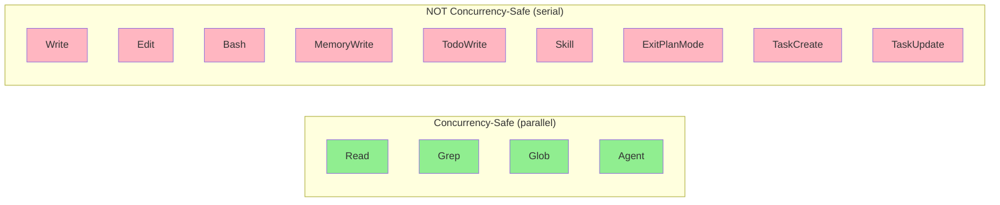

**Figure 10.1.1** — Tool concurrency classification.

### 10.2 Concurrency Rules

| Rule | Rationale |
|------|-----------|
| Read-only search tools (`Read`, `Grep`, `Glob`) are concurrency-safe | No side effects; multiple reads don't interfere |
| `Agent` is concurrency-safe | Each sub-agent runs in an isolated context keyed by `tool_use_id` |
| All mutating tools are serial | Prevents interleaving writes, duplicate prompts, or inconsistent state |
| `Promise.all` with chunked overflow at 10 | Prevents overwhelming the system with too many parallel spawns |

---

## 11. Complete Data Flows

### 11.1 End-to-End Tool Invocation Flow

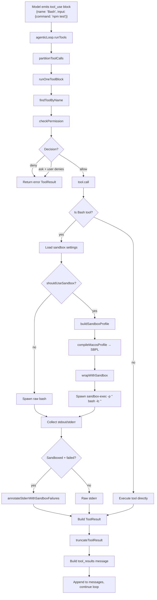

**Figure 11.1.1** — Complete end-to-end tool invocation flow.

### 11.2 Plan Mode Lifecycle

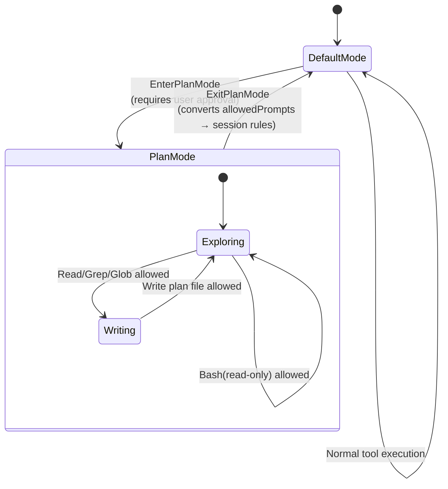

**Figure 11.2.1** — Plan mode state diagram.

### 11.3 Permission + Sandbox Interaction

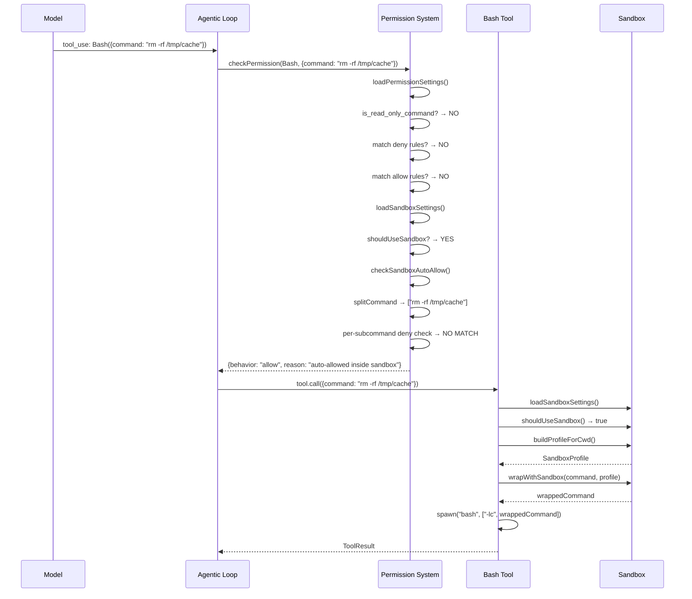

**Figure 11.3.1** — Permission + sandbox interaction for a Bash command.

---

## 12. How the Module Achieves the Tooling Layer

The Tooling Layer is the bridge between the agent's reasoning (the agentic loop) and the external world (the filesystem, shell, and network). It achieves this through three interlocking design principles:

### 12.1 Uniform Interface with Heterogeneous Implementation

Every capability the agent has — reading a file, executing a shell command, delegating to a sub-agent, loading a skill — is expressed through the same `Tool` interface. The agentic loop does not need to know whether a tool is a simple file read or a complex multi-turn sub-agent delegation. It calls `findToolByName()`, checks permissions, and invokes `tool.call()`. The uniform interface means:

- **New tools are trivial to add**: Implement `Tool`, add to `BUILTIN_TOOLS`, done.
- **MCP tools are first-class citizens**: External tools from MCP servers are wrapped in the same interface and registered alongside built-in tools. The agentic loop treats them identically.
- **The agentic loop stays simple**: It has exactly one execution path for all tools, with concurrency partitioning as the only special case.

### 12.2 Defense-in-Depth Safety

The layer implements three independent safety boundaries, each catching what the others miss:

1. **Path safety (`pathUtils.ts`)** — Prevents the agent from accessing files outside the workspace. This is the first gate: every file tool calls `resolveWorkspacePath()` before any I/O. It is a static check that cannot be bypassed.

2. **Permission system (`permissions.ts`)** — Implements a 10-step decision cascade that balances safety with usability. Auto mode allows everything (for power users). Plan mode restricts to read-only. Default mode uses allow/deny rules, sandbox auto-allow, and dangerous-command detection. The key insight is that **visibility ≠ permission**: the model always sees all tools, but `checkPermission()` gates execution.

3. **Sandbox (`sandbox/`)** — Provides defense-in-depth for Bash commands. Even if the permission system allows a command, the sandbox can prevent it from writing to system directories, settings files, or the skills directory. The sandbox uses macOS Seatbelt (SBPL) with deny-default semantics and last-match-wins evaluation.

These three layers compose: a Bash command must pass path safety (if it accesses files), the permission system (always), and the sandbox (if enabled). No single layer is solely responsible for security.

### 12.3 The Unified Abstraction

The sandbox and permission systems are not independent silos — they share a unified abstraction through permission rules. When a user writes `Edit(/src)` in their `allow` list:

- The **permission system** treats it as an allow rule for the Edit tool targeting `/src`.
- The **sandbox** translates it into an `allowWrite` entry for `/src` in the SBPL profile.

This means a single rule controls both the high-level permission decision and the low-level sandbox policy. The same pattern applies to `WebFetch(domain:x)` rules controlling both WebFetch permissions and sandbox network whitelists. This eliminates configuration drift and reduces the cognitive load on users.

### 12.4 Per-Call Freshness

Tools load their configuration on every invocation, not at startup. The Bash tool loads sandbox settings per call. The permission system loads settings per check. This means:

- A user can change `settings.json` mid-session and the changes take effect immediately.
- Approving a permission rule (via `allow_always`) immediately adds it to session rules, affecting the next tool call.
- No restart or session reset is required for configuration changes.

### 12.5 Graceful Degradation

The layer is designed to degrade gracefully at every boundary:

- **Sandbox unavailable** (non-macOS, missing binary): Commands run unsandboxed with a startup warning. The permission system still applies.
- **MCP server disconnected**: MCP tools disappear from the registry. Built-in tools continue working. Reconnection is available via `/mcp reconnect`.
- **Permission settings unparseable**: The system throws (rather than silently reducing permissions), forcing the user to fix their config.
- **Sandbox settings unparseable**: The Bash tool swallows the error and proceeds without sandboxing, logging the failure.

### 12.6 Concurrency Without Races

The concurrency model is intentionally conservative. Only read-only, side-effect-free tools can run in parallel. All mutating tools run serially. The partitioning algorithm groups consecutive concurrency-safe tools into parallel batches, with a hard cap of 10 concurrent operations. This prevents:

- Interleaved file writes from concurrent Edit operations.
- Duplicate permission prompts from concurrent Bash commands.
- Race conditions in session state (todo list, plan mode).

The Agent tool is the exception: it is marked concurrency-safe because each sub-agent runs in an isolated context keyed by `tool_use_id`, with its own permission settings and session rules. Multiple sub-agents can safely run in parallel without interfering with each other or the parent.

---

> **Summary:** The Tooling Layer transforms the agentic loop from a conversational system into an actionable one. Through a uniform `Tool` interface, a layered safety architecture (path guards + permissions + sandbox), a unified abstraction that eliminates configuration drift, and a conservative concurrency model, it provides the agent with safe, governed access to the local environment while remaining extensible through MCP and the skills system.
