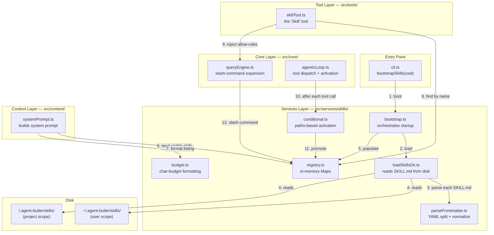
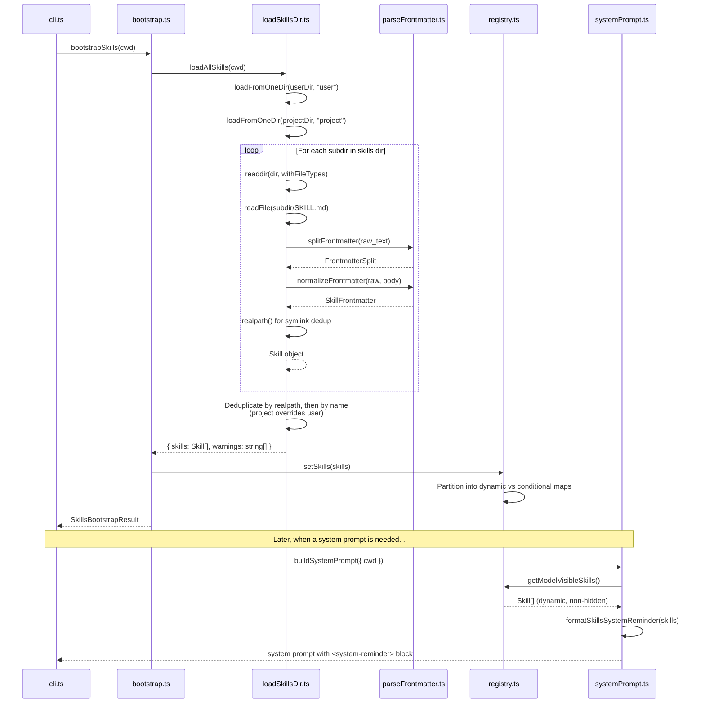
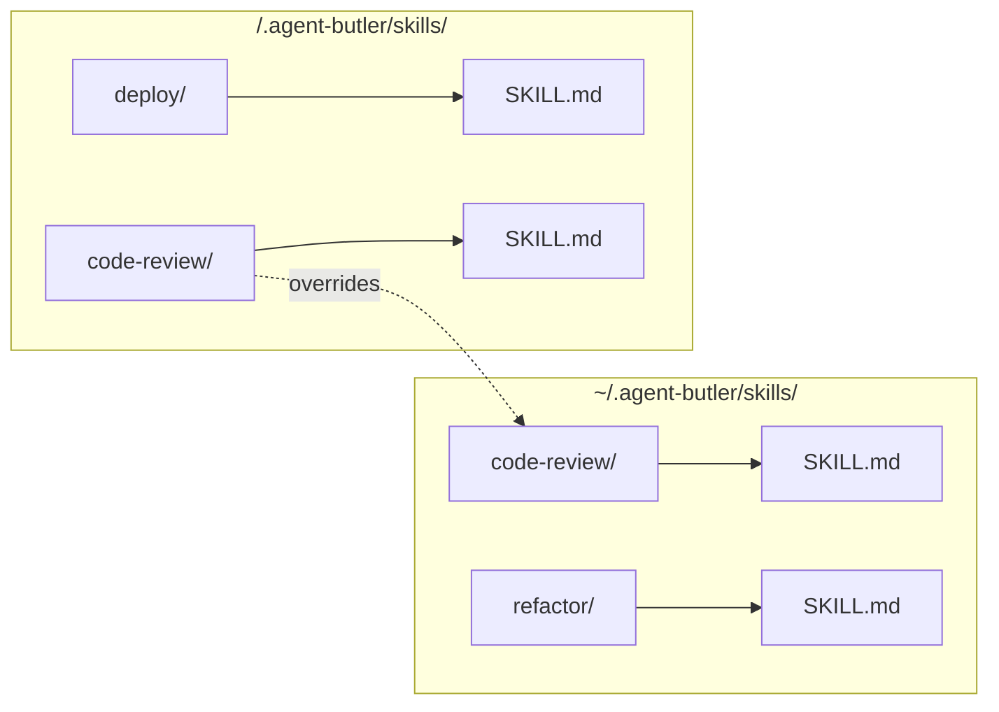
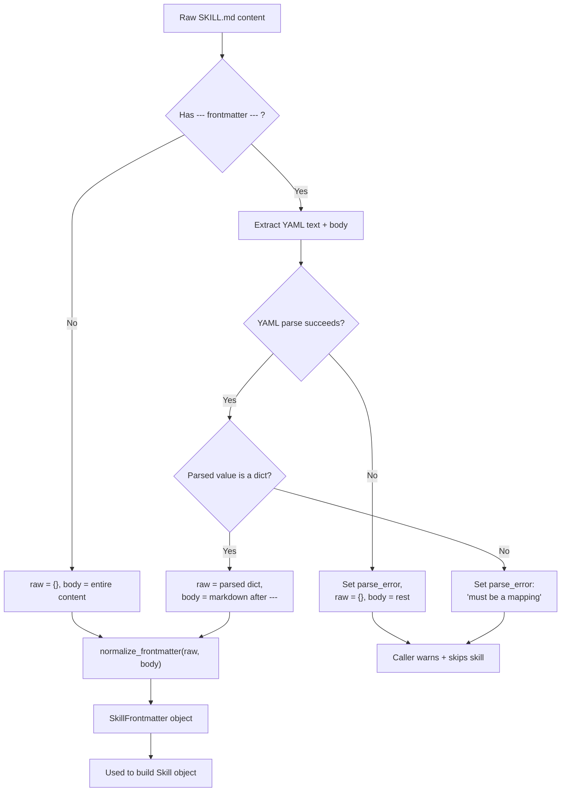
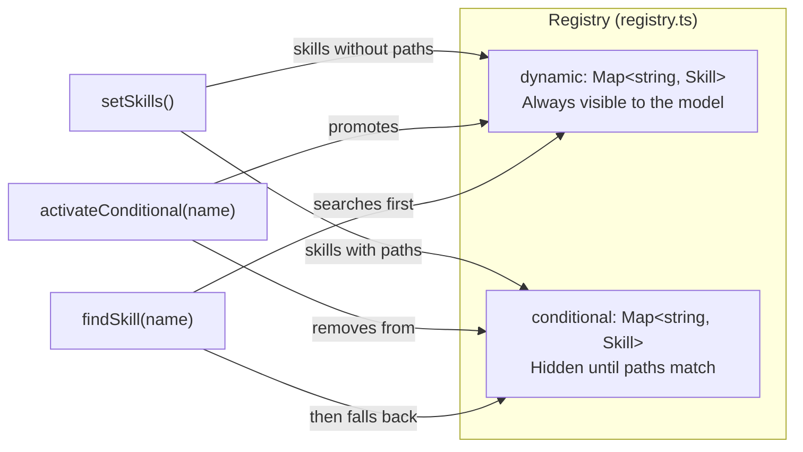
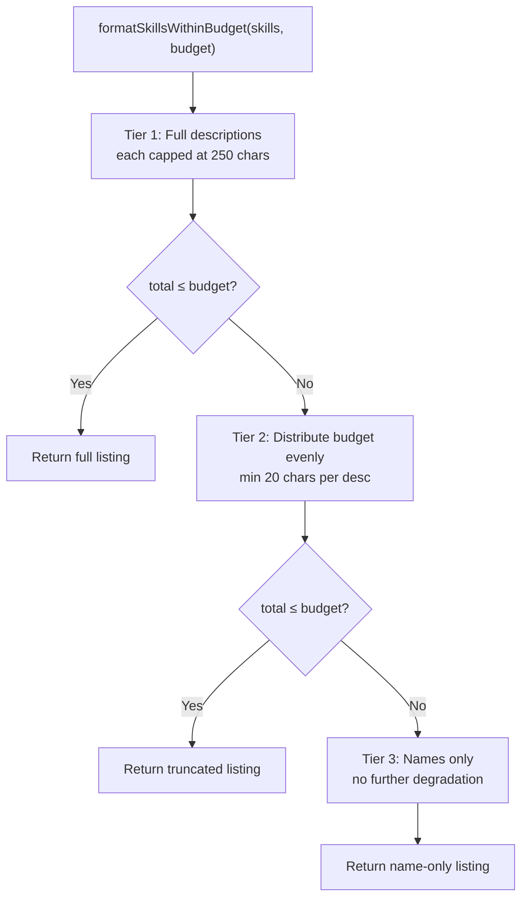
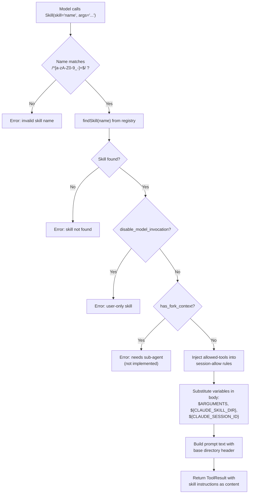
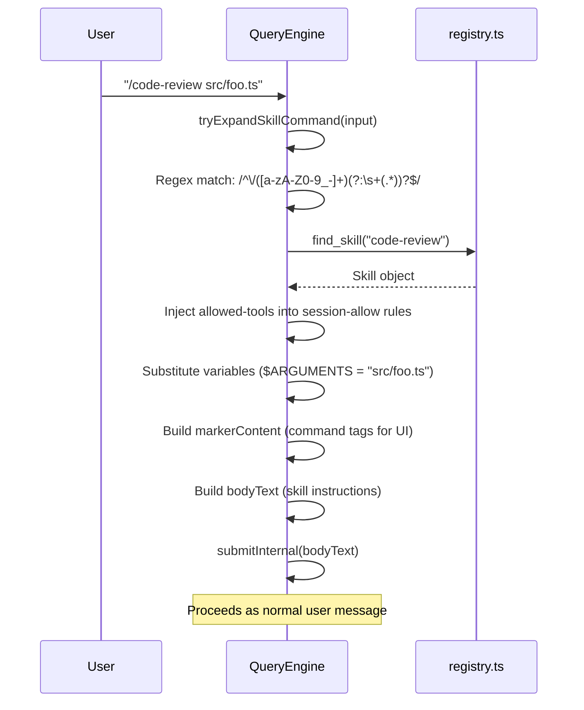
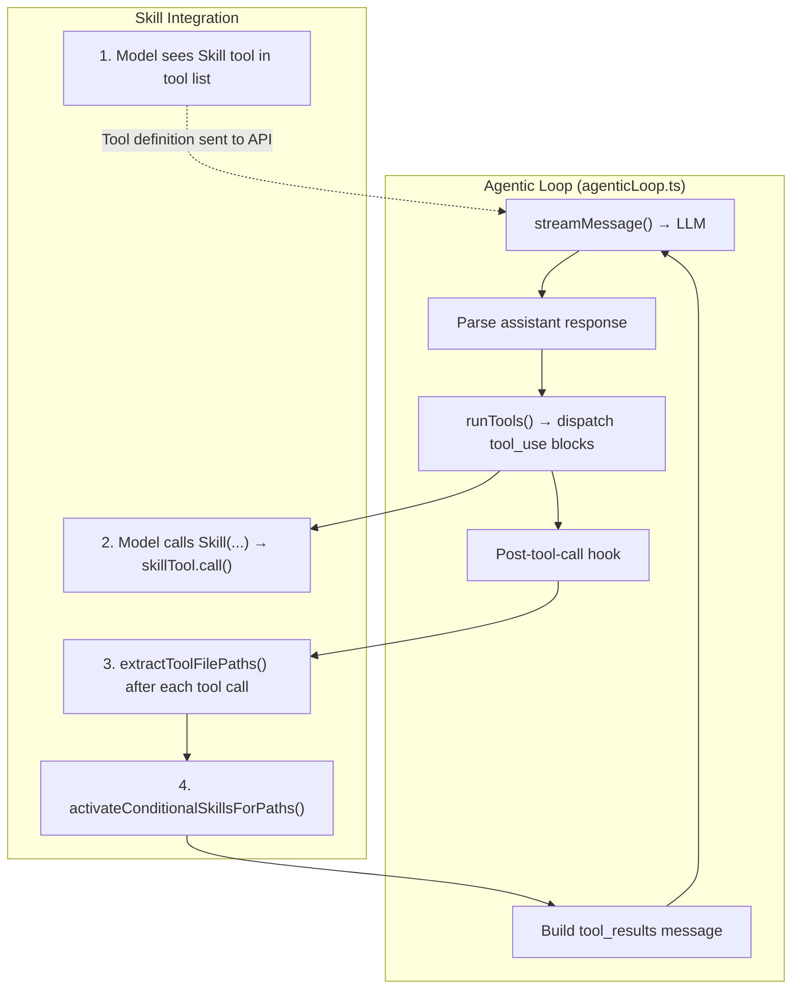

# 03a — The Skill Tool: Comprehensive Technical Explanation

> **Scope**: Every file in the Skill subsystem, from disk loading through frontmatter parsing,
> registry management, budget-aware system prompt injection, tool execution, conditional
> activation, and user slash-command expansion. Mermaid diagrams are used throughout to
> represent call chains, data flows, and architectural relationships.

---

## Table of Contents

1. [Overview](#1-overview)
2. [Architecture Diagram](#2-architecture-diagram)
3. [File Inventory and Responsibilities](#3-file-inventory-and-responsibilities)
4. [Data Types](#4-data-types)
5. [Boot Sequence](#5-boot-sequence)
6. [Disk Loading — `loadSkillsDir.ts`](#6-disk-loading--loadskillsdirts)
7. [Frontmatter Parsing — `parseFrontmatter.ts`](#7-frontmatter-parsing--parsefrontmatternrts)
8. [Registry — `registry.ts`](#8-registry--registryts)
9. [Budget & System Prompt Injection — `budget.ts`](#9-budget--system-prompt-injection--budgetts)
10. [Skill Tool Execution — `skillTool.ts`](#10-skill-tool-execution--skilltoolts)
11. [Conditional Activation — `conditional.ts`](#11-conditional-activation--conditionalts)
12. [User Slash-Command Expansion — `queryEngine.ts`](#12-user-slash-command-expansion--queryenginets)
13. [Integration with the Agentic Loop](#13-integration-with-the-agentic-loop)
14. [End-to-End Invocation Sequence](#14-end-to-end-invocation-sequence)
15. [How the Module Achieves the Skill Tool](#15-how-the-module-achieves-the-skill-tool)

---

## 1. Overview

A **Skill** is a reusable, declarative workflow defined as a Markdown file (`SKILL.md`) with
YAML frontmatter. Unlike a Tool (which is imperative TypeScript code), a Skill is purely
*prompt-based*: its body becomes instructions injected into the LLM conversation at invocation
time. The model reads the instructions and follows them using the tools already available to it.

The Skill system provides:

- **Disk-based discovery** of `SKILL.md` files from two scopes (user-global and project-local).
- **YAML frontmatter parsing** for metadata (name, description, allowed-tools, paths, etc.).
- **An in-memory registry** split into *dynamic* (always visible) and *conditional* (activated
  by file path patterns) skill maps.
- **Budget-aware system prompt injection** so the model knows which skills are available without
  exceeding token limits.
- **A `Skill` tool** the model can call to load and follow a skill's instructions inline.
- **Conditional activation** via gitignore-style `paths` patterns — skills only become visible
  when the agent touches matching files.
- **User slash-command expansion** so users can type `/skill-name args` to invoke a skill
  directly, bypassing the model.

---

## 2. Architecture Diagram



---

## 3. File Inventory and Responsibilities

| File | Path | Responsibility |
|------|------|----------------|
| **types.ts** | `src/types/types.ts` | `Skill`, `SkillFrontmatter`, `SkillSource` type definitions |
| **parseFrontmatter.ts** | `src/services/skills/parseFrontmatter.ts` | YAML frontmatter splitting, parsing, and field normalization |
| **loadSkillsDir.ts** | `src/services/skills/loadSkillsDir.ts` | Filesystem traversal, symlink dedup, name dedup across scopes |
| **registry.ts** | `src/services/skills/registry.ts` | Two-Map in-memory store (dynamic + conditional), lookup, promotion |
| **budget.ts** | `src/services/skills/budget.ts` | Character-budget-aware formatting of the discovery listing |
| **conditional.ts** | `src/services/skills/conditional.ts` | Gitignore-style path matching for conditional skill activation |
| **bootstrap.ts** | `src/services/skills/bootstrap.ts` | Startup orchestration — loads, registers, warns |
| **skillTool.ts** | `src/tools/skillTool.ts` | The `Skill` tool exposed to the LLM — lookup, guard, substitute, return |
| **systemPrompt.ts** | `src/context/systemPrompt.ts` | Injects skill discovery listing into every system prompt |
| **queryEngine.ts** | `src/core/queryEngine.ts` | User `/skill-name` slash-command expansion |
| **agenticLoop.ts** | `src/core/agenticLoop.ts` | Post-tool-call conditional activation trigger |

---

## 4. Data Types

### 4.1 `SkillSource`

A simple union type indicating where a skill was loaded from. Controls override priority
(project wins over user on name collision).

```python
# Pseudocode representation
SkillSource = "user" | "project"
```

### 4.2 `SkillFrontmatter`

The parsed and normalized YAML metadata from the top of a `SKILL.md` file.

```python
class SkillFrontmatter:
    name: Optional[str]                    # Display name (defaults to dirname)
    description: Optional[str]             # One-line description for discovery
    when_to_use: Optional[str]             # Hint appended to description
    allowed_tools: list[str]               # Tool whitelist for session-allow rules
    argument_hint: Optional[str]           # UI hint for arguments
    disable_model_invocation: bool         # If True, hidden from AI; user can still /name
    paths: Optional[list[str]]             # Gitignore-style conditional activation patterns
    has_fork_context: bool                 # Whether frontmatter declares context: fork
    raw: dict[str, Any]                    # Untouched frontmatter for forward compat
```

### 4.3 `Skill`

The fully-loaded, ready-to-invoke skill object.

```python
class Skill:
    name: str                              # Unique identifier (also the /name slug)
    description: str                       # Final display description
    when_to_use: Optional[str]             # Optional when-to-use hint
    body: str                              # Markdown body (frontmatter stripped)
    file_path: str                         # Absolute path to SKILL.md (symlink-resolved)
    base_dir: str                          # Absolute path to containing directory
    source: SkillSource                    # "user" or "project"
    frontmatter: SkillFrontmatter          # Parsed metadata
```

### 4.4 `FrontmatterSplit`

Intermediate result from the parser before normalization.

```python
class FrontmatterSplit:
    raw: dict[str, Any]                    # Parsed YAML object (empty dict if absent)
    body: str                              # Markdown content after the --- delimiter
    parse_error: Optional[str]             # Set when YAML parsing failed
```

---

## 5. Boot Sequence

Skills are loaded **once** at process startup, before the React UI mounts or any system
prompt is rendered. This is critical because `buildSystemPrompt()` reads the skill registry
to inject the `<system-reminder>` discovery block.



### 5.1 Bootstrap Function

```python
async def bootstrap_skills(cwd: str) -> SkillsBootstrapResult:
    # 1. Load from both scopes in parallel
    skills, warnings = await load_all_skills(cwd)

    # 2. Populate the in-memory registry
    set_skills(skills)

    # 3. Warn about malformed SKILL.md files
    for warning in warnings:
        console.warn(f"[agent-butler] {warning}")

    # 4. Return counts for the caller
    conditional_count = sum(1 for s in skills if s.frontmatter.paths)
    return SkillsBootstrapResult(
        skill_count=len(skills) - conditional_count,
        conditional_count=conditional_count,
        warnings=warnings,
    )
```

---

## 6. Disk Loading — `loadSkillsDir.ts`

### 6.1 Scope Resolution

Two directories are scanned, in parallel:

| Scope | Path | Precedence |
|-------|------|------------|
| **User** | `~/.agent-butler/skills/` | Lower — overridden by project |
| **Project** | `<cwd>/.agent-butler/skills/` | Higher — wins on name collision |

Each scope directory contains subdirectories, each representing one skill. The subdirectory
name becomes the default skill name if the frontmatter doesn't specify one.



### 6.2 Single-Directory Loader

```python
async def load_from_one_dir(dir: str, source: SkillSource) -> LoadedFromDir:
    try:
        entries = await fs.readdir(dir, with_file_types=True)
    except error:
        if error.code == "ENOENT":
            return LoadedFromDir(skills=[], warnings=[])
        return LoadedFromDir(skills=[], warnings=[f"Failed to read {dir}: {error.message}"])

    skills = []
    warnings = []

    for entry in entries:
        if not entry.is_dir():
            continue

        skill_dir = join(dir, entry.name)
        file_path = join(skill_dir, "SKILL.md")

        try:
            raw = await fs.read_file(file_path, encoding="utf-8")
        except error:
            if error.code != "ENOENT":
                warnings.append(f"Skipping {skill_dir}: {error.message}")
            continue

        split = split_frontmatter(raw)
        if split.parse_error:
            warnings.append(f"Skipping {entry.name}: {split.parse_error}")
            continue

        frontmatter = normalize_frontmatter(split.raw, split.body)

        # Resolve symlinks for dedup
        real_file = await fs.realpath(file_path).catch(() => file_path)
        real_dir = await fs.realpath(skill_dir).catch(() => skill_dir)

        name = frontmatter.name or entry.name
        description = frontmatter.description or extract_fallback_description(split.body) or name

        skills.append(Skill(
            name=name,
            description=description,
            when_to_use=frontmatter.when_to_use,
            body=split.body,
            file_path=real_file,
            base_dir=real_dir,
            source=source,
            frontmatter=frontmatter,
        ))

    return LoadedFromDir(skills=skills, warnings=warnings)
```

### 6.3 Cross-Scope Deduplication

```python
async def load_all_skills(cwd: str) -> LoadAllSkillsResult:
    user_dir = get_user_skills_dir()        # ~/.agent-butler/skills
    project_dir = get_project_skills_dir(cwd)  # <cwd>/.agent-butler/skills

    # Load both scopes in parallel
    user_result, project_result = await asyncio.gather(
        load_from_one_dir(user_dir, "user"),
        load_from_one_dir(project_dir, "project"),
    )

    seen_real_paths = set()
    by_name = {}

    # User skills first, then project — project overwrites on name collision
    for skill in [*user_result.skills, *project_result.skills]:
        if skill.file_path in seen_real_paths:
            continue  # Symlink dedup
        seen_real_paths.add(skill.file_path)
        by_name[skill.name] = skill  # Project loaded second → wins

    return LoadAllSkillsResult(
        skills=list(by_name.values()),
        warnings=[*user_result.warnings, *project_result.warnings],
    )
```

---

## 7. Frontmatter Parsing — `parseFrontmatter.ts`

### 7.1 Splitting

The parser uses a regex to split the `---\n...\n---\n<body>` structure:

```python
FRONTMATTER_RE = r"^---\r?\n([\s\S]*?)\r?\n---\r?\n?([\s\S]*)$"

def split_frontmatter(content: str) -> FrontmatterSplit:
    match = regex.match(FRONTMATTER_RE, content)
    if not match:
        return FrontmatterSplit(raw={}, body=content)

    yaml_text, body = match.group(1), match.group(2)

    try:
        parsed = yaml.parse(yaml_text)
        if parsed is not None and isinstance(parsed, dict):
            return FrontmatterSplit(raw=parsed, body=body)
        return FrontmatterSplit(
            raw={}, body=body,
            parse_error="Frontmatter must be a YAML mapping (key: value)"
        )
    except yaml.YAMLError as e:
        return FrontmatterSplit(raw={}, body=body, parse_error=str(e))
```

### 7.2 Field Normalization

Raw YAML keys are normalized to the canonical `SkillFrontmatter` structure. The system
supports both kebab-case (`allowed-tools`) and camelCase (`allowedTools`) variants:

```python
def normalize_frontmatter(raw: dict, body: str) -> SkillFrontmatter:
    allowed_tools = as_string_array(raw.get("allowed-tools") or raw.get("allowedTools"))
    paths = as_string_array(raw.get("paths"))

    return SkillFrontmatter(
        name=as_string(raw.get("name")),
        description=as_string(raw.get("description")),
        when_to_use=as_string(raw.get("when_to_use") or raw.get("whenToUse")),
        allowed_tools=allowed_tools,
        argument_hint=as_string(raw.get("argument-hint") or raw.get("argumentHint")),
        disable_model_invocation=as_boolean(
            raw.get("disable-model-invocation") or raw.get("disableModelInvocation")
        ),
        paths=paths if paths else None,
        has_fork_context=as_string(raw.get("context")) == "fork",
        raw=raw,  # Preserve untouched for forward compat
    )
```

### 7.3 Type Coercion Helpers

```python
def as_string(value) -> Optional[str]:
    if isinstance(value, str):
        trimmed = value.strip()
        return trimmed if trimmed else None
    if isinstance(value, (int, float, bool)):
        return str(value)
    return None

def as_string_array(value) -> list[str]:
    if isinstance(value, list):
        return [item.strip() for item in value if isinstance(item, str) and item.strip()]
    if isinstance(value, str):
        return [s.strip() for s in value.split(",") if s.strip()]
    return []

def as_boolean(value) -> bool:
    if isinstance(value, bool):
        return value
    if isinstance(value, str):
        return value.strip().lower() in ("true", "yes", "1")
    return False
```

### 7.4 Fallback Description Extraction

When the frontmatter has no `description` field, the system extracts the first non-empty,
non-heading paragraph from the markdown body:

```python
def extract_fallback_description(body: str) -> str:
    lines = body.split("\n")
    buffer = []
    for raw_line in lines:
        line = raw_line.strip()
        if not line:
            if buffer:
                break  # End of first paragraph
            continue
        if not buffer and line.startswith("#"):
            continue  # Skip leading headings
        buffer.append(line)
    return " ".join(buffer).replace(r"\s+", " ").strip()
```

### 7.5 Parsing Flow Diagram



---

## 8. Registry — `registry.ts`

The registry is the central in-memory state for all loaded skills. It maintains two
separate `Map` instances:



### 8.1 Core Operations

```python
# Module-level state
dynamic: dict[str, Skill] = {}
conditional: dict[str, Skill] = {}
initialized: bool = False

def set_skills(skills: list[Skill]) -> None:
    """Called once at startup. Partitions skills by paths presence."""
    dynamic.clear()
    conditional.clear()
    for skill in skills:
        if skill.frontmatter.paths and len(skill.frontmatter.paths) > 0:
            conditional[skill.name] = skill
        else:
            dynamic[skill.name] = skill
    global initialized
    initialized = True

def find_skill(name: str) -> Optional[Skill]:
    """Look up by name across both maps. Dynamic checked first."""
    return dynamic.get(name) or conditional.get(name)

def get_model_visible_skills() -> list[Skill]:
    """Skills visible in the system prompt. Excludes disable-model-invocation."""
    return [s for s in dynamic.values() if not s.frontmatter.disable_model_invocation]

def get_all_user_invocable_skills() -> list[Skill]:
    """All skills a user can invoke via /<name>. Includes conditional + hidden."""
    return [*dynamic.values(), *conditional.values()]

def activate_conditional(name: str) -> bool:
    """Promote a conditional skill to dynamic. Returns True if it was latent."""
    skill = conditional.get(name)
    if not skill:
        return False
    del conditional[name]
    dynamic[name] = skill
    return True

def list_conditional_skills() -> list[Skill]:
    """Read-only view of still-latent conditional skills."""
    return list(conditional.values())

def clear_skills() -> None:
    """Drop everything — for tests / hot reload."""
    dynamic.clear()
    conditional.clear()
    initialized = False
```

### 8.2 Visibility Matrix

| Skill State | `disable-model-invocation` | `paths` present | Visible in System Prompt | Model Can Invoke | User Can `/name` |
|-------------|---------------------------|-----------------|--------------------------|------------------|------------------|
| Dynamic, visible | `false` | No | **Yes** | **Yes** | **Yes** |
| Dynamic, hidden | `true` | No | No | No (rejected) | **Yes** |
| Conditional, visible | `false` | **Yes** (not yet matched) | No | No (not found) | **Yes** |
| Conditional, hidden | `true` | **Yes** (not yet matched) | No | No (not found) | **Yes** |
| Promoted (was conditional) | `false` | **Yes** (matched) | **Yes** | **Yes** | **Yes** |

---

## 9. Budget & System Prompt Injection — `budget.ts`

### 9.1 The Problem

A project might have dozens of skills. Injecting all of them with full descriptions into
every system prompt would consume a significant portion of the context window. The budget
system prevents this.

### 9.2 Budget Constants

| Constant | Value | Purpose |
|----------|-------|---------|
| `DEFAULT_BUDGET_CHARS` | 8000 | Default character budget (~2000 tokens) |
| `MAX_LISTING_DESC_CHARS` | 250 | Per-skill description cap |
| `MIN_DESC_CHARS_PER_SKILL` | 20 | Minimum description length before falling to names-only |

The budget can be overridden via the `AGENT_BUTLER_SKILL_CHAR_BUDGET` environment variable.

### 9.3 Three-Tier Degradation



```python
MAX_LISTING_DESC_CHARS = 250
MIN_DESC_CHARS_PER_SKILL = 20
DEFAULT_BUDGET_CHARS = 8000

def get_skill_char_budget() -> int:
    env_value = os.environ.get("AGENT_BUTLER_SKILL_CHAR_BUDGET")
    if env_value:
        parsed = int(env_value)
        if parsed > 0:
            return parsed
    return DEFAULT_BUDGET_CHARS

def format_skills_within_budget(skills: list[Skill], budget: int = None) -> str:
    if budget is None:
        budget = get_skill_char_budget()
    if not skills:
        return ""

    # Tier 1: full descriptions
    tier1 = [build_line(s, MAX_LISTING_DESC_CHARS) for s in skills]
    tier1_total = sum(len(line) + 1 for line in tier1)
    if tier1_total <= budget:
        return "\n".join(tier1)

    # Tier 2: evenly distributed descriptions
    prefix_cost = sum(len(f"- {s.name}: ") + 1 for s in skills)
    desc_budget = budget - prefix_cost
    if desc_budget >= len(skills) * MIN_DESC_CHARS_PER_SKILL:
        per_desc = max(MIN_DESC_CHARS_PER_SKILL, desc_budget // len(skills))
        tier2 = [build_line(s, per_desc) for s in skills]
        tier2_total = sum(len(line) + 1 for line in tier2)
        if tier2_total <= budget:
            return "\n".join(tier2)

    # Tier 3: names only
    return "\n".join(f"- {s.name}" for s in skills)
```

### 9.4 System Reminder Block

The formatted listing is wrapped in `<system-reminder>` tags to signal to the model that
this is ambient context, not a direct user instruction:

```python
def format_skills_system_reminder(skills: list[Skill]) -> str:
    if not skills:
        return ""
    listing = format_skills_within_budget(skills)
    if not listing:
        return ""
    return "\n".join([
        "<system-reminder>",
        "Available skills you can invoke via the `Skill` tool. "
        "Each line is `- <name>: <description>`.",
        "Call `Skill(skill=\"<name>\", args=\"<optional args>\")` "
        "when the user's request matches one of these.",
        "",
        listing,
        "</system-reminder>",
    ])
```

### 9.5 Integration with `systemPrompt.ts`

In `buildSystemPrompt()`, the skill listing is injected into the dynamic sections of the
system prompt:

```python
async def build_system_prompt(options: BuildSystemPromptOptions) -> list[str]:
    # ... other sections ...

    # Skill discovery listing
    skills_reminder = format_skills_system_reminder(get_model_visible_skills())

    dynamic_sections = [
        SYSTEM_PROMPT_DYNAMIC_START,
        format_environment_context(environment_context),
        agent_md_context,
        memory_sections,
        additional_instructions,
        skills_reminder,        # <-- Injected here
        agents_reminder,
        SYSTEM_PROMPT_DYNAMIC_END,
    ]

    return [*static_sections, *dynamic_sections]
```

---

## 10. Skill Tool Execution — `skillTool.ts`

### 10.1 Tool Definition

The `skillTool` implements the `Tool` interface and is registered as one of the built-in
tools in `src/tools/index.ts`.

```python
skill_tool = Tool(
    name="Skill",
    description=(
        "Execute a named skill within the current conversation. "
        "Pass the skill's `name` and optional `args` string. "
        "The skill's instructions are returned as text — read them "
        "and continue the conversation following those instructions."
    ),
    input_schema={
        "type": "object",
        "properties": {
            "skill": {
                "type": "string",
                "description": "Name of the skill to execute.",
            },
            "args": {
                "type": "string",
                "description": "Optional argument string for $ARGUMENTS substitution.",
            },
        },
        "required": ["skill"],
        "additionalProperties": False,
    },
    is_read_only=lambda: False,   # Side-effecting — rejected in Plan Mode
    is_enabled=lambda: True,
)
```

### 10.2 Execution Flow



### 10.3 The `call()` Method

```python
async def skill_tool_call(input: dict, context: ToolContext) -> ToolResult:
    name = input.get("skill", "").strip()
    args = input.get("args", "")

    # 1. Validate name format
    if not name or not regex.match(r"^[a-zA-Z0-9_-]+$", name):
        return ToolResult(
            content=f"Error: invalid skill name. Got: {json.dumps(name)}",
            is_error=True,
        )

    # 2. Look up in registry
    skill = find_skill(name)
    if not skill:
        return ToolResult(
            content=f'Error: skill "{name}" not found.',
            is_error=True,
        )

    # 3. Guard: disable-model-invocation
    if skill.frontmatter.disable_model_invocation:
        return ToolResult(
            content=f'Error: skill "{name}" can only be invoked by the user.',
            is_error=True,
        )

    # 4. Guard: context: fork (not yet implemented)
    if skill.frontmatter.has_fork_context:
        return ToolResult(
            content=f'Error: skill "{name}" requires forked sub-agent context.',
            is_error=True,
        )

    # 5. Inject allowed-tools into session-allow rules
    if skill.frontmatter.allowed_tools and context.add_session_allow_rules:
        context.add_session_allow_rules(skill.frontmatter.allowed_tools)

    # 6. Variable substitution
    session_id = context.session_id or "unknown-session"
    prompt_text = build_prompt_text(skill, args, session_id)

    # 7. Return the skill's instructions as the tool result
    return ToolResult(
        content=(
            f'Loaded skill "{skill.name}" ({skill.source}). '
            f"Follow the instructions below.\n\n"
            f"{prompt_text}"
        ),
    )
```

### 10.4 Variable Substitution

Three variables are substituted in the skill body:

| Variable | Replacement | Example |
|----------|-------------|---------|
| `${CLAUDE_SKILL_DIR}` | Absolute path to the skill's directory (POSIX-style) | `/Users/nick/.agent-butler/skills/code-review` |
| `${CLAUDE_SESSION_ID}` | Current session identifier | `sess_abc123` |
| `$ARGUMENTS` | The `args` parameter from the tool call | `src/foo.ts` |

```python
def substitute_variables(body: str, skill: Skill, args: str, session_id: str) -> str:
    dir_path = "/".join(skill.base_dir.split(os.sep))  # POSIXify
    return (
        body
        .replace("${CLAUDE_SKILL_DIR}", dir_path)
        .replace("${CLAUDE_SESSION_ID}", session_id)
        .replace("$ARGUMENTS", args)
    )

def build_prompt_text(skill: Skill, args: str, session_id: str) -> str:
    dir_path = "/".join(skill.base_dir.split(os.sep))
    header = f"Base directory for this skill: {dir_path}\n\n"
    return header + substitute_variables(skill.body, skill, args, session_id)
```

### 10.5 Allowed-Tools Injection

When a skill declares `allowed-tools` in its frontmatter, those tool names are injected
into the session's allow rules. This means subsequent tool calls by the model (while
following the skill's instructions) won't trigger permission prompts for those tools.

```python
# In the skill's SKILL.md frontmatter:
# ---
# allowed-tools:
#   - Read
#   - Grep
#   - Glob
# ---

# At invocation time:
if skill.frontmatter.allowed_tools and context.add_session_allow_rules:
    context.add_session_allow_rules(skill.frontmatter.allowed_tools)
    # Now Read, Grep, Glob won't ask for permission this session
```

---

## 11. Conditional Activation — `conditional.ts`

### 11.1 Concept

A skill can declare `paths` in its frontmatter — gitignore-style patterns. Such a skill
starts in the `conditional` registry map and is **not** visible in the system prompt. It
only becomes visible when the agent touches a file matching one of the patterns.

```yaml
# Example SKILL.md frontmatter
---
name: test-reviewer
description: Reviews test files for coverage gaps
paths:
  - "**/*.test.ts"
  - "**/*.spec.ts"
  - "tests/**"
---
```

### 11.2 Activation Mechanism

After every successful tool call in the agentic loop, the system checks whether the tool
touched any file paths. If so, it runs those paths against every conditional skill's
patterns using the `ignore` library (same gitignore semantics).

```mermaid
sequenceDiagram
    participant LOOP as agenticLoop.ts
    participant COND as conditional.ts
    participant REG as registry.ts

    LOOP->>LOOP: Tool call completes (e.g., Write "src/foo.test.ts")
    LOOP->>COND: extractToolFilePaths("Write", input)
    COND-->>LOOP: ["src/foo.test.ts"]

    alt File paths found
        LOOP->>COND: activateConditionalSkillsForPaths(paths, cwd)
        COND->>COND: Convert to repo-relative paths
        COND->>REG: listConditionalSkills()
        REG-->>COND: [test-reviewer, ...]

        loop For each conditional skill
            COND->>COND: ignore(patterns).ignores(path)?
            alt Pattern matches
                COND->>REG: activateConditional("test-reviewer")
                REG->>REG: Move from conditional → dynamic
                REG-->>COND: True (was latent)
            end
        end

        COND-->>LOOP: ["test-reviewer"] (activated names)
        Note over LOOP: Skill now visible in system prompt
    end
```

### 11.3 Implementation

```python
def activate_conditional_skills_for_paths(file_paths: list[str], cwd: str) -> list[str]:
    if not file_paths:
        return []

    candidates = list_conditional_skills()
    if not candidates:
        return []

    # Convert to repo-relative paths (gitignore patterns are relative)
    relative_paths = []
    for p in file_paths:
        abs_path = p if path.isabs(p) else path.resolve(cwd, p)
        rel = path.relative(cwd, abs_path)
        if not rel or rel.startswith("..") or path.isabs(rel):
            continue  # Skip paths outside the repo
        relative_paths.append(rel.replace(os.sep, "/"))

    if not relative_paths:
        return []

    activated = []
    for skill in candidates:
        patterns = skill.frontmatter.paths
        if not patterns:
            continue
        matcher = ignore_lib()
        matcher.add(patterns)
        if any(matcher.ignores(p) for p in relative_paths):
            if activate_conditional(skill.name):
                activated.append(skill.name)

    return activated

def extract_tool_file_paths(tool_name: str, input: dict) -> list[str]:
    """Extract file paths from well-known tool inputs."""
    paths = []
    if tool_name in ("Read", "Write", "Edit"):
        fp = input.get("file_path")
        if isinstance(fp, str):
            paths.append(fp)
    elif tool_name == "Glob":
        root = input.get("path")
        if isinstance(root, str):
            paths.append(root)
    return paths
```

### 11.4 Key Properties

- **One-way**: Once activated, a skill stays in the `dynamic` map for the lifetime of the
  process. It does not deactivate if the file is no longer relevant.
- **Sticky**: This prevents "flicker" — the skill appearing and disappearing as the model
  navigates files, which would confuse it.
- **Per-process**: A restart resets all conditional skills to their latent state.

---

## 12. User Slash-Command Expansion — `queryEngine.ts`

### 12.1 Overview

Users can invoke skills directly by typing `/skill-name args` in the REPL. This bypasses
the model entirely — the skill's instructions are injected as a user message.

### 12.2 Expansion Flow



### 12.3 Implementation

```python
def try_expand_skill_command(self, input_str: str) -> Optional[SkillExpansion]:
    match = regex.match(r"^\/([a-zA-Z0-9_-]+)(?:\s+(.*))?$", input_str)
    if not match:
        return None

    name, raw_args = match.group(1), match.group(2)
    skill = find_skill(name)
    if not skill:
        return None  # Not a skill — fall through to /command dispatcher

    args = (raw_args or "").strip()
    dir_path = "/".join(skill.base_dir.split(os.sep))
    session_id = self.tool_context.session_id or "unknown-session"

    # Inject allowed-tools
    if skill.frontmatter.allowed_tools:
        self.add_session_allow_rules(skill.frontmatter.allowed_tools)

    # Build UI marker (for the command bubble in ConversationView)
    marker_lines = [
        f"<command-message>{skill.name}</command-message>",
        f"<command-name>/{skill.name}</command-name>",
    ]
    if args:
        marker_lines.append(f"<command-args>{args}</command-args>")
    marker_content = "\n".join(marker_lines)

    # Build the body text (skill instructions)
    body = skill.body \
        .replace("${CLAUDE_SKILL_DIR}", dir_path) \
        .replace("${CLAUDE_SESSION_ID}", session_id) \
        .replace("$ARGUMENTS", args)

    header = (
        f"[skill_invocation:{skill.name}]\n"
        f'Run skill "{skill.name}" with the following instructions. '
        f"Base directory for this skill: {dir_path}.\n\n"
    )

    return SkillExpansion(
        skill=skill,
        marker_content=marker_content,
        body_text=header + body,
    )
```

---

## 13. Integration with the Agentic Loop

### 13.1 Tool Registration

The `skillTool` is registered as a built-in tool in `src/tools/index.ts` alongside all
other tools:

```python
BUILTIN_TOOLS = [
    file_read_tool,
    file_write_tool,
    file_edit_tool,
    glob_tool,
    grep_tool,
    bash_tool,
    memory_write_tool,
    todo_write_tool,
    task_create_tool,
    task_update_tool,
    task_get_tool,
    task_list_tool,
    enter_plan_mode_tool,
    exit_plan_mode_tool,
    skill_tool,          # <-- Registered here
    agent_tool,
]
```

### 13.2 Agentic Loop Integration Points

The Skill system integrates with the agentic loop at three points:



### 13.3 Post-Tool-Call Conditional Activation

In `runOneToolBlock()` within `agenticLoop.ts`, after every successful tool call, the
system extracts file paths and checks for conditional skill activation:

```python
async def run_one_tool_block(block, context, options) -> RunOneToolReturn:
    # ... permission check, tool.call(), truncation ...

    if not result.is_error:
        # Extract file paths from the tool input
        file_paths = extract_tool_file_paths(block.name, tool_input)
        if file_paths:
            # Try to activate conditional skills
            activated = activate_conditional_skills_for_paths(file_paths, context.cwd)
            # activated names could be surfaced in UI ("activated skill: X")

    return RunOneToolReturn(execution=..., permission_request=...)
```

This means that if the model reads, writes, or edits a file matching a conditional skill's
`paths` patterns, that skill will be promoted to the dynamic set and appear in the system
prompt on the *next* turn.

### 13.4 Tool Properties

| Property | Value | Rationale |
|----------|-------|-----------|
| `isReadOnly()` | `false` | Skills can instruct the model to do anything; Plan Mode rejects them |
| `isEnabled()` | `true` | Always available |
| `isConcurrencySafe()` | Not set (defaults `false`) | Session mutation (allow-rules injection) requires serial execution |

---

## 14. End-to-End Invocation Sequence

### 14.1 Model-Initiated Invocation

```mermaid
sequenceDiagram
    participant USER as User
    participant UI as Terminal UI
    participant QE as QueryEngine
    participant LOOP as agenticLoop
    participant API as Anthropic API
    participant SKILL as skillTool
    participant REG as registry

    USER->>UI: "Review src/foo.ts for bugs"
    UI->>QE: submitMessage("Review src/foo.ts for bugs")
    QE->>QE: buildSystemPrompt() → includes skill listing
    QE->>LOOP: query(messages, system, tools)
    LOOP->>API: streamMessage(messages, tools=[..., Skill, ...])

    API-->>LOOP: tool_use: Skill(skill="code-review", args="src/foo.ts")
    LOOP->>SKILL: call({skill: "code-review", args: "src/foo.ts"}, context)
    SKILL->>REG: find_skill("code-review")
    REG-->>SKILL: Skill object
    SKILL->>SKILL: Validate, inject allowed-tools, substitute variables
    SKILL-->>LOOP: ToolResult(content="Loaded skill 'code-review'...<instructions>")

    LOOP->>API: tool_result with skill instructions
    Note over API: Model now follows the skill's instructions
    API-->>LOOP: tool_use: Read(file_path="src/foo.ts")
    LOOP->>LOOP: Execute Read, then activateConditionalSkillsForPaths()
    LOOP-->>QE: ... continues until task complete
```

### 14.2 User-Initiated Invocation (Slash Command)

```mermaid
sequenceDiagram
    participant USER as User
    participant UI as Terminal UI
    participant QE as QueryEngine
    participant REG as registry
    participant LOOP as agenticLoop
    participant API as Anthropic API

    USER->>UI: "/code-review src/foo.ts"
    UI->>QE: submitMessage("/code-review src/foo.ts")
    QE->>QE: tryExpandSkillCommand("/code-review src/foo.ts")
    QE->>REG: find_skill("code-review")
    REG-->>QE: Skill object
    QE->>QE: Inject allowed-tools, substitute variables
    QE->>QE: Build markerContent + bodyText
    QE->>LOOP: query(messages with skill instructions as user msg)
    LOOP->>API: streamMessage(messages, tools)
    Note over API: Model sees skill instructions as direct user message
    API-->>LOOP: tool_use: Read(file_path="src/foo.ts")
    LOOP-->>QE: ... continues following skill instructions
```

---

## 15. How the Module Achieves the Skill Tool

The Skill tool is not a single file but a **distributed subsystem** spanning seven source
files across three architectural layers. Here is how they collaborate to make the feature
work, narrated as a single coherent story.

### 15.1 The Lifecycle of a Skill

At its core, the Skill tool is a bridge between **declarative Markdown files on disk** and
**imperative LLM behavior at runtime**. The lifecycle has four phases:

**Phase 1 — Discovery and Loading.** When the process starts, `bootstrapSkills()` in
`bootstrap.ts` orchestrates the entire initialization. It calls `loadAllSkills()` in
`loadSkillsDir.ts`, which scans two filesystem locations in parallel: the user-global
directory (`~/.agent-butler/skills/`) and the project-local directory
(`~/.agent-butler/skills/` relative to the working directory). Each location contains
subdirectories, and each subdirectory is expected to hold a `SKILL.md` file. The loader
reads every `SKILL.md`, passes its raw content to `splitFrontmatter()` in
`parseFrontmatter.ts` which uses a regex to separate the YAML frontmatter block from the
Markdown body, then passes the raw YAML through `normalizeFrontmatter()` to coerce the
typed fields. The resulting `Skill` objects carry the parsed metadata, the Markdown body,
resolved filesystem paths (using `realpath()` to deduplicate symlinks), and a source tag
(`"user"` or `"project"`). When two skills from different scopes share the same name, the
project-scope skill wins because it is loaded second into a name-keyed map.

**Phase 2 — Registration.** The loaded skills are handed to `setSkills()` in `registry.ts`,
which partitions them into two in-memory maps. Skills without a `paths` frontmatter field
go into the `dynamic` map — they are immediately visible. Skills with `paths` go into the
`conditional` map — they are latent, hidden from the model, waiting for a file path match.
This two-map design is the registry's central architectural decision: it enables lazy
activation without any polling or background scanning.

**Phase 3 — Visibility.** Every time the system builds a system prompt (which happens before
every LLM call), `buildSystemPrompt()` in `systemPrompt.ts` calls
`getModelVisibleSkills()` to pull the current dynamic skills, then passes them to
`formatSkillsSystemReminder()` in `budget.ts`. The budget module implements a three-tier
degradation strategy: it first tries to fit all skills with full descriptions (capped at
250 characters each); if that exceeds the character budget (default 8000, roughly 2000
tokens), it shrinks all descriptions proportionally to a minimum of 20 characters each;
and if that still doesn't fit, it falls back to names only. The result is wrapped in
`<system-reminder>` tags and injected into the system prompt. This is how the model
*knows* which skills exist — it reads the listing and decides whether to invoke the
`Skill` tool.

**Phase 4 — Invocation.** There are two invocation paths. When the *model* decides to use a
skill, it emits a `tool_use` block for the `Skill` tool with the skill's name and optional
arguments. The `skillTool.call()` method in `skillTool.ts` runs: it validates the name
format against a strict regex, looks up the skill in the registry (checking both maps),
guards against `disable-model-invocation` and `hasForkContext` flags, injects the skill's
`allowed-tools` list into the session's permission allow-rules (so subsequent tool calls
don't trigger permission prompts), substitutes the three template variables
(`$ARGUMENTS`, `${CLAUDE_SKILL_DIR}`, `${CLAUDE_SESSION_ID}`), and returns the skill's
body as the tool result. The model then reads this result — which contains detailed
instructions — and continues the conversation following them. When the *user* invokes a
skill via `/skill-name args`, the `QueryEngine.tryExpandSkillCommand()` method in
`queryEngine.ts` performs the same lookup, guard, injection, and substitution, but instead
of returning a tool result, it injects the instructions directly as a user message before
the query reaches the agentic loop.

### 15.2 The Conditional Activation Flywheel

The conditional activation system creates a feedback loop between tool execution and skill
visibility. After every successful tool call in the agentic loop (`agenticLoop.ts`), the
system calls `extractToolFilePaths()` to pull file paths from the tool's input (for
`Read`, `Write`, `Edit`, and `Glob`), then passes those paths to
`activateConditionalSkillsForPaths()` in `conditional.ts`. This function converts the paths
to repo-relative form and tests them against each conditional skill's `paths` patterns
using the `ignore` library (gitignore semantics). When a match is found, the skill is
promoted from the `conditional` map to the `dynamic` map via `activateConditional()`. This
promotion is one-way and sticky — once activated, the skill stays visible for the rest of
the process. On the *next* LLM call, the system prompt will include the newly activated
skill in its discovery listing, and the model can then invoke it. This creates a just-in-time
activation pattern: the model doesn't need to know about conditional skills upfront; they
emerge into its awareness as the context of the conversation makes them relevant.

### 15.3 Permission Integration

The Skill tool is classified as side-effecting (`isReadOnly() = false`), which means it is
rejected in Plan Mode. This is a deliberate design choice: since a skill's body can instruct
the model to perform arbitrary operations (write files, run commands, etc.), allowing it in
Plan Mode would violate the read-only contract. When a skill *is* invoked, its
`allowed-tools` list is injected into the session's permission allow-rules via
`context.addSessionAllowRules()`, which is wired through `ToolContext` back to the
`QueryEngine`'s session permission state. This means the skill can declare "I need Read,
Grep, and Bash" and those tools will be auto-approved for the remainder of the session,
avoiding repeated permission prompts that would interrupt the workflow.

### 15.4 Architectural Boundaries

The module respects the project's layered architecture strictly. The `services/skills/`
directory is in the **Model Communication Layer** (Layer 5) — it handles data loading and
formatting. The `skillTool.ts` file is in the **Tooling Layer** (Layer 4) — it implements
the `Tool` interface. The integration points in `agenticLoop.ts` and `queryEngine.ts` are
in the **Core Agentic Loop** (Layer 3) and **Orchestration Layer** (Layer 2) respectively.
The skill system never reaches across layers: it doesn't import from the UI layer, and it
doesn't directly call the API layer. Its only cross-layer dependency is on the
`addSessionAllowRules` callback in `ToolContext`, which is the sanctioned interface for
tools to modify session-level permission state. This clean separation means the skill
subsystem can be tested, modified, and extended without touching the terminal UI, the
streaming layer, or the sandbox system.
