# 04 — Model Communication Layer: Technical Deep Dive

> **Scope:** `src/services/api/`, `src/services/mcp/`, `src/services/skills/`, `src/types/message.ts`, `src/types/mcp.ts`, `src/types/types.ts`, `src/utils/streamDebug.ts`, `src/utils/tokens.ts`
>
> The Model Communication Layer is the fifth and lowest layer in Agent Butler's
> five-layer architecture. It sits beneath the Core Agentic Loop and provides
> three foundational capabilities: (1) streaming API communication with LLMs,
> (2) external tool server integration via the Model Context Protocol, and
> (3) reusable prompt template management through the Skills system. Every
> token that flows between Agent Butler and an LLM passes through this layer.

---

## Table of Contents

1. [Architectural Overview](#1-architectural-overview)
2. [Type Foundations](#2-type-foundations)
3. [API Client Subsystem](#3-api-client-subsystem)
4. [Streaming Engine](#4-streaming-engine)
5. [Token Estimation and Budget Management](#5-token-estimation-and-budget-management)
6. [MCP Subsystem Architecture](#6-mcp-subsystem-architecture)
7. [MCP Configuration Loading](#7-mcp-configuration-loading)
8. [MCP Client Connection Management](#8-mcp-client-connection-management)
9. [MCP Tool Discovery and Adaptation](#9-mcp-tool-discovery-and-aptation)
10. [MCP String Utilities and Name Normalization](#10-mcp-string-utilities-and-name-normalization)
11. [Skills Subsystem Architecture](#11-skills-subsystem-architecture)
12. [Skills Disk Loading and Frontmatter Parsing](#12-skills-disk-loading-and-frontmatter-parsing)
13. [Skills Registry and Conditional Activation](#13-skills-registry-and-conditional-activation)
14. [Skills Budget and System Prompt Injection](#14-skills-budget-and-system-prompt-injection)
15. [Stream Debug Infrastructure](#15-stream-debug-infrastructure)
16. [Integration with the Core Agentic Loop](#16-integration-with-the-core-agentic-loop)
17. [Complete Data Flows](#17-complete-data-flows)
18. [How the Module Achieves the Communication Layer](#18-how-the-module-achieves-the-communication-layer)

---

## 1. Architectural Overview

The Model Communication Layer is composed of three loosely-coupled subsystems that share a common purpose: managing all bidirectional data flow between the Agent Butler runtime and external services (LLM APIs, MCP tool servers, and skill definition files on disk).

| Subsystem | Directory | Responsibility |
|-----------|-----------|----------------|
| **API Client & Streaming** | `src/services/api/` | Anthropic SDK singleton, streaming message delivery, retry with escalation |
| **MCP (Model Context Protocol)** | `src/services/mcp/` | External tool server discovery, lifecycle management, tool adaptation |
| **Skills System** | `src/services/skills/` | Reusable prompt template loading, registry, conditional activation, budget formatting |

```mermaid
graph TB
    subgraph "Layer 3: Core Agentic Loop"
        AL[agenticLoop.ts<br/>query / streamMessage]
        QE[queryEngine.ts<br/>submitMessage / handleCommand]
    end

    subgraph "Layer 5: Model Communication"
        subgraph "API Client & Streaming (src/services/api/)"
            AC[client.ts<br/>getAnthropicClient / verifyApiKey]
            ST[streaming.ts<br/>streamMessage / createMessage / streamMessageWithRetry]
        end

        subgraph "MCP Subsystem (src/services/mcp/)"
            MC[client.ts<br/>connectToServer / escalatedKill]
            MR[registry.ts<br/>setMcpRegistryEntry / getMcpRegistry]
            MB[bootstrap.ts<br/>bootstrapMcp / reconnectMcpServer]
            MCF[config.ts<br/>loadMcpConfigs / validateServerConfig]
            MF[fetchTools.ts<br/>fetchToolsForConnection / buildToolAdapter]
            MN[normalization.ts<br/>normalizeNameForMCP]
            MS[mcpStringUtils.ts<br/>buildMcpToolName / parseMcpToolName]
        end

        subgraph "Skills Subsystem (src/services/skills/)"
            SR[registry.ts<br/>setSkills / findSkill / activateConditional]
            SL[loadSkillsDir.ts<br/>loadAllSkills / loadFromOneDir]
            SB[bootstrap.ts<br/>bootstrapSkills]
            SBU[budget.ts<br/>formatSkillsWithinBudget / formatSkillsSystemReminder]
            SC[conditional.ts<br/>activateConditionalSkillsForPaths]
            SP[parseFrontmatter.ts<br/>splitFrontmatter / normalizeFrontmatter]
        end
    end

    subgraph "Supporting Types & Utilities"
        TM[types/message.ts<br/>StreamEvent / ContentBlock / Usage]
        TMC[types/mcp.ts<br/>McpServerConnection / McpServerConfig]
        TT[types/types.ts<br/>Skill / SkillFrontmatter]
        SD[utils/streamDebug.ts<br/>writeStreamDebug]
        TK[utils/tokens.ts<br/>estimateMessageTokens / buildTokenBudgetSnapshot]
    end

    subgraph "Layer 4: Tooling Layer"
        TI[tools/index.ts<br/>registerMcpTools / getAllTools]
        TTool[tools/Tool.ts<br/>Tool interface]
    end

    AL -->|"streamMessage()"| ST
    AL -->|"findToolByName()"| TI
    QE -->|"getToolsApiParams()"| TI
    QE -->|"handleMcpCommand()"| MR
    QE -->|"handleSkillsCommand()"| SR
    QE -->|"findSkill()"| SR
    ST -->|"getAnthropicClient()"| AC
    ST -->|"writeStreamDebug()"| SD
    ST -.->|"StreamEvent types"| TM
    AC -.->|"Anthropic SDK"| TM
    MB -->|"loadMcpConfigs()"| MCF
    MB -->|"connectToServer()"| MC
    MB -->|"fetchToolsForConnection()"| MF
    MB -->|"setMcpRegistryEntry()"| MR
    MB -->|"registerMcpTools()"| TI
    MC -.->|"McpServerConnection"| TMC
    MCF -.->|"ScopedMcpServerConfig"| TMC
    MF -->|"buildMcpToolName()"| MS
    MF -->|"Tool adapter"| TTool
    MR -.->|"Tool[] + McpServerConnection"| TMC
    SB -->|"loadAllSkills()"| SL
    SB -->|"setSkills()"| SR
    SL -->|"splitFrontmatter()"| SP
    SL -.->|"Skill"| TT
    SC -->|"activateConditional()"| SR
    SR -.->|"Skill"| TT
    SBU -.->|"Skill"| TT
```

**Figure 1.1** — High-level architecture showing all three subsystems, their internal file dependencies, and their interactions with adjacent layers.

---

## 2. Type Foundations

The Model Communication Layer is built on a shared type system that defines the shape of every message, stream event, MCP connection, and skill definition that flows through the system.

### 2.1 Message and Content Block Types

The message type system (`src/types/message.ts`) maps directly to the Anthropic Messages API format. Every piece of content exchanged between Agent Butler and the LLM is expressed through these types.

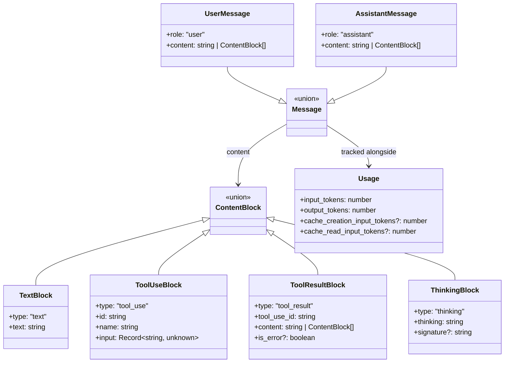

**Figure 2.1.1** — Message and content block type hierarchy.

#### Python Pseudocode: Core Message Types

```python
from dataclasses import dataclass, field
from typing import Union


@dataclass
class TextBlock:
    type: str = "text"
    text: str = ""


@dataclass
class ToolUseBlock:
    type: str = "tool_use"
    id: str = ""
    name: str = ""
    input: dict = field(default_factory=dict)


@dataclass
class ToolResultBlock:
    type: str = "tool_result"
    tool_use_id: str = ""
    content: Union[str, list] = ""
    is_error: bool = False


@dataclass
class ThinkingBlock:
    """Extended-thinking content block for internal model reasoning."""
    type: str = "thinking"
    thinking: str = ""
    signature: str = None


ContentBlock = Union[TextBlock, ToolUseBlock, ToolResultBlock, ThinkingBlock]


@dataclass
class UserMessage:
    role: str = "user"
    content: Union[str, list[ContentBlock]] = ""


@dataclass
class AssistantMessage:
    role: str = "assistant"
    content: Union[str, list[ContentBlock]] = ""


Message = Union[UserMessage, AssistantMessage]


@dataclass
class Usage:
    input_tokens: int = 0
    output_tokens: int = 0
    cache_creation_input_tokens: int = None
    cache_read_input_tokens: int = None
```

#### Key Design Decisions

1. **`ThinkingBlock` preservation** — Extended-thinking blocks (with their `signature` field) are preserved in the message history so they can be echoed back on the next turn. Some providers (e.g. MiniMax, Anthropic's extended-thinking mode) behave erratically if prior thinking blocks are missing.

2. **`ToolResultBlock` is dual-format** — The `content` field accepts either a plain string or an array of `ContentBlock` objects. The string form is used by all built-in tools; the array form exists for MCP tool results that may contain images or resources.

3. **Cache token tracking** — The `Usage` type includes optional `cache_creation_input_tokens` and `cache_read_input_tokens` fields to support Anthropic's prompt caching feature. These are captured from both `message_start` and `message_delta` events since different providers report them at different points.

### 2.2 Stream Event Types

The streaming system yields a discriminated union of events that the agentic loop and UI consume incrementally.

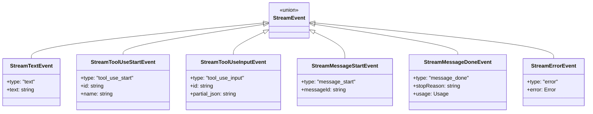

**Figure 2.2.1** — Stream event discriminated union.

Each event type serves a specific purpose in the incremental delivery pipeline:

| Event | When Emitted | Consumer |
|-------|-------------|----------|
| `message_start` | First event from the API; carries the `messageId` | Stream debug logger |
| `text` | Each text delta from the model | UI (real-time rendering), agentic loop (yield) |
| `tool_use_start` | When a new `tool_use` content block begins | UI (show tool card), agentic loop (yield) |
| `tool_use_input` | Each JSON delta for a tool's input arguments | UI (progressive input display) |
| `message_done` | Stream complete; carries final `stopReason` and `usage` | Agentic loop (assemble response, check stop reason) |
| `error` | Any error during streaming (network, API, parsing) | Agentic loop (abort turn) |

### 2.3 MCP Connection State Types

The MCP type system (`src/types/mcp.ts`) models the full lifecycle of an MCP server connection, from configuration through active connection to failure.

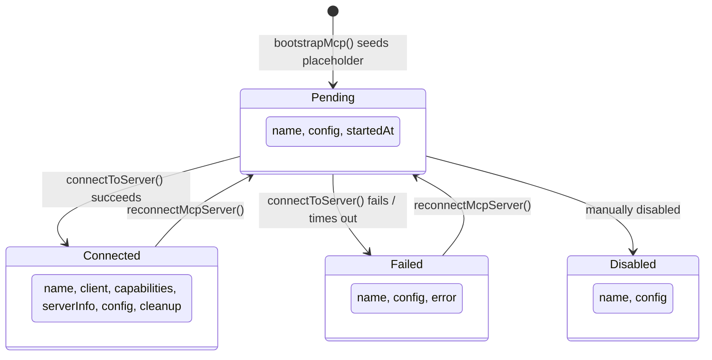

**Figure 2.3.1** — MCP server connection state machine.

#### Python Pseudocode: MCP Types

```python
from dataclasses import dataclass
from typing import Union, Optional, Callable, Awaitable


@dataclass
class McpStdioServerConfig:
    type: str = "stdio"
    command: str = ""
    args: list[str] = field(default_factory=list)
    env: dict[str, str] = field(default_factory=dict)


@dataclass
class McpHTTPServerConfig:
    type: str = "http"
    url: str = ""
    headers: dict[str, str] = field(default_factory=dict)


@dataclass
class McpSSEServerConfig:
    type: str = "sse"
    url: str = ""
    headers: dict[str, str] = field(default_factory=dict)


McpServerConfig = Union[McpStdioServerConfig, McpHTTPServerConfig, McpSSEServerConfig]


@dataclass
class ScopedMcpServerConfig:
    """Server config tagged with its origin scope."""
    scope: str = ""  # "user" or "project"
    # Plus all fields from the underlying config variant


@dataclass
class ConnectedMcpServer:
    name: str = ""
    type: str = "connected"
    client: object = None          # MCP SDK Client instance
    capabilities: object = None    # ServerCapabilities
    server_info: dict = None       # {name, version}
    config: ScopedMcpServerConfig = None
    cleanup: Callable[[], Awaitable[None]] = None


@dataclass
class FailedMcpServer:
    name: str = ""
    type: str = "failed"
    config: ScopedMcpServerConfig = None
    error: str = ""


@dataclass
class PendingMcpServer:
    name: str = ""
    type: str = "pending"
    config: ScopedMcpServerConfig = None
    started_at: int = 0  # Date.now()


McpServerConnection = Union[
    ConnectedMcpServer, FailedMcpServer, PendingMcpServer
]
```

### 2.4 Skill Type System

Skills (`src/types/types.ts`) are declarative prompt templates defined as Markdown files with YAML frontmatter.

```python
@dataclass
class SkillFrontmatter:
    name: str = None
    description: str = None
    when_to_use: str = None
    allowed_tools: list[str] = field(default_factory=list)
    argument_hint: str = None
    disable_model_invocation: bool = False
    paths: list[str] = None        # gitignore-style conditional activation
    has_fork_context: bool = False
    raw: dict = field(default_factory=dict)  # untouched YAML for forward compat


@dataclass
class Skill:
    name: str = ""
    description: str = ""
    when_to_use: str = None
    body: str = ""                  # Markdown without frontmatter
    file_path: str = ""             # Absolute, realpath-resolved
    base_dir: str = ""              # Directory containing SKILL.md
    source: str = ""                # "user" or "project"
    frontmatter: SkillFrontmatter = None
```

---

## 3. API Client Subsystem

The API client (`src/services/api/client.ts`) is a thin, intentionally minimal wrapper around the Anthropic TypeScript SDK. Its sole responsibility is managing a lazily-initialized singleton client instance.

### 3.1 Architecture

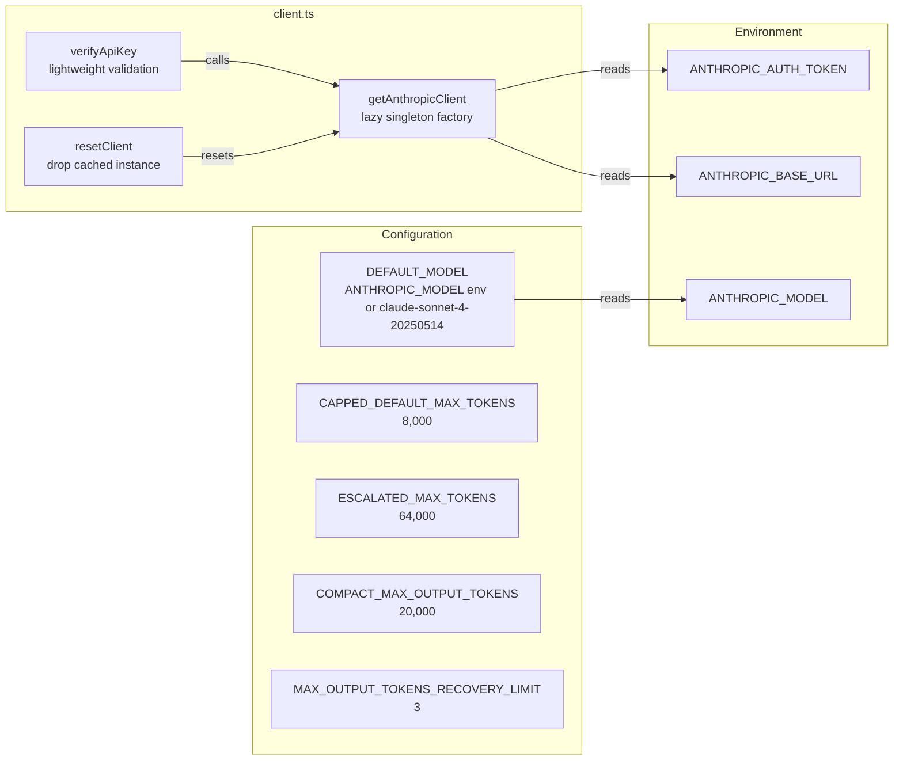

**Figure 3.1.1** — API client architecture and configuration sources.

### 3.2 Singleton Pattern

The client uses a lazy-initialization singleton pattern. The first call to `getAnthropicClient()` creates and caches the instance; subsequent calls return the cached instance. The `options` parameter allows overrides (e.g., for `verifyApiKey` with a specific key) without polluting the cache.

#### Python Pseudocode: Client Singleton

```python
_client_instance: AnthropicClient | None = None


def get_anthropic_client(
    api_key: str | None = None,
    base_url: str | None = None,
) -> AnthropicClient:
    """
    Get or create the Anthropic client instance.

    The SDK automatically reads ANTHROPIC_AUTH_TOKEN from the environment.
    Optionally pass api_key to override. When no options are passed and
    a cached instance exists, returns the cache (fast path).
    """
    global _client_instance

    if _client_instance is not None and api_key is None and base_url is None:
        return _client_instance

    client = AnthropicClient(
        api_key=api_key or os.environ.get("ANTHROPIC_AUTH_TOKEN"),
        base_url=base_url or os.environ.get("ANTHROPIC_BASE_URL"),
    )

    # Only cache the "default" instance (no overrides)
    if api_key is None and base_url is None:
        _client_instance = client

    return client


def verify_api_key(api_key: str | None = None) -> bool:
    """Verify the API key is valid by making a lightweight request."""
    try:
        client = get_anthropic_client(api_key=api_key)
        client.messages.create(
            model=DEFAULT_MODEL,
            max_tokens=1,
            messages=[{"role": "user", "content": "hi"}],
        )
        return True
    except Exception:
        return False


def reset_client() -> None:
    """Reset the cached client instance. Useful when API key changes at runtime."""
    global _client_instance
    _client_instance = None
```

### 3.3 Token Limit Constants

The client module defines the token limit constants used throughout the streaming and retry logic:

| Constant | Value | Purpose |
|----------|-------|---------|
| `CAPPED_DEFAULT_MAX_TOKENS` | 8,000 | Default output cap for normal turns |
| `ESCALATED_MAX_TOKENS` | 64,000 | Retry cap when output is truncated at `max_tokens` |
| `COMPACT_MAX_OUTPUT_TOKENS` | 20,000 | Output cap for compaction/summarization calls |
| `MAX_OUTPUT_TOKENS_RECOVERY_LIMIT` | 3 | Maximum continuation attempts after truncation |

The escalation strategy is: first try at 8K, if truncated retry at 64K. If still truncated, the caller (QueryEngine) can perform multi-turn recovery.

---

## 4. Streaming Engine

The streaming engine (`src/services/api/streaming.ts`) is the most critical file in the entire Model Communication Layer. It is the single communication primitive — every LLM interaction in the system flows through `streamMessage()`.

### 4.1 Architecture

```mermaid
graph TB
    subgraph "streaming.ts"
        SM[streamMessage<br/>AsyncGenerator yielding StreamEvents]
        SMR[streamMessageWithRetry<br/>auto-escalation wrapper]
        CM[createMessage<br/>non-streaming single-shot]
    end

    subgraph "State Accumulators"
        CB[contentBlocks: ContentBlock[]<br/>indexed by block position]
        TIJ[toolInputJsonByIndex: Map<br/>per-block JSON accumulation]
        MID[messageId: string]
        SR[stopReason: string]
        US[usage: Usage]
    end

    subgraph "Anthropic SDK"
        SDK[client.messages.stream()<br/>SSE event iterator]
    end

    SM -->|"creates"| SDK
    SM -->|"maintains"| CB
    SM -->|"maintains"| TIJ
    SM -->|"maintains"| MID
    SM -->|"maintains"| SR
    SM -->|"maintains"| US
    SMR -->|"wraps"| SM
    CM -->|"uses"| SDK
```

**Figure 4.1.1** — Streaming engine architecture with state accumulators.

### 4.2 The `streamMessage()` Generator

This is an `AsyncGenerator<StreamEvent, StreamResult>` — it yields incremental `StreamEvent` objects as they arrive from the API and returns a `StreamResult` (containing the fully assembled `AssistantMessage`, final `Usage`, and `stopReason`) when the stream completes.

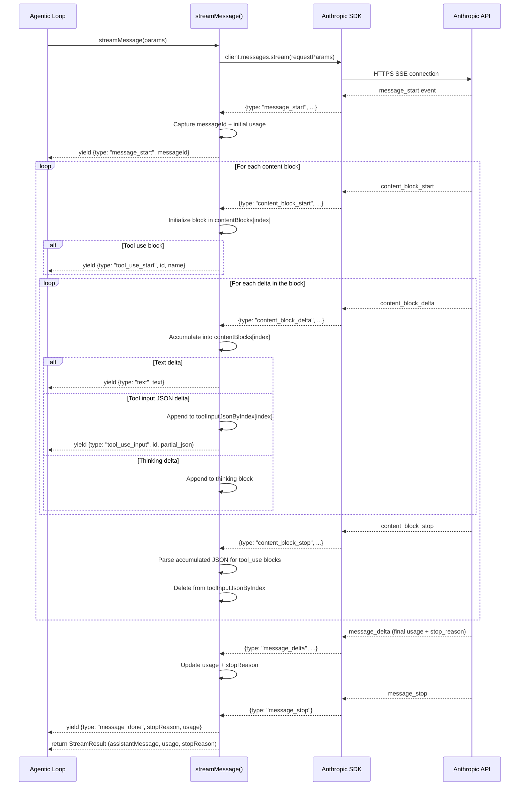

**Figure 4.2.1** — Complete streaming sequence showing the event lifecycle.

#### Python Pseudocode: streamMessage Generator

```python
async def stream_message(params: StreamRequestParams) -> AsyncGenerator:
    """
    Send a streaming request to the Anthropic API and yield StreamEvents.

    This is the main communication primitive — everything else builds on top.
    The generator yields incremental events as they arrive and accumulates
    the full response internally. When the stream completes, it returns
    a StreamResult via the generator's return value.
    """
    client = get_anthropic_client()
    model = params.model or DEFAULT_MODEL
    max_tokens = params.max_tokens or DEFAULT_MAX_TOKENS

    request_params = {
        "model": model,
        "max_tokens": max_tokens,
        "messages": params.messages,
        "stream": True,
    }
    if params.system:
        request_params["system"] = params.system
    if params.tools and len(params.tools) > 0:
        request_params["tools"] = params.tools

    stream = client.messages.stream(request_params, signal=params.signal)

    # State accumulators
    content_blocks = []
    tool_input_json_by_index = {}  # Map[int, str]
    message_id = ""
    stop_reason = ""
    usage = {"input_tokens": 0, "output_tokens": 0}

    write_stream_debug("request", {
        "model": model,
        "messageCount": len(params.messages),
    })

    try:
        async for event in stream:
            write_stream_debug("event", event)

            if event.type == "message_start":
                message_id = event.message.id
                if event.message.usage:
                    usage["input_tokens"] = event.message.usage.input_tokens
                    usage["output_tokens"] = event.message.usage.output_tokens
                    # Capture cache tokens from message_start
                    _capture_cache_tokens(usage, event.message.usage)
                yield StreamMessageStartEvent(messageId=message_id)

            elif event.type == "message_delta":
                if event.usage:
                    usage["output_tokens"] = event.usage.output_tokens
                    _capture_cache_tokens(usage, event.usage)
                    # Some providers report input_tokens in message_delta
                    if hasattr(event.usage, "input_tokens") and event.usage.input_tokens > 0:
                        usage["input_tokens"] = event.usage.input_tokens
                stop_reason = event.delta.stop_reason or ""

            elif event.type == "message_stop":
                yield StreamMessageDoneEvent(stopReason=stop_reason, usage=usage)

            elif event.type == "content_block_start":
                index = event.index
                if event.content_block.type == "text":
                    content_blocks[index] = TextBlock(text="")
                elif event.content_block.type == "thinking":
                    content_blocks[index] = ThinkingBlock(
                        thinking=event.content_block.thinking or ""
                    )
                elif event.content_block.type == "tool_use":
                    seed_input = event.content_block.input or {}
                    content_blocks[index] = ToolUseBlock(
                        id=event.content_block.id,
                        name=event.content_block.name,
                        input=seed_input,
                    )
                    tool_input_json_by_index[index] = ""
                    yield StreamToolUseStartEvent(
                        id=event.content_block.id,
                        name=event.content_block.name,
                    )

            elif event.type == "content_block_delta":
                delta = event.delta
                index = event.index

                if delta.type == "text_delta":
                    content_blocks[index].text += delta.text
                    yield StreamTextEvent(text=delta.text)

                elif delta.type == "thinking_delta":
                    if content_blocks[index] and content_blocks[index].type == "thinking":
                        content_blocks[index].thinking += delta.thinking or ""

                elif delta.type == "signature_delta":
                    if content_blocks[index] and content_blocks[index].type == "thinking":
                        content_blocks[index].signature = (
                            (content_blocks[index].signature or "") + (delta.signature or "")
                        )

                elif delta.type == "input_json_delta":
                    prev = tool_input_json_by_index.get(index, "")
                    tool_input_json_by_index[index] = prev + delta.partial_json
                    block = content_blocks[index]
                    if block and block.type == "tool_use":
                        yield StreamToolUseInputEvent(
                            id=block.id,
                            partial_json=delta.partial_json,
                        )

            elif event.type == "content_block_stop":
                index = event.index
                block = content_blocks[index]
                accumulated = tool_input_json_by_index.get(index)
                if block and block.type == "tool_use" and accumulated:
                    try:
                        block.input = json.loads(accumulated)
                    except json.JSONDecodeError:
                        block.input = {"_raw": accumulated}
                del tool_input_json_by_index[index]

    except Exception as error:
        write_stream_debug("stream_error", {"message": str(error)})
        yield StreamErrorEvent(error=error)

    write_stream_debug("assembled", {
        "stopReason": stop_reason,
        "blockCount": len([b for b in content_blocks if b]),
    })

    return StreamResult(
        assistantMessage=AssistantMessage(
            role="assistant",
            content=[b for b in content_blocks if b],
        ),
        usage=usage,
        stopReason=stop_reason,
    )
```

### 4.3 Per-Block JSON Accumulation

A critical implementation detail: tool input JSON is accumulated **per content-block index**, not in a single shared buffer. This prevents data corruption when the provider emits overlapping content blocks (e.g., starting `content_block_start` for block 1 before `content_block_stop` of block 0). Some providers (notably MiniMax and certain Anthropic-compatible shims) exhibit this behavior.

```mermaid
graph LR
    subgraph "Correct: Per-Index Buffers"
        M0["Map[0] = '{\"command\": \"ls\"}'"]
        M1["Map[1] = '{\"pattern\": \"*.ts\"}'"]
    end

    subgraph "Broken: Shared Buffer"
        SB["'{\"command\": \"ls\"}{\"pattern\": \"*.ts\"}'<br/>JSON.parse fails!"]
    end

    style M0 fill:#90EE90
    style M1 fill:#90EE90
    style SB fill:#FFB6C1
```

**Figure 4.3.1** — Per-index vs shared buffer for tool input JSON accumulation.

### 4.4 Error Handling

Errors during streaming are caught and yielded as `StreamErrorEvent` objects rather than thrown. This allows the caller (agentic loop) to handle them gracefully within the generator protocol:

```python
try:
    async for event in stream:
        # ... process events
except Exception as error:
    write_stream_debug("stream_error", {"message": str(error)})
    yield StreamErrorEvent(error=error)
```

The agentic loop checks for `error` events and terminates the turn with `reason: "model_error"`.

### 4.5 The `createMessage()` Non-Streaming Alternative

For internal tasks (compaction, classification) where incremental output is unnecessary, `createMessage()` provides a simpler synchronous call:

```python
async def create_message(params: StreamRequestParams) -> dict:
    """Simple non-streaming call for quick one-off requests."""
    client = get_anthropic_client()
    response = await client.messages.create(
        model=params.model or DEFAULT_MODEL,
        max_tokens=params.max_tokens or DEFAULT_MAX_TOKENS,
        messages=params.messages,
        # ... system, tools
    )

    content_blocks = []
    for block in response.content:
        if block.type == "text":
            content_blocks.append(TextBlock(text=block.text))
        elif block.type == "tool_use":
            content_blocks.append(ToolUseBlock(
                id=block.id, name=block.name, input=block.input
            ))

    return {
        "content": content_blocks,
        "usage": _extract_usage(response.usage),
        "stopReason": response.stop_reason or "end_turn",
    }
```

### 4.6 Escalated Retry (`streamMessageWithRetry`)

When the model hits `max_tokens` (stop reason), `streamMessageWithRetry` automatically retries with `ESCALATED_MAX_TOKENS` (64K):

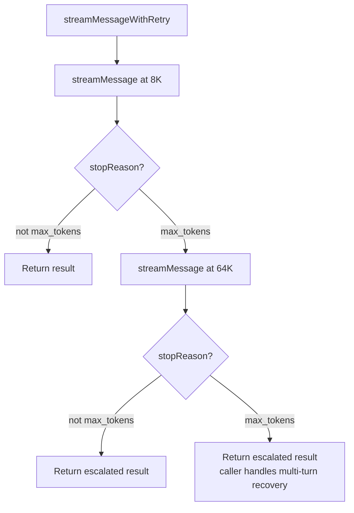

**Figure 4.6.1** — Escalated retry flow for truncated outputs.

---

## 5. Token Estimation and Budget Management

The token utilities (`src/utils/tokens.ts`) provide character-based token estimation and context-window budget calculations used by the compaction system and agentic loop to prevent context overflow.

### 5.1 Estimation Strategy

The system uses a heuristic approach rather than a true tokenizer (which would require a native dependency):

| Content Type | Chars/Token | Rationale |
|-------------|-------------|-----------|
| Plain text | 4 | Average English text ratio |
| JSON (tool input/output) | 2 | JSON is more token-dense |
| Binary (images, documents) | Fixed 2,000 | Conservative estimate |
| Message overhead | 12 tokens | Role + structural framing |
| Tool block overhead | 24 tokens | Name + schema metadata |

```python
TEXT_CHARS_PER_TOKEN = 4
JSON_CHARS_PER_TOKEN = 2
MESSAGE_OVERHEAD_TOKENS = 12
TOOL_BLOCK_OVERHEAD_TOKENS = 24
FIXED_BINARY_BLOCK_TOKENS = 2_000


def estimate_content_block_tokens(content) -> int:
    """Estimate tokens for a single content block."""
    if isinstance(content, str):
        return max(1, round(len(content) / TEXT_CHARS_PER_TOKEN))

    if not isinstance(content, list):
        return 0

    total = 0
    for block in content:
        if block.type == "text":
            total += max(1, round(len(block.text) / TEXT_CHARS_PER_TOKEN))
        elif block.type == "tool_use":
            total += TOOL_BLOCK_OVERHEAD_TOKENS
            total += max(1, round(len(block.name) / TEXT_CHARS_PER_TOKEN))
            total += max(1, round(len(json.dumps(block.input)) / JSON_CHARS_PER_TOKEN))
        elif block.type == "tool_result":
            serialized = block.content if isinstance(block.content, str) else json.dumps(block.content)
            total += TOOL_BLOCK_OVERHEAD_TOKENS + max(1, round(len(serialized) / JSON_CHARS_PER_TOKEN))
        elif block.type in ("image", "document"):
            total += FIXED_BINARY_BLOCK_TOKENS
        else:
            total += max(1, round(len(json.dumps(block)) / JSON_CHARS_PER_TOKEN))
    return total


def estimate_message_tokens(message) -> int:
    """Estimate tokens for a complete message."""
    return MESSAGE_OVERHEAD_TOKENS + estimate_content_block_tokens(message.content)


def rough_token_count_for_messages(messages: list) -> int:
    """Estimate total tokens for a message array, with 4/3 inflation factor."""
    raw_estimate = sum(estimate_message_tokens(m) for m in messages)
    return math.ceil((raw_estimate * 4) / 3)
```

The `4/3` inflation factor accounts for the systematic underestimation of the character-based heuristic compared to actual tokenization.

### 5.2 Context Window Budget

The budget system computes thresholds for auto-compaction and token warnings:

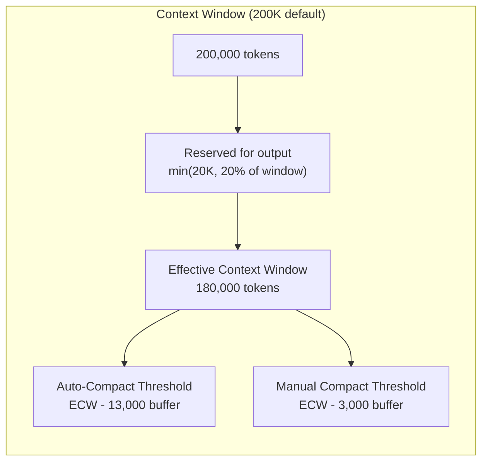

**Figure 5.2.1** — Context window budget allocation.

#### Python Pseudocode: Token Budget

```python
MODEL_CONTEXT_WINDOW_DEFAULT = 200_000
MAX_OUTPUT_TOKENS_FOR_SUMMARY = 20_000
AUTOCOMPACT_BUFFER_TOKENS = 13_000
MANUAL_COMPACT_BUFFER_TOKENS = 3_000

MODEL_CONTEXT_WINDOWS = {
    "claude-opus-4-20250514": 200_000,
    "claude-sonnet-4-20250514": 200_000,
    "claude-haiku-3-20250307": 200_000,
    # ... more models
}


def get_context_window_for_model(model: str) -> int:
    """Look up context window size, with env override support."""
    env_override = os.environ.get("CLAUDE_CODE_MAX_CONTEXT_TOKENS")
    if env_override:
        parsed = int(env_override)
        if parsed > 0:
            return parsed

    if model in MODEL_CONTEXT_WINDOWS:
        return MODEL_CONTEXT_WINDOWS[model]

    # Fuzzy match: model name contains a known key or vice versa
    for key, value in MODEL_CONTEXT_WINDOWS.items():
        if key in model or model in key:
            return value

    return MODEL_CONTEXT_WINDOW_DEFAULT


def get_effective_context_window(model: str) -> int:
    """Context window minus reserved space for output."""
    window = get_context_window_for_model(model)
    reserved = min(MAX_OUTPUT_TOKENS_FOR_SUMMARY, window // 5)
    return window - reserved


def build_token_budget_snapshot(messages, options=None) -> dict:
    """Build a complete budget snapshot for a conversation."""
    estimated = token_count_with_estimation(messages, options)
    model = options.get("model") or os.environ.get("ANTHROPIC_MODEL") or "claude-sonnet-4-20250514"
    window = get_context_window_for_model(model)
    effective = get_effective_context_window(model)

    return {
        "estimated_conversation_tokens": estimated,
        "context_window": window,
        "effective_context_window": effective,
        "auto_compact_threshold": max(0, effective - scale_buffer(AUTOCOMPACT_BUFFER_TOKENS, effective)),
        "manual_compact_threshold": max(0, effective - scale_buffer(MANUAL_COMPACT_BUFFER_TOKENS, effective)),
    }
```

### 5.3 Hybrid Usage + Estimation

The system uses a hybrid approach for token counting: when the API returns actual usage data, it anchors on that and only estimates for messages added after the anchor point. This combines the accuracy of API-reported tokens with the flexibility of estimation for mid-conversation checks.

```python
def token_count_with_estimation(messages, options=None) -> int:
    """
    Hybrid token counting: use API usage as anchor when available,
    estimate only for messages added after the anchor.
    """
    system_prompt_tokens = 0
    if options and options.get("system_prompt"):
        system_prompt_tokens = estimate_system_prompt_tokens(options["system_prompt"])

    usage = options.get("usage") if options else None
    anchor_index = options.get("usage_anchor_index") if options else None

    if usage and anchor_index is not None and anchor_index >= 0:
        # Anchor on API-reported tokens, estimate only the suffix
        suffix = messages[anchor_index + 1:]
        return (
            get_token_count_from_usage(usage)
            + rough_token_count_for_messages(suffix)
            + system_prompt_tokens
        )

    return rough_token_count_for_messages(messages) + system_prompt_tokens
```

---

## 6. MCP Subsystem Architecture

The Model Context Protocol (MCP) subsystem enables Agent Butler to discover and use tools from external MCP servers. It supports three transport types: stdio (local subprocess), HTTP (Streamable HTTP), and SSE (legacy Server-Sent Events).

### 6.1 Module Map

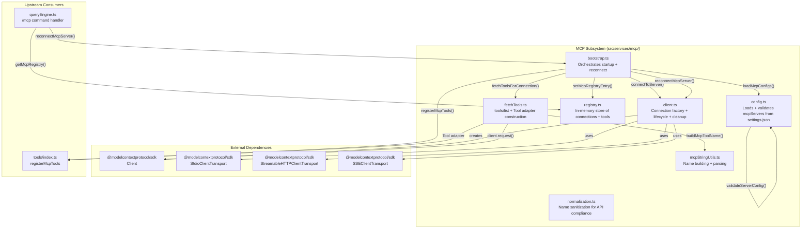

**Figure 6.1.1** — MCP subsystem module map showing internal and external dependencies.

### 6.2 Bootstrap Sequence

The MCP bootstrap is a carefully orchestrated startup sequence that connects to all configured servers in parallel while providing immediate UI feedback:

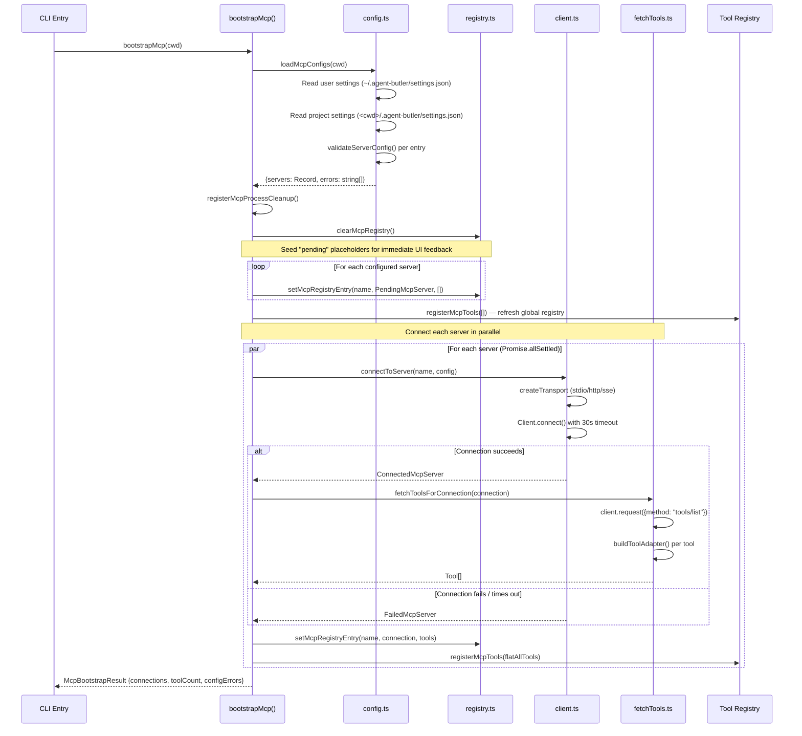

**Figure 6.2.1** — MCP bootstrap sequence showing parallel connection and incremental registry updates.

---

## 7. MCP Configuration Loading

The configuration system (`src/services/mcp/config.ts`) loads MCP server definitions from two JSON files with project-overrides-user precedence.

### 7.1 Configuration Sources

| Source | Path | Priority |
|--------|------|----------|
| User | `~/.agent-butler/settings.json` | Lower |
| Project | `<cwd>/.agent-butler/settings.json` | Higher |

Project settings override user settings on name conflicts (same pattern as the permission system). The `mcpServers` field lives inside the existing `settings.json` so users don't need a second config file.

### 7.2 Validation Flow

```mermaid
flowchart TD
    A[loadMcpConfigs] --> B[Read user settings.json]
    A --> C[Read project settings.json]
    B --> D[extractScopedServers<br/>scope = "user"]
    C --> E[extractScopedServers<br/>scope = "project"]

    D --> F[For each mcpServers entry]
    E --> F

    F --> G[validateServerConfig]
    G --> H{type field?}
    H -->|"undefined / 'stdio'"| I[validateStdioConfig]
    H -->|"'http'"| J[validateRemoteConfig<br/>type = "http"]
    H -->|"'sse'"| K[validateRemoteConfig<br/>type = "sse"]
    H -->|"other"| L[Error: unsupported transport]

    I --> M{command present<br/>and non-empty?}
    M -->|no| N[Error]
    M -->|yes| O{args is string array?}
    O -->|no| P[Error]
    O -->|yes| Q{env is string→string map?}
    Q -->|no| R[Error]
    Q -->|yes| S[Return McpStdioServerConfig]

    J --> T{url valid?}
    T -->|no| U[Error]
    T -->|yes| V[Return McpHTTPServerConfig]

    K --> T

    D --> W["Merge: user + project<br/>(project wins on conflict)"]
    E --> W
    W --> X[McpConfigLoadResult]
```

**Figure 7.2.1** — MCP configuration validation and merging flow.

#### Python Pseudocode: Configuration Loading

```python
async def load_mcp_configs(cwd: str) -> McpConfigLoadResult:
    """Load MCP server configurations from user + project settings."""
    user_path, project_path = get_settings_paths(cwd)

    errors = []
    user_file, project_file = await asyncio.gather(
        read_json_settings_file(user_path),
        read_json_settings_file(project_path),
    )

    if user_file.parse_error:
        errors.append(user_file.parse_error)
    if project_file.parse_error:
        errors.append(project_file.parse_error)

    user_servers = extract_scoped_servers(user_file.raw, "user", user_path, errors)
    project_servers = extract_scoped_servers(project_file.raw, "project", project_path, errors)

    # Project overrides user — dict merge with project second
    servers = {**user_servers, **project_servers}

    for error in errors:
        log_warn(f"[mcp] config: {error}")

    return McpConfigLoadResult(servers=servers, errors=errors)


def validate_server_config(name, raw, scope) -> Result:
    """Validate a single server config. Returns ok+value or ok+error."""
    if not raw or not isinstance(raw, dict):
        return Error(f"mcpServers.{name} must be an object")

    transport_type = raw.get("type")

    if transport_type not in (None, "stdio", "http", "sse"):
        return Error(f"unsupported transport '{transport_type}'")

    if transport_type in ("http", "sse"):
        return validate_remote_config(name, raw, scope, transport_type)

    return validate_stdio_config(name, raw, scope)
```

---

## 8. MCP Client Connection Management

The MCP client (`src/services/mcp/client.ts`) is the most complex file in the MCP subsystem (~445 lines). It manages the lifecycle of MCP server connections including transport creation, handshake with timeout, connection caching, and graceful cleanup.

### 8.1 Transport Factory Pattern

The client supports three transport types through a `TransportBundle` abstraction that encapsulates the transport, its description, stderr collection, and cleanup logic:

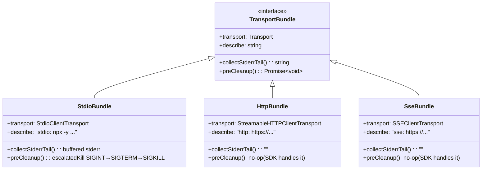

**Figure 8.1.1** — Transport bundle abstraction for the three supported MCP transport types.

### 8.2 Connection Flow

```mermaid
flowchart TD
    A[connectToServer] --> B{Cache hit?<br/>getCacheKey(name, config)}
    B -->|yes| C[Return cached Promise]
    B -->|no| D[doConnect]

    D --> E{config.type?}
    E -->|http| F[createHttpTransport]
    E -->|sse| G[createSseTransport]
    E -->|stdio| H[createStdioTransport]

    F --> I[TransportBundle]
    G --> I
    H --> I

    I --> J[Create MCP SDK Client]
    J --> K["client.connect(transport)"]
    K --> L["Promise.race with 30s timeout"]

    L --> M{Outcome?}
    M -->|timeout| N[close transport, return FailedMcpServer]
    M -->|error| O[close transport, return FailedMcpServer]
    M -->|success| P[Read capabilities + server version]
    P --> Q[Build cleanup function]
    Q --> R[Return ConnectedMcpServer]
    R --> S[Register in activeConnections map]

    D --> T[Cache the Promise]
    T --> U["All callers share same in-flight Promise"]
```

**Figure 8.2.1** — MCP connection flow with caching and timeout.

### 8.3 Stdio Cleanup Escalation

For stdio transports (local subprocesses), the client implements a three-stage signal escalation to prevent zombie processes:

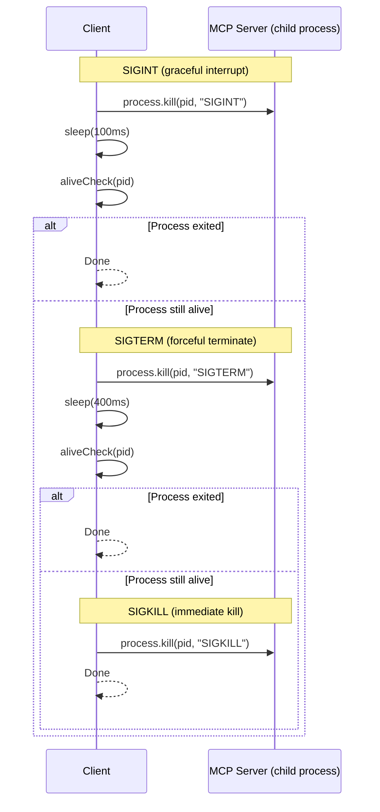

**Figure 8.3.1** — Signal escalation for stdio MCP server cleanup (total cap ~500ms).

### 8.4 Cache Key Strategy

The cache key includes the full transport-specific configuration so that any edit to `settings.json` (command, args, env, url, headers, or even switching transport type) produces a fresh cache entry. Scope metadata is excluded to avoid spurious cache busts.

```python
def get_cache_key(name: str, config: ScopedMcpServerConfig) -> str:
    """Build a stable cache key from server name + transport config."""
    if config.type in ("http", "sse"):
        return f"{name}:{json.dumps({'type': config.type, 'url': config.url, 'headers': config.headers}, sort_keys=True)}"
    return f"{name}:{json.dumps({'type': 'stdio', 'command': config.command, 'args': config.args, 'env': config.env}, sort_keys=True)}"
```

### 8.5 Process-Level Cleanup

A single SIGINT/SIGTERM/beforeExit handler cleans up every active MCP stdio child process. Without this, a Ctrl+C on the CLI would leave zombie `npx @mcp/server-foo` processes:

```python
_cleanup_registered = False
_active_connections: dict[str, ConnectedMcpServer] = {}


def register_mcp_process_cleanup():
    """Register a single handler for all signal types."""
    global _cleanup_registered
    if _cleanup_registered:
        return
    _cleanup_registered = True

    async def run_cleanup():
        connections = list(_active_connections.values())
        _active_connections.clear()
        await asyncio.gather(*[c.cleanup() for c in connections], return_exceptions=True)

    def on_signal(signal):
        fire_and_forget(run_cleanup())

    signal.signal("SIGINT", on_signal)
    signal.signal("SIGTERM", on_signal)
    atexit.register(lambda: fire_and_forget(run_cleanup()))
```

---

## 9. MCP Tool Discovery and Adaptation

The tool discovery module (`src/services/mcp/fetchTools.ts`) bridges the MCP protocol's tool model and Agent Butler's local `Tool` interface. This is where external tools become first-class citizens in the system.

### 9.1 Discovery and Adaptation Flow

```mermaid
flowchart TD
    A[fetchToolsForConnection] --> B{Server declares<br/>tools capability?}
    B -->|no| C[Return empty array]
    B -->|yes| D["client.request({method: 'tools/list'})"]

    D --> E{Request succeeds?}
    E -->|no| F[Log warning, return empty]
    E -->|yes| G[For each MCP tool descriptor]

    G --> H[buildToolAdapter]
    H --> I[buildMcpToolName<br/>mcp__server__tool]
    H --> J[truncateDescription<br/>max 2048 chars]
    H --> K[Map readOnlyHint → isReadOnly]
    H --> L[Pass through inputSchema]

    H --> M[Return local Tool with async call method]
    M --> N["On call(): client.request({method: 'tools/call', params: {name: original, arguments}})"]
    N --> O[stringifyMcpContent<br/>Map response blocks to string]
    O --> P[Return ToolResult]

    G --> Q[Collect all adapted tools]
    Q --> R[Return Tool[]]
```

**Figure 9.1.1** — MCP tool discovery and adaptation flow.

### 9.2 Tool Adapter Construction

Each MCP tool is wrapped in a local `Tool` implementation. The key insight is that the adapter uses the **prefixed name** (`mcp__server__tool`) for the local registry but sends the **original name** to the MCP server:

```python
MAX_MCP_DESCRIPTION_LENGTH = 2048


def build_tool_adapter(connection: ConnectedMcpServer, mcp_tool) -> Tool:
    """Build a local Tool from a single MCP tool descriptor."""
    full_name = build_mcp_tool_name(connection.name, mcp_tool.name)
    description = truncate_description(mcp_tool.description)
    is_read_only = mcp_tool.annotations.get("readOnlyHint", False) if mcp_tool.annotations else False
    input_schema = mcp_tool.input_schema or {"type": "object", "properties": {}}

    class McpToolAdapter:
        name = full_name
        description = description
        input_schema = input_schema

        def is_read_only(self):
            return is_read_only

        def is_enabled(self):
            return True

        async def call(self, raw_input, context):
            try:
                result = await connection.client.request(
                    {"method": "tools/call", "params": {"name": mcp_tool.name, "arguments": raw_input}},
                    CallToolResultSchema,
                )
                content = stringify_mcp_content(result.content)
                return ToolResult(content=content, isError=result.is_error == True)
            except Exception as error:
                return ToolResult(content=f"MCP tool '{full_name}' failed: {error}", isError=True)

    return McpToolAdapter()
```

### 9.3 Content Stringification

MCP tool results can contain multiple content block types. The adapter flattens them into a single string:

```python
def stringify_mcp_content(content) -> str:
    """Map MCP CallToolResult.content[] blocks to a single string."""
    if not isinstance(content, list):
        return ""

    parts = []
    for block in content:
        if block.type == "text":
            parts.append(block.text)
        elif block.type == "image":
            parts.append(f"[image: {block.mime_type or '?'}, {len(block.data or '')} base64 chars]")
        elif block.type == "resource":
            r = block.resource
            parts.append(r.text if hasattr(r, "text") else f"[resource: {getattr(r, 'uri', '<no uri>')}]")
        else:
            parts.append(f"[{getattr(block, 'type', 'unknown')} block]")

    return "\n".join(parts)
```

---

## 10. MCP String Utilities and Name Normalization

### 10.1 Name Normalization

The Anthropic API requires tool names to match `^[a-zA-Z0-9_-]{1,64}$`. MCP server and tool names allow much broader character sets (dots, spaces, etc.), so the normalization module (`src/services/mcp/normalization.ts`) replaces any invalid character with `_`:

```python
def normalize_name_for_mcp(name: str) -> str:
    """Replace any non-alphanumeric/non-dash/non-underscore character with _."""
    return re.sub(r"[^a-zA-Z0-9_-]", "_", name)
```

### 10.2 Tool Name Convention

The string utilities (`src/services/mcp/mcpStringUtils.ts`) implement the `mcp__<server>__<tool>` naming convention:

```python
def build_mcp_tool_name(server_name: str, tool_name: str) -> str:
    """Build the fully qualified MCP tool name."""
    return f"mcp__{normalize_name_for_mcp(server_name)}__{normalize_name_for_mcp(tool_name)}"


def is_mcp_tool_name(name: str) -> bool:
    """Cheap predicate: does this look like an MCP-prefixed tool name?"""
    return name.startswith("mcp__")


def parse_mcp_tool_name(full_name: str) -> dict | None:
    """Parse an MCP tool name back into server / tool components."""
    parts = full_name.split("__")
    if len(parts) < 3 or parts[0] != "mcp" or not parts[1]:
        return None
    return {
        "server_name": parts[1],
        "tool_name": "__".join(parts[2:]),  # Rejoin in case tool name contained __
    }
```

The double-underscore delimiter means tool names containing `__` will parse incorrectly — this is a known limitation documented in both the source code and Agent Butler.

---

## 11. Skills Subsystem Architecture

The Skills system provides reusable prompt templates that can be loaded from disk, conditionally activated based on file paths, and budget-constrained for system prompt injection.

### 11.1 Module Map

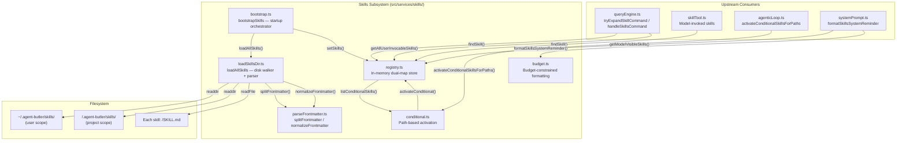

**Figure 11.1.1** — Skills subsystem module map.

### 11.2 Bootstrap Sequence

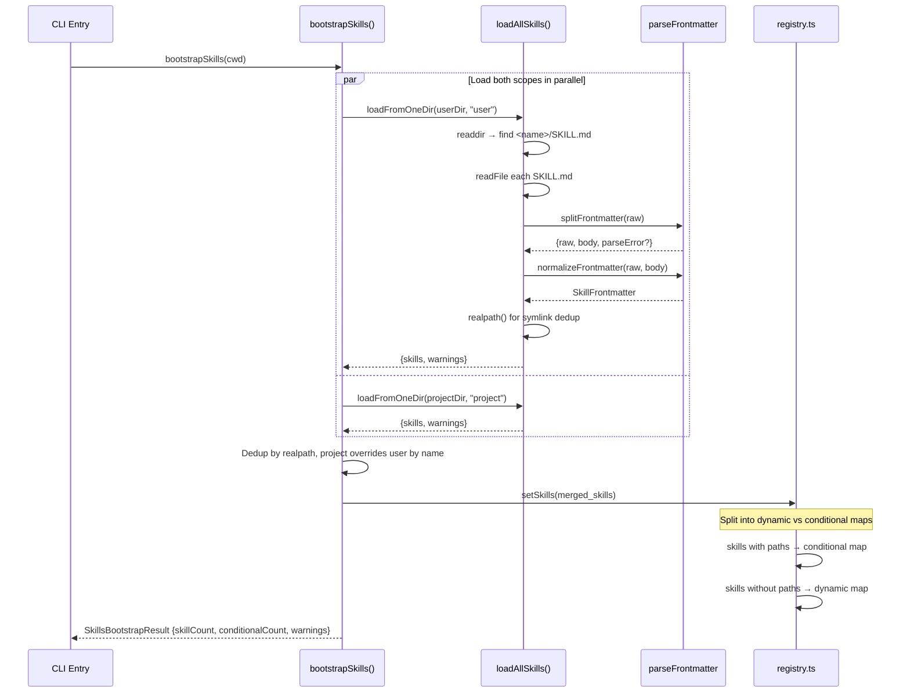

**Figure 11.2.1** — Skills bootstrap sequence with dual-scope loading.

---

## 12. Skills Disk Loading and Frontmatter Parsing

### 12.1 Directory Structure

Skills are organized as directories containing a `SKILL.md` file:

```text
~/.agent-butler/skills/              (user scope)
├── code-review/
│   └── SKILL.md
└── refactor-helper/
    └── SKILL.md

<cwd>/.agent-butler/skills/          (project scope)
├── test-reviewer/
│   └── SKILL.md                   (conditional: paths: ["**/*.test.ts"])
└── deploy-helper/
    └── SKILL.md
```

### 12.2 Frontmatter Parsing

The frontmatter parser (`src/services/skills/parseFrontmatter.ts`) splits a `---\n...\n---\n<body>` document into its YAML frontmatter object and the markdown body:

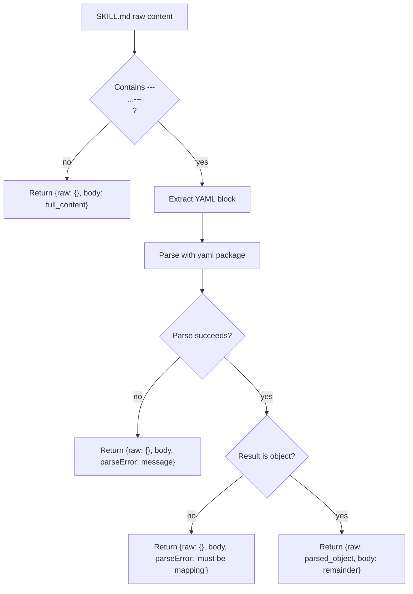

**Figure 12.2.1** — Frontmatter parsing flow.

### 12.3 Field Normalization

The `normalizeFrontmatter()` function converts raw YAML into a typed `SkillFrontmatter`:

```python
def normalize_frontmatter(raw: dict, body: str) -> SkillFrontmatter:
    """Normalize a raw YAML map into a SkillFrontmatter."""
    allowed_tools = as_string_array(raw.get("allowed-tools") or raw.get("allowedTools"))
    paths = as_string_array(raw.get("paths"))

    return SkillFrontmatter(
        name=as_string(raw.get("name")),
        description=as_string(raw.get("description")),
        when_to_use=as_string(raw.get("when_to_use") or raw.get("whenToUse")),
        allowed_tools=allowed_tools,
        argument_hint=as_string(raw.get("argument-hint") or raw.get("argumentHint")),
        disable_model_invocation=as_boolean(
            raw.get("disable-model-invocation") or raw.get("disableModelInvocation")
        ),
        paths=paths if paths else None,
        has_fork_context=as_string(raw.get("context")) == "fork",
        raw=raw,
    )
```

Key normalization behaviors:
- **`allowed-tools`** accepts both YAML arrays and CSV strings (`"Read, Grep, Glob"`)
- **`paths`** is always normalized to an array
- **Boolean fields** accept `true`/`yes`/`1` as truthy values
- **Unknown fields** are preserved in `raw` for forward compatibility

### 12.4 Fallback Description Extraction

When the SKILL.md has no `description` in its frontmatter, the system extracts the first non-empty, non-heading paragraph from the markdown body:

```python
def extract_fallback_description(body: str) -> str:
    """Extract the first non-empty paragraph from a markdown body."""
    lines = body.split("\n")
    buf = []
    for raw_line in lines:
        line = raw_line.strip()
        if not line:
            if buf:
                break  # End of first paragraph
            continue
        if not buf and line.startswith("#"):
            continue  # Skip leading headings
        buf.append(line)
    return " ".join(buf).strip()
```

---

## 13. Skills Registry and Conditional Activation

### 13.1 Dual-Map Registry

The skills registry (`src/services/skills/registry.ts`) maintains two separate maps:

```mermaid
graph LR
    subgraph "setSkills(skills)"
        INPUT[Loaded skills]
    end

    INPUT -->|"paths present?"| COND[Conditional Map<br/>skills with paths frontmatter]
    INPUT -->|"no paths"| DYN[Dynamic Map<br/>always visible]

    subgraph "Runtime Activation"
        TOUCH[File touched by agent<br/>Read/Write/Edit/Glob]
        TOUCH --> MATCH[activateConditionalSkillsForPaths]
        MATCH -->|"gitignore match"| PROMOTE[Promote: conditional → dynamic]
    end

    subgraph "Query APIs"
        MV[getModelVisibleSkills<br/>dynamic - disableModelInvocation]
        AU[getAllUserInvocableSkills<br/>dynamic + conditional]
        FS[findSkill(name)<br/>search both maps]
    end

    DYN --> MV
    DYN --> AU
    COND --> AU
    DYN --> FS
    COND --> FS
```

**Figure 13.1.1** — Dual-map registry architecture.

| Map | Contains | Visible To |
|-----|----------|-----------|
| `dynamic` | Skills without `paths`, plus activated conditional skills | Model (via system prompt listing) and user (via `/<name>`) |
| `conditional` | Skills with `paths` that haven't matched yet | User only (via `/<name>`); hidden from model listing |

### 13.2 Conditional Activation

Conditional skills are activated when the agent touches a file matching their `paths` patterns (gitignore-style). Activation is **one-way and sticky** — once activated, a skill stays visible for the process lifetime:

```python
def activate_conditional_skills_for_paths(file_paths: list[str], cwd: str) -> list[str]:
    """
    Try to activate every still-conditional skill against the given file paths.
    Returns the names of skills that just became visible.
    """
    candidates = list_conditional_skills()
    if not candidates or not file_paths:
        return []

    # Convert to repo-relative paths for gitignore matching
    relative_paths = []
    for p in file_paths:
        abs_path = os.path.abspath(p) if not os.path.isabsolute(p) else p
        rel = os.path.relpath(abs_path, cwd)
        if rel and not rel.startswith("..") and not os.path.isabs(rel):
            relative_paths.append(rel.replace(os.sep, "/"))

    if not relative_paths:
        return []

    activated = []
    for skill in candidates:
        patterns = skill.frontmatter.paths
        if not patterns:
            continue
        matcher = ignore().add(patterns)
        if any(matcher.ignores(p) for p in relative_paths):
            if activate_conditional(skill.name):
                activated.append(skill.name)

    return activated
```

### 13.3 File Path Extraction

The `extractToolFilePaths()` function extracts file-path-shaped fields from tool inputs to trigger conditional activation:

| Tool | Extracted Field |
|------|----------------|
| `Read` | `file_path` |
| `Write` | `file_path` |
| `Edit` | `file_path` |
| `Glob` | `path` (search root) |

This is intentionally conservative — only well-known fields from file tools are extracted to avoid false positives.

---

## 14. Skills Budget and System Prompt Injection

### 14.1 Budget-Constrained Formatting

The budget module (`src/services/skills/budget.ts`) formats skill descriptions into the system prompt while respecting a character budget. It implements a three-tier degradation strategy:

```mermaid
flowchart TD
    A[formatSkillsWithinBudget] --> B[Tier 1: Full descriptions<br/>Each capped at 250 chars]
    B --> C{Total ≤ budget?}
    C -->|yes| D[Return full listing]
    C -->|no| E[Tier 2: Shrink descriptions<br/>Distribute remaining budget evenly]

    E --> F{Per-skill desc ≥ 20 chars?}
    F -->|yes| G{Total ≤ budget?}
    G -->|yes| H[Return shrunk listing]
    G -->|no| I[Tier 3: Names only]
    F -->|no| I

    I --> J[Return "- skill_name" per line]
```

**Figure 14.1.1** — Three-tier budget degradation for skill listings.

| Tier | Format | Example |
|------|--------|---------|
| 1 (full) | `- name: description (up to 250 chars)` | `- code-review: Analyzes code for bugs, style issues, and security vulnerabilities — use when reviewing PRs` |
| 2 (shrunk) | `- name: description (shared budget)` | `- code-review: Analyzes code for bugs` |
| 3 (names) | `- name` | `- code-review` |

The default budget is 8,000 characters (~2,000 tokens for a 200K model), configurable via `AGENT_BUTLER_SKILL_CHAR_BUDGET` environment variable.

### 14.2 System Prompt Injection

The formatted skill listing is wrapped in `<system-reminder>` tags and injected into every system prompt:

```python
def format_skills_system_reminder(skills: list[Skill]) -> str:
    """Build the system-reminder block for the system prompt."""
    if not skills:
        return ""

    listing = format_skills_within_budget(skills)
    if not listing:
        return ""

    return "\n".join([
        "<system-reminder>",
        "Available skills you can invoke via the `Skill` tool. Each line is `- <name>: <description>`.",
        'Call `Skill(skill="<name>", args="<optional args>")` when the user\'s request matches one of these.',
        "",
        listing,
        "</system-reminder>",
    ])
```

---

## 15. Stream Debug Infrastructure

The stream debug module (`src/utils/streamDebug.ts`) provides opt-in logging of every raw SSE event for debugging provider compatibility issues.

### 15.1 Activation and Output

- **Activation**: `AGENT_BUTLER_DEBUG_STREAM=1` environment variable
- **Output**: `~/.agent-butler/stream-debug.log` (JSONL format)
- **Performance**: No-op when disabled (single boolean check)
- **Safety**: Logging never throws or affects the stream

```python
DEBUG_STREAM = os.environ.get("AGENT_BUTLER_DEBUG_STREAM") == "1"

def write_stream_debug(kind: str, payload):
    """Append a single JSON record to the debug log."""
    if not DEBUG_STREAM:
        return
    try:
        line = json.dumps({"ts": datetime.now().isoformat(), "kind": kind, "payload": payload}) + "\n"
        with open(resolve_log_path(), "a") as f:
            f.write(line)
    except Exception:
        pass  # Logging must never break the stream
```

### 15.2 Debug Record Types

| Kind | When | Payload |
|------|------|---------|
| `request` | Before streaming starts | `{model, messageCount, toolNames}` |
| `event` | Each raw SSE event | Full event object from SDK |
| `assembled` | After stream completes | `{stopReason, blockCount, blocks[]}` |
| `stream_error` | On catch | `{message: error.message}` |

This is invaluable when debugging Anthropic-compatible endpoints (MiniMax, LiteLLM, OpenAI→Anthropic shims) whose streaming translation often mis-handles tool_use or thinking blocks.

---

## 16. Integration with the Core Agentic Loop

The Model Communication Layer integrates with the Core Agentic Loop (`src/core/agenticLoop.ts`) and the QueryEngine (`src/core/queryEngine.ts`) through well-defined interfaces.

### 16.1 Streaming Integration

The agentic loop's `query()` generator calls `streamMessage()` directly:

```mermaid
sequenceDiagram
    participant QE as QueryEngine
    participant AL as agenticLoop.query()
    participant ST as streamMessage()
    participant API as Anthropic API

    QE->>AL: query({messages, systemPrompt, getTools, model, ...})

    loop While turnCount < maxTurns
        AL->>AL: Token budget check (skip first turn)
        AL->>ST: streamMessage({messages, model, system, tools, signal})

        loop For each StreamEvent
            ST-->>AL: yield {type: "text", text}
            AL-->>QE: yield {type: "text", text}
            ST-->>AL: yield {type: "tool_use_start", id, name}
            AL-->>QE: yield {type: "tool_use_start", id, name}
        end

        ST-->>AL: return StreamResult
        AL->>AL: Update usage totals
        AL->>AL: Append assistant message
        AL-->>QE: yield {type: "assistant_message", message}

        alt stopReason == "tool_use"
            AL->>AL: runTools(assistantContent)
            AL->>AL: Build tool_results message
            AL-->>QE: yield {type: "tool_result_message", message}
            Note over AL: Continue loop (next turn)
        else stopReason != "tool_use"
            AL-->>QE: yield {type: "turn_complete", reason: "completed"}
            Note over AL: Exit loop
        end
    end

    AL-->>QE: return AgenticLoopResult
```

**Figure 16.1.1** — Streaming integration between QueryEngine, agentic loop, and streaming engine.

### 16.2 MCP Integration via Tool Registry

MCP tools become available to the agentic loop through the global tool registry:

```mermaid
flowchart LR
    subgraph "Startup"
        MB[bootstrapMcp] -->|"registerMcpTools(allTools)"| TR[tools/index.ts]
    end

    subgraph "Per-Turn"
        AL[agenticLoop] -->|"getToolsApiParams(mode)"| TR
        TR -->|"BUILTIN_TOOLS + mcpTools"| AL
        AL -->|"tools param"| ST[streamMessage]
        ST -->|"sent to API"| API[Anthropic API]
        API -->|"tool_use: mcp__server__tool"| AL
        AL -->|"findToolByName('mcp__server__tool')"| TR
        TR -->|"McpToolAdapter"| AL
        AL -->|"adapter.call(input)"| MCP[MCP Server]
        MCP -->|"ToolResult"| AL
    end
```

**Figure 16.2.1** — MCP tool lifecycle from startup through execution.

### 16.3 Skills Integration

Skills integrate at three points: user slash commands (QueryEngine), model-invoked skills (SkillTool), and system prompt injection (systemPrompt.ts).

```mermaid
flowchart TD
    subgraph "User Path: /skill-name args"
        U1[User types /skill-name args] --> U2[QueryEngine.submitMessage]
        U2 --> U3[tryExpandSkillCommand]
        U3 --> U4[findSkill(name) in registry]
        U4 --> U5[Substitute $ARGUMENTS, ${CLAUDE_SKILL_DIR}, ${CLAUDE_SESSION_ID}]
        U5 --> U6[Inject allowed-tools into session allow rules]
        U6 --> U7[Create marker message for UI]
        U7 --> U8[Submit expanded body as user message]
    end

    subgraph "Model Path: Skill tool call"
        M1[Model emits tool_use: Skill] --> M2[skillTool.call]
        M2 --> M3[findSkill(name)]
        M3 --> M4[Substitute variables]
        M4 --> M5[Inject allowed-tools]
        M5 --> M6[Return skill body as ToolResult]
    end

    subgraph "System Prompt Path"
        S1[buildSystemPrompt] --> S2[getModelVisibleSkills]
        S2 --> S3[formatSkillsSystemReminder]
        S3 --> S4[Inject into system prompt]
    end

    subgraph "Conditional Activation Path"
        C1[agenticLoop.runOneToolBlock] --> C2[extractToolFilePaths]
        C2 --> C3[activateConditionalSkillsForPaths]
        C3 --> C4[Promote conditional → dynamic in registry]
    end
```

**Figure 16.3.1** — Three integration paths for the Skills system.

---

## 17. Complete Data Flows

### 17.1 End-to-End LLM Communication Flow

```mermaid
flowchart TD
    A["User types message"] --> B[QueryEngine.submitMessage]
    B --> C[Build system prompt<br/>systemPrompt.ts]
    C --> D[Auto-compact if needed<br/>compaction.ts]
    D --> E[Append user message to history]
    E --> F[agenticLoop.query]

    F --> G[streamMessage<br/>streaming.ts]
    G --> H[getAnthropicClient<br/>client.ts]
    H --> I["Anthropic API (SSE)"]

    I --> J{Event type?}
    J -->|message_start| K[Capture messageId + usage]
    J -->|content_block_start + text| L[Initialize text block]
    J -->|content_block_delta + text_delta| M[Accumulate text, yield to UI]
    J -->|content_block_start + tool_use| N[Initialize tool block, yield tool_use_start]
    J -->|content_block_delta + input_json| O[Accumulate JSON per-index]
    J -->|content_block_stop + tool_use| P[Parse accumulated JSON]
    J -->|content_block_start + thinking| Q[Initialize thinking block]
    J -->|content_block_delta + thinking| R[Accumulate thinking text]
    J -->|content_block_delta + signature| S[Accumulate signature]
    J -->|message_delta| T[Update final usage + stopReason]
    J -->|message_stop| U["Yield message_done event"]
    J -->|error| V["Yield error event"]

    K --> G
    L --> G
    M --> W[QueryEngine yields text to UI]
    N --> X[QueryEngine yields tool_use_start to UI]
    O --> G
    P --> G
    Q --> G
    R --> G
    S --> G
    T --> G
    U --> Y[Assemble AssistantMessage]
    V --> Z[Abort turn with model_error]

    Y --> AA{stopReason?}
    AA -->|tool_use| AB[runTools → execute tool calls]
    AB --> AC[Build tool_results message]
    AC --> AD[Append to messages, continue loop]
    AD --> F

    AA -->|end_turn| AE[Return AgenticLoopResult]
    AA -->|max_tokens| AF{Retry with 64K?}
    AF -->|yes| G
    AF -->|no| AE
```

**Figure 17.1.1** — Complete end-to-end LLM communication flow.

### 17.2 MCP Server Lifecycle Flow

```mermaid
flowchart TD
    A[CLI Startup] --> B[bootstrapMcp]
    B --> C[loadMcpConfigs from settings.json]
    C --> D[Seed pending placeholders in registry]
    D --> E["Connect all servers (Promise.allSettled)"]

    E --> F{Transport type?}
    F -->|stdio| G[Spawn child process<br/>StdioClientTransport]
    F -->|http| H[StreamableHTTPClientTransport]
    F -->|sse| I[SSEClientTransport]

    G --> J["Client.connect() with 30s timeout"]
    H --> J
    I --> J

    J --> K{Connected?}
    K -->|yes| L[Read capabilities + version]
    L --> M[fetchToolsForConnection]
    M --> N["tools/list request"]
    N --> O[buildToolAdapter per tool]
    O --> P[setMcpRegistryEntry]
    P --> Q[registerMcpTools → global registry]

    K -->|no| R[Return FailedMcpServer]
    R --> P

    Q --> S[CLI ready, user can interact]

    S --> T{User runs /mcp reconnect?}
    T -->|yes| U[clearServerCache]
    U --> V[deleteMcpRegistryEntry]
    V --> W[connectToServer → fresh connection]
    W --> X[fetchToolsForConnection]
    X --> Y[setMcpRegistryEntry + refresh global]

    S --> Z{CLI exiting?}
    Z -->|yes| AA[Signal handler fires]
    AA --> AB["For each active connection: cleanup()"]
    AB --> AC[preCleanup: SIGINT→SIGTERM→SIGKILL for stdio]
    AC --> AD["client.close()"]
    AD --> AE[Process exits cleanly]
```

**Figure 17.2.1** — Complete MCP server lifecycle from startup through reconnect to shutdown.

### 17.3 Skills Lifecycle Flow

```mermaid
flowchart TD
    A[CLI Startup] --> B[bootstrapSkills]
    B --> C["Load user skills (~/.agent-butler/skills/)"]
    B --> D["Load project skills (<cwd>/.agent-butler/skills/)"]

    C --> E[Walk directories, find SKILL.md]
    D --> E
    E --> F[splitFrontmatter → YAML + body]
    F --> G[normalizeFrontmatter → SkillFrontmatter]
    G --> H[realpath() for symlink dedup]
    H --> I["Merge: project overrides user by name"]
    I --> J[setSkills → split into dynamic/conditional]

    J --> K[CLI ready]

    K --> L{Invocation path?}
    L -->|User: /name args| M[QueryEngine.tryExpandSkillCommand]
    M --> N[findSkill in registry]
    N --> O["Substitute $ARGUMENTS, ${CLAUDE_SKILL_DIR}, ${CLAUDE_SESSION_ID}"]
    O --> P[Inject allowed-tools into session rules]
    P --> Q[Submit as user message]

    L -->|Model: Skill tool| R[skillTool.call]
    R --> S[findSkill]
    S --> T[Substitute variables]
    T --> U[Return body as ToolResult]

    L -->|System prompt| V[getModelVisibleSkills]
    V --> W[formatSkillsWithinBudget]
    W --> X["Inject <system-reminder> block"]

    L -->|File path match| Y[agent touches file via Read/Write/Edit/Glob]
    Y --> Z[activateConditionalSkillsForPaths]
    Z --> AA["Match paths against gitignore patterns"]
    AA --> AB["Promote conditional → dynamic"]
    AB --> AC["Next system prompt includes newly activated skill"]
```

**Figure 17.3.1** — Complete skills lifecycle from loading through invocation to conditional activation.

---

## 18. How the Module Achieves the Communication Layer

The Model Communication Layer is the foundational infrastructure that transforms Agent Butler from a local program into a conversational agent. It achieves this through several interlocking design principles that work together to create a reliable, extensible, and observable communication bridge between the runtime and external services.

### 18.1 Three-Subsystem Decomposition

The layer decomposes the communication problem into three independent subsystems, each handling a distinct type of external interaction. The API Client & Streaming subsystem handles bidirectional LLM communication. The MCP subsystem handles external tool server integration. The Skills system handles prompt template management. These three subsystems share no runtime state and can be developed, tested, and evolved independently. The only coupling between them is that MCP tools are registered into the same global tool registry that built-in tools use, and skills are injected into the same system prompt that the streaming engine sends to the API.

### 18.2 Streaming as the Fundamental Primitive

Every LLM interaction in the system flows through a single function: `streamMessage()`. This generator-based streaming approach is the architectural keystone. By yielding incremental events rather than waiting for a complete response, it enables real-time UI rendering (the user sees text appear token by token), early error detection (network failures surface immediately rather than after a long timeout), and progressive tool detection (the agentic loop can begin preparing for tool execution as soon as it sees a `tool_use_start` event, before the full input JSON has arrived).

The per-index JSON accumulation strategy is a particularly important detail. Rather than using a single shared buffer for tool input JSON, the system maintains a separate buffer per content-block index. This prevents data corruption when providers emit overlapping content blocks — a real-world issue discovered with MiniMax and certain Anthropic-compatible API shims. The design choice to handle this at the streaming layer, rather than requiring every caller to be aware of it, keeps the complexity contained.

### 18.3 Protocol Abstraction Through the Tool Interface

The MCP subsystem achieves external tool integration by mapping the MCP protocol's tool model onto Agent Butler's local `Tool` interface. Each MCP tool is wrapped in an adapter that translates between the two worlds: the adapter's `name` property returns the prefixed `mcp__server__tool` format that the Anthropic API and permission system require, while its `call()` method forwards to the MCP server using the tool's original unprefixed name. This adapter pattern means the agentic loop, permission system, and tool registry never need to know whether a tool is built-in or external — they all implement the same interface.

The naming convention (`mcp__<server>__<tool>`) with normalization (`[^a-zA-Z0-9_-]` → `_`) ensures API compliance while preserving enough information for the permission system to support wildcard rules like `mcp__github__*`. The double-underscore delimiter is a pragmatic compromise that works for the vast majority of server and tool names.

### 18.4 Declarative Prompt Templates with Runtime Activation

The Skills system treats prompt engineering as a filesystem concern. Skills are Markdown files with YAML frontmatter, discoverable by directory listing, and loadable without any TypeScript compilation. This makes them easy for end users to author and share.

The dual-map registry (dynamic vs conditional) implements a lazy activation model. Skills that declare `paths` patterns start hidden and are promoted to the visible set only when the agent actually touches matching files. This keeps the system prompt lean — the model only sees skills relevant to the files it's working with. The activation is one-way and sticky to prevent flickering (a skill appearing and disappearing as the model navigates files would confuse it).

The budget-constrained formatting with three-tier degradation ensures that even when many skills are loaded, the system prompt doesn't consume an excessive portion of the context window. The 8,000-character default budget (~2,000 tokens) is deliberately conservative.

### 18.5 Defensive Infrastructure

The layer implements several defensive mechanisms that prevent external service failures from cascading into the agent runtime:

- **Connection caching with cache-busting** — MCP connections are cached by a key that includes the full transport configuration. Any edit to `settings.json` automatically invalidates the cache, while unchanged configurations reuse the existing connection.
- **30-second connect timeout** — Every MCP server connection attempt races against a configurable timeout. A slow `npx -y` install for one server doesn't block the entire startup.
- **Parallel connection with incremental updates** — `Promise.allSettled` connects all MCP servers in parallel. Each server's tools are registered into the global registry as they become available, so fast servers don't wait for slow ones.
- **Graceful shutdown escalation** — Stdio MCP servers are cleaned up with SIGINT (100ms) → SIGTERM (400ms) → SIGKILL, preventing zombie child processes on CLI exit.
- **Stream error isolation** — Streaming errors are caught and yielded as events rather than thrown, allowing the agentic loop to handle them within the generator protocol.
- **Escalated retry** — When the model's output is truncated at `max_tokens`, the system automatically retries at 64K tokens before giving up.

### 18.6 Observability by Design

The stream debug infrastructure (`AGENT_BUTLER_DEBUG_STREAM=1`) provides complete visibility into the raw SSE event stream, logged as JSONL to `~/.agent-butler/stream-debug.log`. This is a zero-cost-when-disabled feature (single boolean check per event) that has proven essential for debugging provider compatibility issues. The four record types (request, event, assembled, error) capture the full lifecycle of every API call.

### 18.7 Upward Integration Points

The layer exposes clean integration points that the upper layers consume without needing to understand the internal implementation:

- **For the Agentic Loop**: `streamMessage()` is the single communication primitive. The loop calls it, consumes yielded events, and assembles the final response from the generator's return value.
- **For the QueryEngine**: The MCP registry (`getMcpRegistry()`) provides status information for the `/mcp` command. The skills registry (`findSkill()`, `getModelVisibleSkills()`) provides skill lookup for slash commands and system prompt construction.
- **For the Tool Registry**: `registerMcpTools()` pushes MCP-discovered tools into the global registry. The registry doesn't care where tools come from.
- **For the UI**: Stream events (`text`, `tool_use_start`, `tool_use_input`) are yielded through the QueryEngine to the React/Ink terminal interface for real-time rendering.

The Model Communication Layer thus serves as the stable foundation upon which the entire agentic system is built — every token, every tool discovery, and every prompt template flows through it.

---

> **Summary:** The Model Communication Layer provides three foundational capabilities through three independent subsystems: streaming LLM communication via a generator-based API client with per-index accumulation and escalated retry; external tool server integration via the Model Context Protocol with connection caching, parallel bootstrap, and transparent Tool interface adaptation; and reusable prompt template management via a filesystem-based skills system with conditional activation and budget-constrained formatting. Together, these subsystems form the communication bridge between the Agent Butler runtime and the external services that power it.
